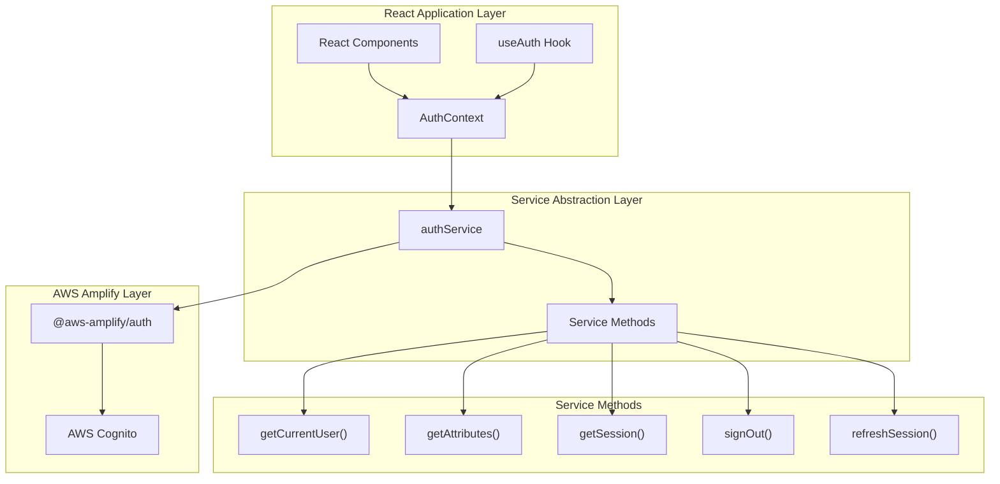
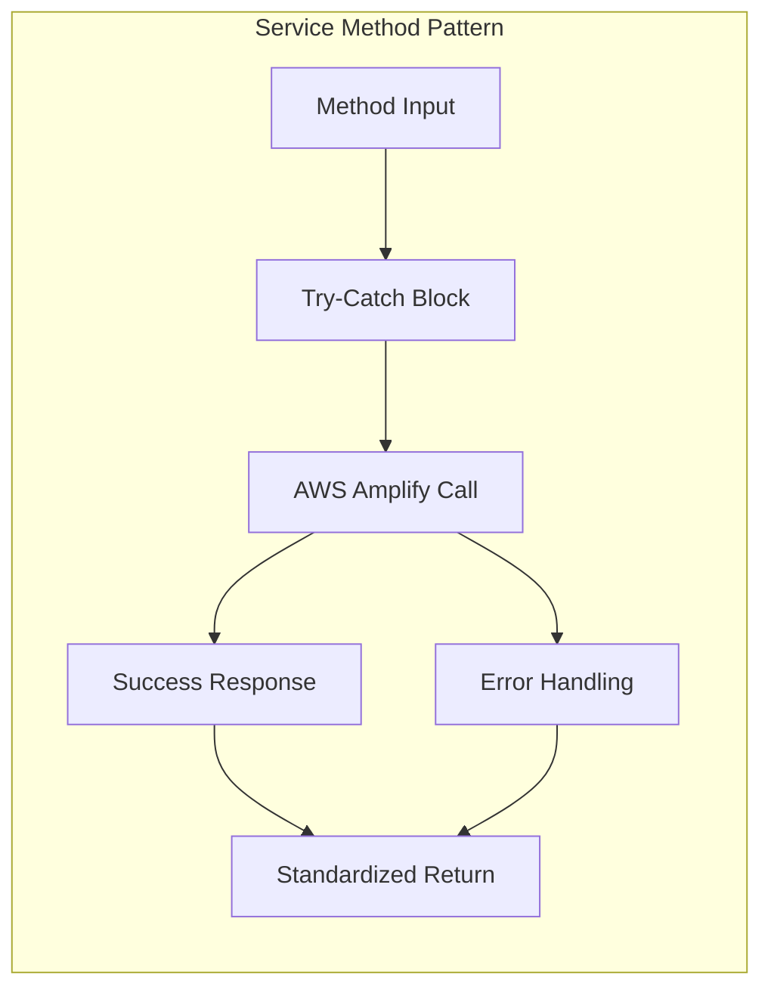
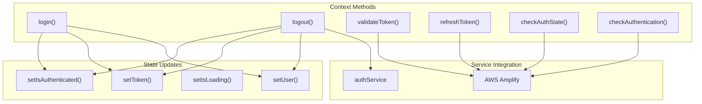
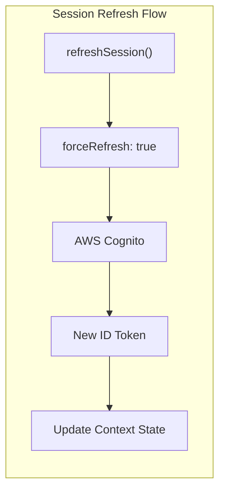

# Authentication Services

<details>
<summary>Relevant source files</summary>

The following files were used as context for generating this wiki page:

- [src/contexts/AuthContext.tsx](/src/contexts/AuthContext.tsx)
- [src/contexts/AuthService.ts](/src/contexts/AuthService.ts)

</details>


This document covers the backend authentication service abstraction layer and AWS Amplify integration patterns used in the CasinoVizion application. The authentication services provide a clean abstraction over AWS Amplify Auth functions and manage authentication state through React Context.

For information about authentication flows and user interface components, see [Login Flow](./6_Login_Flow.md), [User Registration](./7_User_Registration.md), and [OAuth Integration](./9_OAuth_Integration.md). For routing and access control, see [Routing and Navigation](./12_Routing_and_Navigation.md).

## Service Layer Architecture

The authentication services are implemented through two primary layers: a low-level service abstraction (`AuthService`) and a higher-level React context provider (`AuthContext`). This separation allows for clean abstraction of AWS Amplify operations while providing reactive state management for the React application.

**Authentication Service Architecture**



Sources: [src/contexts/AuthService.ts:1-62](), [src/contexts/AuthContext.tsx:1-201]()

## Core Service Methods

The `authService` object provides five core methods that abstract AWS Amplify authentication operations. Each method implements consistent error handling and returns standardized response formats.

| Method | Purpose | Return Type | AWS Amplify Function |
|--------|---------|-------------|---------------------|
| `getCurrentUser()` | Retrieves current user and attributes | `Promise<[AuthUser, FetchUserAttributesOutput] \| null>` | `getCurrentUser()`, `fetchUserAttributes()` |
| `getAttributes()` | Fetches user attributes only | `Promise<FetchUserAttributesOutput \| null>` | `fetchUserAttributes()` |
| `getSession()` | Gets current auth session | `Promise<AuthSession \| null>` | `fetchAuthSession()` |
| `signOut()` | Signs out current user | `Promise<boolean>` | `signOut()` |
| `refreshSession()` | Force refreshes auth session | `Promise<string \| null>` | `fetchAuthSession({ forceRefresh: true })` |

**Service Method Implementation Pattern**



Sources: [src/contexts/AuthService.ts:3-61]()

## AWS Amplify Integration

The authentication services integrate directly with AWS Amplify Auth functions, providing a consistent interface for authentication operations. The service layer handles the complexity of combining multiple Amplify calls and managing error states.

**Key Integration Points:**

- **User Retrieval**: Combines `getCurrentUser()` and `fetchUserAttributes()` calls to provide complete user information
- **Session Management**: Abstracts `fetchAuthSession()` with optional force refresh capabilities  
- **Token Extraction**: Extracts and formats ID tokens from auth sessions
- **Error Normalization**: Standardizes error handling across all Amplify operations

```typescript
// Example service method structure from AuthService
async getCurrentUser() {
    try {
        const currentUser = getCurrentUser()
        const userAttributes = await fetchUserAttributes();
        return await currentUser, userAttributes;
    } catch (error) {
        console.error('Error getting current user:', error);
        return null;
    }
}
```

Sources: [src/contexts/AuthService.ts:4-22]()

## Context Provider State Management

The `AuthContext` provides higher-level state management and authentication workflows that build upon the service layer. It manages reactive state for authentication status, user data, and tokens throughout the application lifecycle.

**Authentication State Properties:**

| Property | Type | Purpose |
|----------|------|---------|
| `user` | `User \| null` | Current authenticated user with attributes |
| `token` | `string \| null` | Current ID token string |
| `isLoading` | `boolean` | Loading state during auth operations |
| `shown` | `boolean` | UI visibility state |
| `isAuthenticated` | `boolean` | Authentication status flag |
| `userAttributes` | `FetchUserAttributesOutput` | User attributes from Cognito |

**Context Method Operations:**



Sources: [src/contexts/AuthContext.tsx:32-201]()

## Session and Token Management

The authentication services implement comprehensive session and token management with automatic validation, refresh capabilities, and expiration checking.

**Token Validation Process:**

The `validateToken()` method implements JWT token expiration checking by comparing the token's `exp` claim against the current timestamp:

```typescript
// Token validation logic from AuthContext
const idToken = session.tokens.idToken;
const currentTime = Math.floor(Date.now() / 1000);

if (idToken.payload.exp && idToken.payload.exp > currentTime) {
    return true;
}
```

**Session Refresh Mechanism:**

The service layer provides force refresh functionality that bypasses cached sessions and retrieves fresh tokens from AWS Cognito:



Sources: [src/contexts/AuthService.ts:53-61](), [src/contexts/AuthContext.tsx:105-129](), [src/contexts/AuthContext.tsx:165-178]()

## Error Handling Patterns

The authentication services implement consistent error handling patterns across all operations. Errors are logged to the console and methods return `null` or `false` to indicate failure states, allowing calling code to handle errors gracefully.

**Error Handling Strategy:**

- **Graceful Degradation**: Service methods return `null` or `false` on errors rather than throwing exceptions
- **Console Logging**: All errors are logged with descriptive messages for debugging
- **State Cleanup**: Context methods clear authentication state when errors occur
- **Boolean Return Values**: Methods like `signOut()` and `validateToken()` return boolean success indicators

**Common Error Scenarios:**

| Scenario | Service Response | Context Response |
|----------|------------------|------------------|
| Network Failure | Returns `null`, logs error | Clears auth state |
| Token Expired | Returns `false` from validation | Triggers logout |
| Cognito Error | Returns `null`, logs error | Sets `isAuthenticated: false` |
| Session Invalid | Returns `null` from refresh | Clears user and token |

Sources: [src/contexts/AuthService.ts:19-21](), [src/contexts/AuthService.ts:29-31](), [src/contexts/AuthService.ts:38-40](), [src/contexts/AuthContext.tsx:96-102](), [src/contexts/AuthContext.tsx:121-128]()