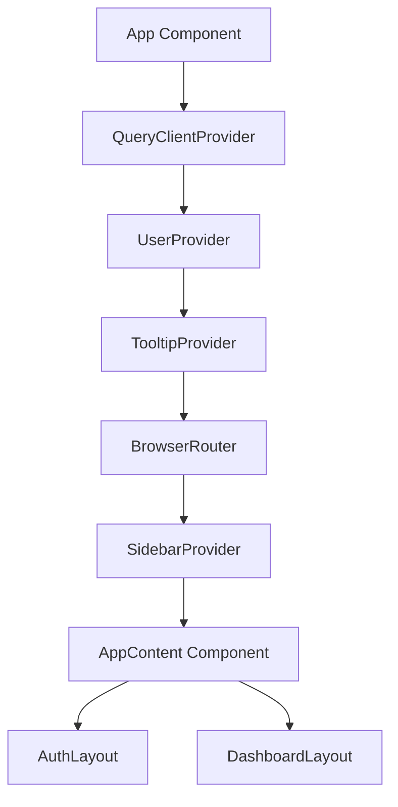
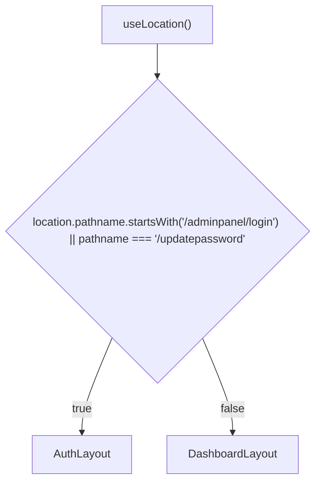
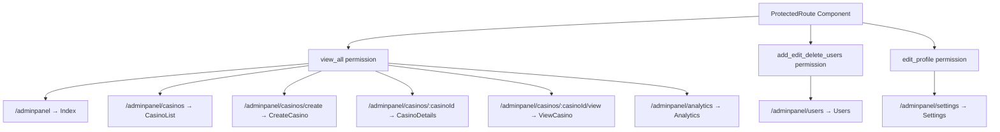
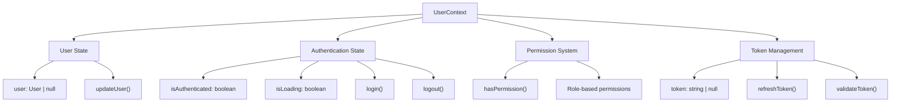
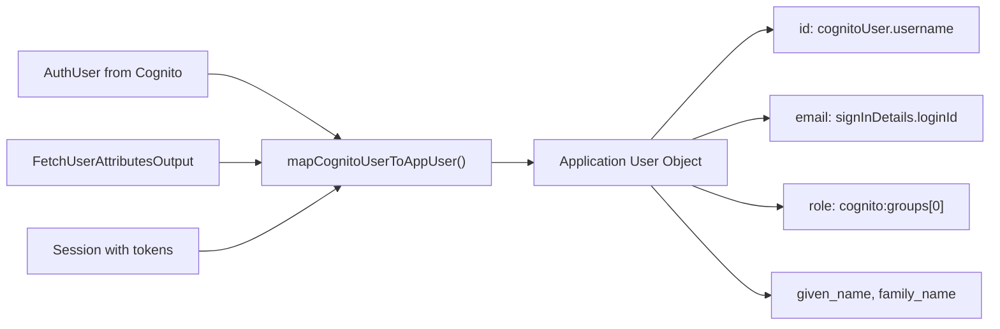

# Application Architecture

<details>
<summary>Relevant source files</summary>

The following files were used as context for generating this wiki page:

- [src/App.tsx](/src/App.tsx)
- [src/contexts/UserContext.tsx](/src/contexts/UserContext.tsx)

</details>


## Purpose and Scope

This document covers the high-level application architecture of the CasinoVizion administrative panel, including component organization, routing structure, layout management, and state provider hierarchy. It focuses on how the main application components are structured and how they interact with each other through React Router, Context providers, and layout selection logic.

For detailed information about authentication flows and user management, see [Authentication System](./5_Authentication_System.md). For UI component organization and styling, see [User Interface Components](./14_User_Interface_Components.md).

## Application Structure Overview

The CasinoVizion application follows a hierarchical provider-based architecture with clear separation between authenticated and unauthenticated user experiences. The application is built around React Router for navigation and React Context for state management.

### Provider Hierarchy

The application wraps multiple context providers around the main router to provide global functionality:



**Sources**: [src/App.tsx:113-127]()

### AWS Amplify Configuration

The application configures AWS Amplify for authentication directly in the main App component, using environment variables for Cognito settings:

| Configuration Key | Environment Variable | Purpose |
|------------------|---------------------|---------|
| `userPoolId` | `VITE_APP_COGNITO_USER_POOL_ID` | Cognito User Pool identifier |
| `userPoolClientId` | `VITE_APP_COGNITO_CLIENT_ID` | Cognito App Client identifier |
| `domain` | `VITE_APP_COGNITO_DOMAIN` | OAuth domain for hosted UI |

**Sources**: [src/App.tsx:31-58]()

## Routing Architecture

The application implements a dual-layout routing system that dynamically selects layouts based on the current route path.

### Layout Selection Logic



**Sources**: [src/App.tsx:35-39]()

### Route Configuration

The application defines distinct route groups with different permission requirements:

#### Public Routes
- `/` - Redirects to `/adminpanel/login`
- `/adminpanel/login` - Login page
- `/updatepassword` - Password update page

#### Protected Administrative Routes
All administrative routes require specific permissions and are wrapped with `ProtectedRoute` components:



**Sources**: [src/App.tsx:62-108]()

## State Management Architecture

The application uses React Context for global state management, centered around user authentication and permissions.

### UserContext Structure

The `UserContext` provides comprehensive user management functionality:



**Sources**: [src/contexts/UserContext.tsx:20-31]()

### User Role System

The application defines three user roles with hierarchical permissions:

| Role | Permissions |
|------|-------------|
| `admin` | `view_all`, `add_edit_delete_users`, `add_edit_records`, `delete_records`, `edit_profile` |
| `developer` | `view_all`, `add_edit_records`, `delete_records`, `edit_profile` |
| `guest` | `view_all`, `add_edit_records`, `edit_profile` |

**Sources**: [src/contexts/UserContext.tsx:155-165]()

### Cognito Integration Mapping

The `UserContext` maps AWS Cognito user data to the application's user structure:



**Sources**: [src/contexts/UserContext.tsx:88-107]()

## Component Organization Patterns

### Layout Components

The application uses two primary layout components that provide different UI structures:

- `AuthLayout` - Used for login and password update pages
- `DashboardLayout` - Used for all authenticated administrative pages

### Protected Route Pattern

All administrative functionality is protected using the `ProtectedRoute` component, which checks user permissions before rendering child components:

```typescript
<ProtectedRoute permission="view_all">
  <Index />
</ProtectedRoute>
```

**Sources**: [src/App.tsx:66-69]()

### Provider Component Pattern

The `UserProvider` component encapsulates all user-related state and authentication logic, providing a clean interface through the `useUser` hook:

```typescript
export const useUser = () => {
  const context = useContext(UserContext);
  if (context === undefined) {
    throw new Error('useUser must be used within a UserProvider');
  }
  return context;
};
```

**Sources**: [src/contexts/UserContext.tsx:211-217]()

## Integration Points

### External Service Configuration

The application integrates with several external services through configuration in the main App component:

- **AWS Amplify**: Configured with Cognito settings for authentication
- **React Query**: Provides server state management capabilities
- **React Router**: Handles client-side routing

### Development vs Production

The application includes development-friendly features such as mock users and configurable redirect URLs for OAuth flows, supporting both local development and production deployments.

**Sources**: [src/App.tsx:40-58](), [src/contexts/UserContext.tsx:52-80]()