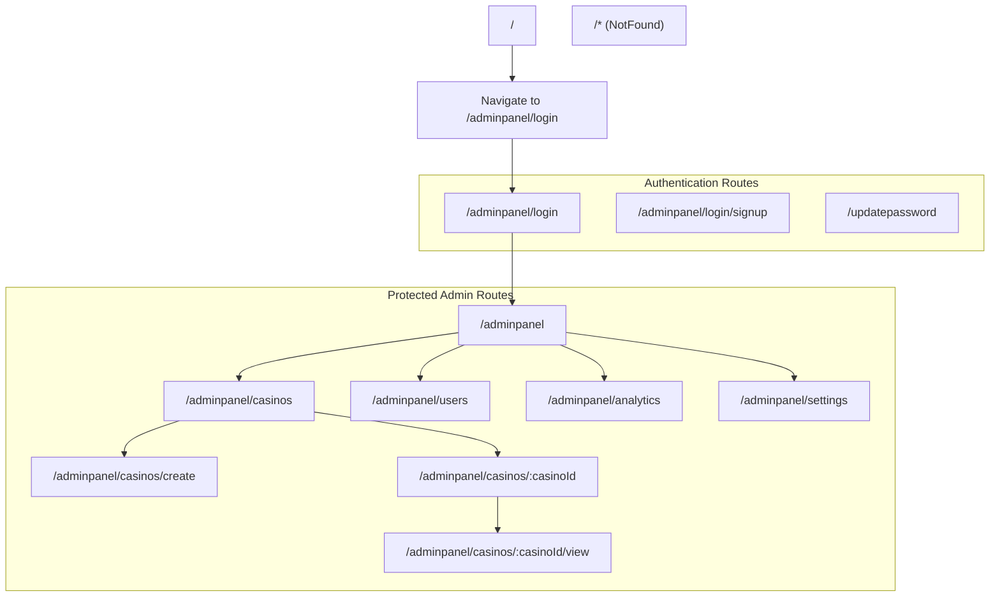
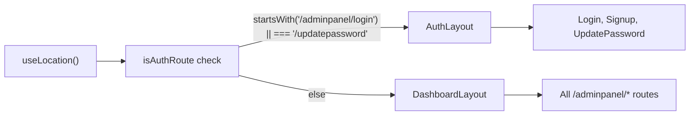
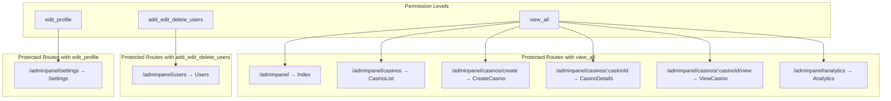
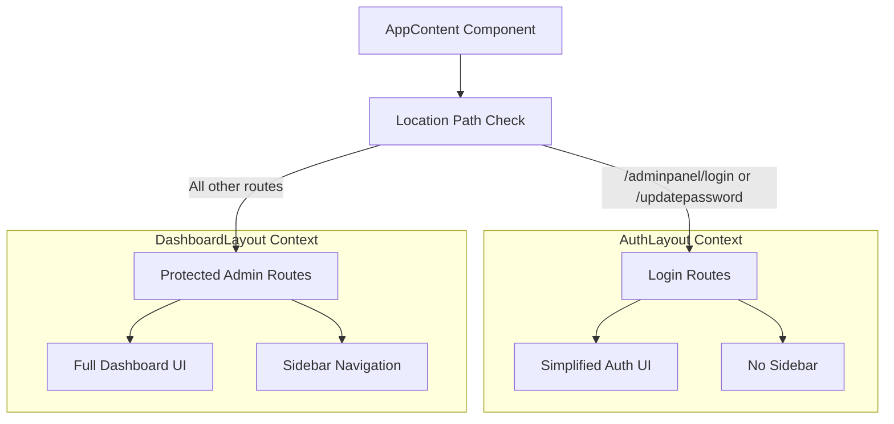
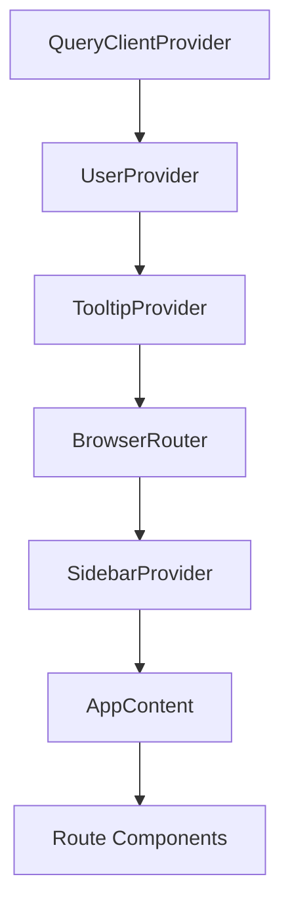

# Routing and Navigation

Relevant source files

The following files were used as context for generating this wiki page:

- [src/App.tsx](/src/App.tsx)

This document covers the routing and navigation system in the CasinoVizion administrative panel. It explains how React Router is configured, how routes are protected with permission-based access control, and how the layout system adapts based on the current route context.

For information about authentication flows and user management, see [Authentication System](./5_Authentication_System.md). For details about user permissions and role management, see [User Context and State Management](./13_User_Context_and_State_Management.md).

## Route Structure Overview

The application uses React Router with a hierarchical route structure that separates authentication routes from protected administrative routes. The routing logic is centralized in the main App component and uses different layouts based on the route context.

### Route Hierarchy

Sources: [src/App.tsx:62-108]()

### Layout Selection Logic

The application dynamically selects layouts based on the current route path using location-based conditional rendering:

Sources: [src/App.tsx:35-39]()

## Protected Routes and Permissions

All administrative routes are wrapped with the `ProtectedRoute` component that enforces permission-based access control. The system uses three main permission levels that correspond to different user roles.

### Permission-Based Route Protection

Sources: [src/App.tsx:66-105]()

### Route Protection Implementation

Each protected route follows this pattern where the `ProtectedRoute` component wraps the target page component:

| Route Path | Component | Required Permission |
|------------|-----------|-------------------|
| `/adminpanel` | `Index` | `view_all` |
| `/adminpanel/casinos` | `CasinoList` | `view_all` |
| `/adminpanel/casinos/create` | `CreateCasino` | `view_all` |
| `/adminpanel/casinos/:casinoId` | `CasinoDetails` | `view_all` |
| `/adminpanel/casinos/:casinoId/view` | `ViewCasino` | `view_all` |
| `/adminpanel/users` | `Users` | `add_edit_delete_users` |
| `/adminpanel/analytics` | `Analytics` | `view_all` |
| `/adminpanel/settings` | `Settings` | `edit_profile` |

Sources: [src/App.tsx:66-105]()

## Layout System Architecture

The application uses a dual-layout system that provides different UI structures for authentication and administrative contexts.

### Layout Component Selection

Sources: [src/App.tsx:35-39](), [src/App.tsx:25-27]()

## Route Configuration Details

### Environment-Based Redirects

The AWS Cognito OAuth configuration includes environment-specific redirect URLs that support both development and production environments:

- Development: `http://localhost:3000/adminpanel/login`
- Production: `${window.location.origin}/login`

Sources: [src/App.tsx:40-56]()

### Default Route Behavior

The root path (`/`) automatically redirects to `/adminpanel/login` using React Router's `Navigate` component with the `replace` prop to avoid adding unnecessary history entries.

Sources: [src/App.tsx:63]()

### Error Handling

All unmatched routes are handled by a catch-all route that renders the `NotFound` component, providing a consistent error experience.

Sources: [src/App.tsx:107]()

## Navigation Context and Providers

The routing system is wrapped within multiple context providers that enable global state management and UI functionality:

### Provider Hierarchy

This provider hierarchy ensures that routing components have access to user context, query capabilities, and UI state management throughout the application.

Sources: [src/App.tsx:113-127]()