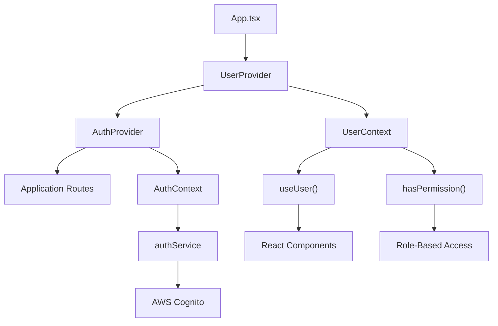
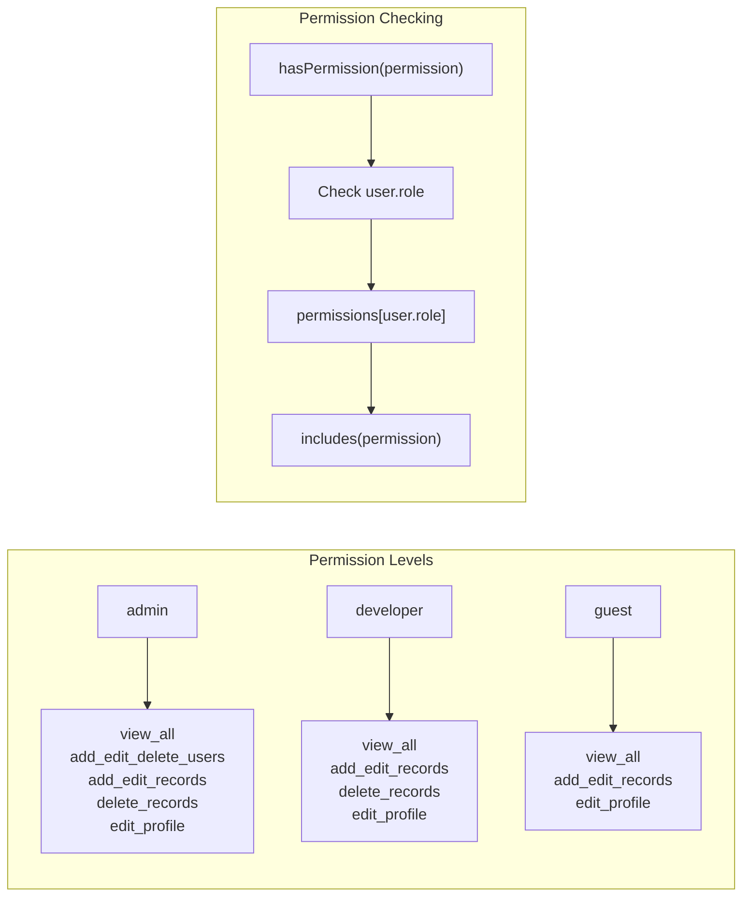
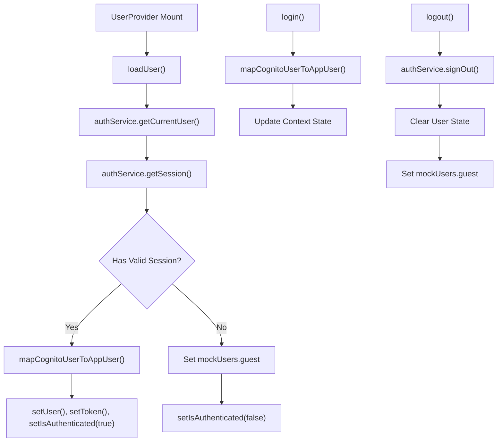
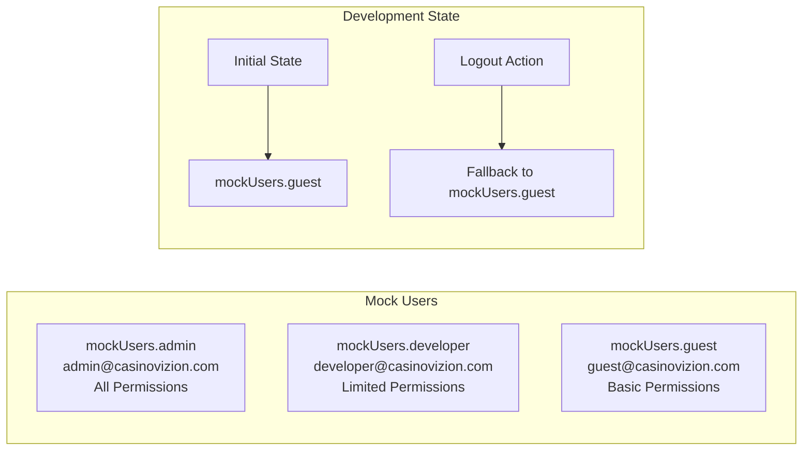
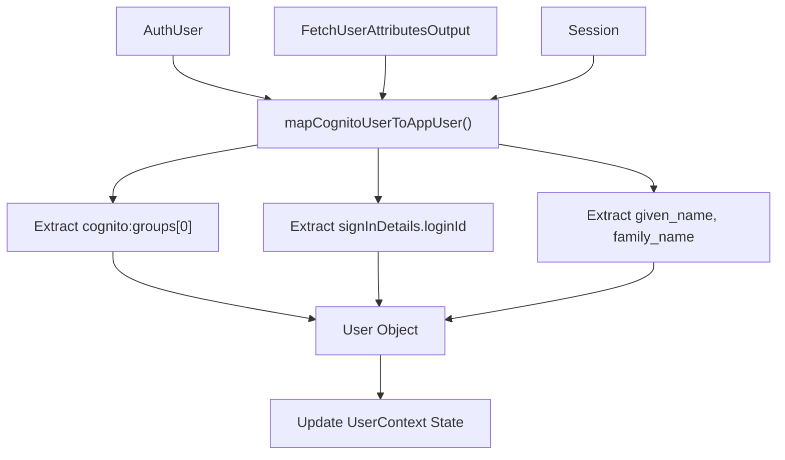

# User Context and State Management

<details>
<summary>Relevant source files</summary>

The following files were used as context for generating this wiki page:

- [src/contexts/AuthContext.tsx](/src/contexts/AuthContext.tsx)
- [src/contexts/UserContext.tsx](/src/contexts/UserContext.tsx)

</details>


## Purpose and Scope

This document covers the global user state management system in CasinoVizion, including user context providers, role-based permissions, and state synchronization with AWS Cognito. The system provides centralized user information, authentication status, and permission checking throughout the application.

For authentication flows and login/logout processes, see [Authentication System](./5_Authentication_System.md). For routing and protected route implementation, see [Routing and Navigation](./12_Routing_and_Navigation.md).

## User Context Architecture

The application uses React Context to manage global user state through two primary contexts: `UserContext` for user data and permissions, and `AuthContext` for authentication state.

### Context Structure



**Sources**: [src/contexts/UserContext.tsx:1-217](), [src/contexts/AuthContext.tsx:1-201]()

### User Interface and Types

The system defines specific TypeScript interfaces for user data and context operations:

| Interface | Purpose | Key Properties |
|-----------|---------|----------------|
| `User` | Core user data structure | `id`, `username`, `email`, `role`, `cognitoId` |
| `UserRole` | Permission levels | `'admin'`, `'developer'`, `'guest'` |
| `UserContextType` | Context operations | `login()`, `logout()`, `hasPermission()`, `validateToken()` |

**Sources**: [src/contexts/UserContext.tsx:5-31]()

## Permission System

The application implements a hierarchical role-based permission system with three distinct user roles, each with specific capabilities.

### Permission Matrix



**Sources**: [src/contexts/UserContext.tsx:155-165]()

### Permission Implementation

The `hasPermission` function provides granular access control:

```typescript
// Permission checking logic from UserContext
const hasPermission = (permission: string): boolean => {
  if (!user) return false;

  const permissions = {
    admin: ['view_all', 'add_edit_delete_users', 'add_edit_records', 'delete_records', 'edit_profile'],
    developer: ['view_all', 'add_edit_records', 'delete_records', 'edit_profile'],
    guest: ['view_all', 'add_edit_records', 'edit_profile']
  };

  return permissions[user.role]?.includes(permission) || false;
};
```

**Sources**: [src/contexts/UserContext.tsx:155-165]()

## State Management Lifecycle

The user context manages state transitions from initial load through authentication to logout, integrating with AWS Cognito for persistent sessions.

### Context State Flow



**Sources**: [src/contexts/UserContext.tsx:109-127](), [src/contexts/UserContext.tsx:129-136](), [src/contexts/UserContext.tsx:138-147]()

### Token Management

The system provides comprehensive token validation and refresh capabilities:

| Function | Purpose | Implementation |
|----------|---------|----------------|
| `validateToken()` | Check token expiration | Compare `exp` claim with current time |
| `refreshToken()` | Renew authentication token | Call `authService.refreshSession()` |
| `getSession()` | Retrieve current session | AWS Amplify session management |

**Sources**: [src/contexts/UserContext.tsx:175-186](), [src/contexts/UserContext.tsx:167-173]()

## Mock Users and Development

The system includes predefined mock users for development and testing purposes, allowing developers to simulate different permission levels.

### Mock User Configuration



**Sources**: [src/contexts/UserContext.tsx:51-80](), [src/contexts/UserContext.tsx:83](), [src/contexts/UserContext.tsx:141]()

## Integration with AWS Cognito

The user context integrates with AWS Cognito through the `authService`, mapping Cognito user data to the application's user model.

### Cognito User Mapping

The `mapCognitoUserToAppUser` function transforms AWS Cognito user data into the application's `User` interface:



**Sources**: [src/contexts/UserContext.tsx:88-107]()

### Context Provider Integration

The system uses the provider pattern to make user state available throughout the component tree:

| Hook | Purpose | Usage |
|------|---------|-------|
| `useUser()` | Access user context | Primary hook for components needing user data |
| `UserProvider` | Context provider | Wraps application to provide user state |
| Error Boundary | Context validation | Throws error if `useUser()` used outside provider |

**Sources**: [src/contexts/UserContext.tsx:211-217](), [src/contexts/UserContext.tsx:82-208]()