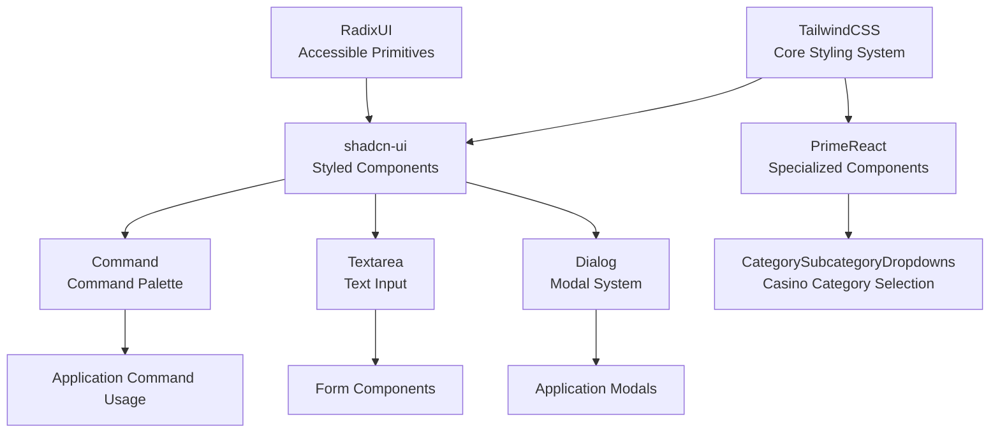
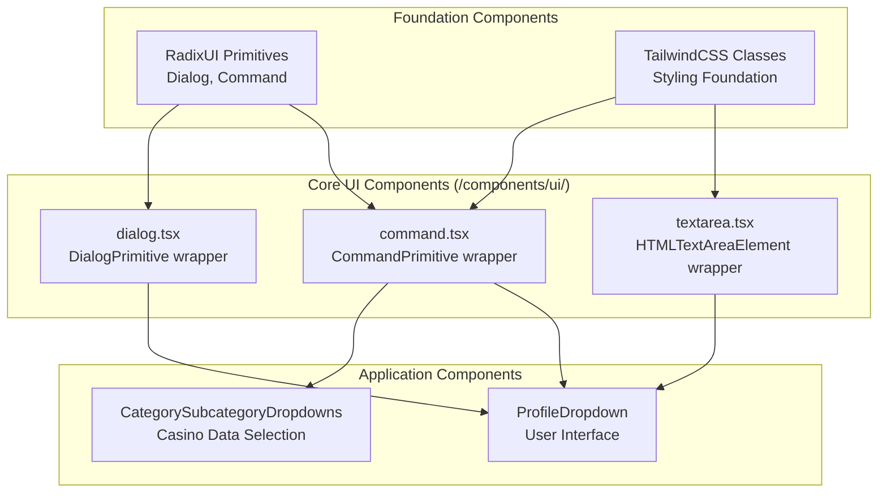
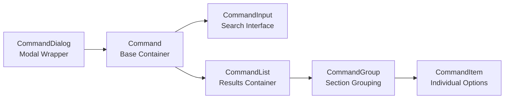
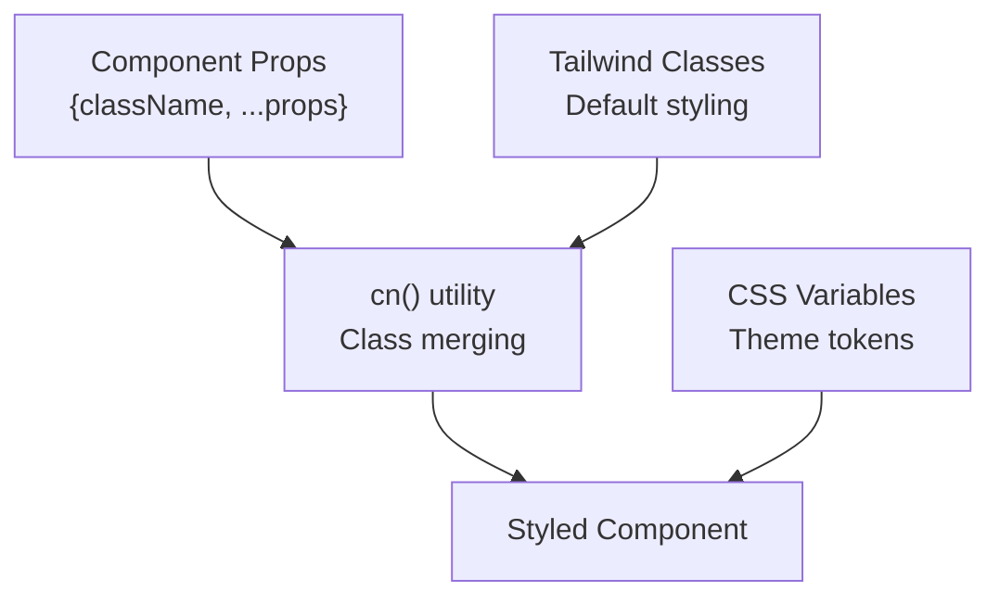

# User Interface Components

<details>
<summary>Relevant source files</summary>

The following files were used as context for generating this wiki page:

- [src/components/ui/command.tsx](/src/components/ui/command.tsx)
- [src/components/ui/textarea.tsx](/src/components/ui/textarea.tsx)
- [tailwind.config.ts](/tailwind.config.ts)

</details>


This document covers the user interface component architecture for the CasinoVizion administrative panel. It details the foundation libraries, component organization patterns, and core UI building blocks that provide the visual interface for casino management operations.

The UI system combines multiple libraries including Tailwind CSS for styling, shadcn-ui components built on Radix UI primitives, and PrimeReact components for specialized functionality. For detailed styling configuration, see [Design System](./15_Design_System.md). For information about higher-level application-specific components, see [Application Components](./17_Application_Components.md).

## UI Foundation Architecture

The component system is built on a layered architecture where each layer provides specific capabilities to the layers above it.

### Foundation Layer Architecture



**Sources:** [tailwind.config.ts:1-128](), [src/components/ui/command.tsx:1-155](), [src/components/ui/textarea.tsx:1-23]()

## Component Organization

The UI components are organized into distinct categories based on their abstraction level and usage patterns.

### Component Hierarchy



**Sources:** [src/components/ui/command.tsx:9-22](), [src/components/ui/textarea.tsx:7-20]()

## Core UI Components

The core UI components provide the fundamental building blocks for the application interface. These components follow consistent patterns for styling, accessibility, and prop forwarding.

### Command Component System

The `Command` component provides a command palette interface built on the `cmdk` library with Radix UI Dialog integration.

| Component | Purpose | Key Features |
|-----------|---------|--------------|
| `Command` | Base command container | Keyboard navigation, search filtering |
| `CommandDialog` | Modal command interface | Dialog wrapper with custom styling |
| `CommandInput` | Search input with icon | Search icon, placeholder styling |
| `CommandList` | Scrollable results container | Max height constraints, overflow handling |
| `CommandItem` | Individual command option | Selection states, keyboard navigation |
| `CommandGroup` | Grouped command sections | Section headers, visual separation |



**Sources:** [src/components/ui/command.tsx:9-155]()

### Form Input Components

The `Textarea` component provides a styled text input area with consistent theming and accessibility features.

**Component Props:**
- Extends `React.TextareaHTMLAttributes<HTMLTextAreaElement>`
- Supports `className` override for custom styling
- Implements `forwardRef` for proper ref handling

**Styling Features:**
- Minimum height of 80px
- Rounded borders with focus ring
- Disabled state styling
- Placeholder text styling

**Sources:** [src/components/ui/textarea.tsx:7-20]()

## Design Token System

The Tailwind configuration defines a comprehensive design token system that provides consistent styling across all components.

### Color Palette

| Color Group | Purpose | CSS Variable Pattern |
|-------------|---------|---------------------|
| `border`, `input`, `ring` | Interactive element styling | `hsl(var(--{name}))` |
| `background`, `foreground` | Base surface colors | `hsl(var(--{name}))` |
| `primary`, `secondary` | Brand color variants | `hsl(var(--{name}))` with foreground |
| `muted`, `accent` | Supporting colors | `hsl(var(--{name}))` with foreground |
| `destructive` | Error/warning states | `hsl(var(--{name}))` with foreground |

### Brand-Specific Colors

The application defines custom color palettes for the casino domain:

- **Navy palette** (`navy`): Primary brand color with 9 shade variants (50-900)
- **Maroon palette** (`maroon`): Secondary brand color with 9 shade variants
- **Casino colors**: `casino.green` (#1A5935) and `casino.gold` (#E0B100)

**Sources:** [tailwind.config.ts:22-96]()

## Component Integration Patterns

Components in the system follow consistent patterns for composition, styling, and prop forwarding.

### Styling Integration Pattern



All core UI components use the `cn()` utility function to merge default Tailwind classes with optional `className` overrides, enabling consistent styling while allowing customization.

### Ref Forwarding Pattern

Components implement `React.forwardRef` to properly forward refs to underlying DOM elements:

```typescript
const Textarea = React.forwardRef<HTMLTextAreaElement, TextareaProps>(
  ({ className, ...props }, ref) => { /* implementation */ }
)
```

This pattern ensures compatibility with form libraries and direct DOM manipulation when needed.

**Sources:** [src/components/ui/textarea.tsx:7-20](), [src/components/ui/command.tsx:9-22]()

## Animation and Interaction System

The Tailwind configuration includes custom keyframe animations for interactive components:

- **Accordion animations**: `accordion-down` and `accordion-up` with 0.2s ease-out timing
- **Focus ring animations**: Implemented via `ring-offset-background` and `focus-visible` utilities
- **Hover states**: Applied through Tailwind's hover state modifiers

These animations provide smooth transitions for expandable content and focus indicators throughout the application interface.

**Sources:** [tailwind.config.ts:103-124]()