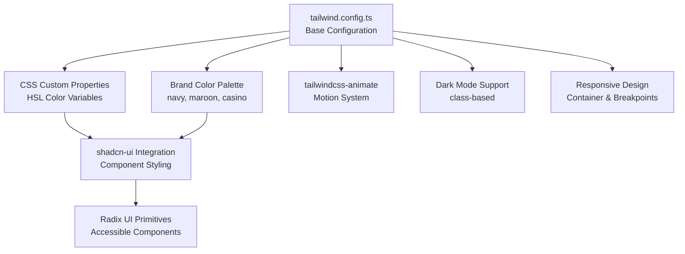
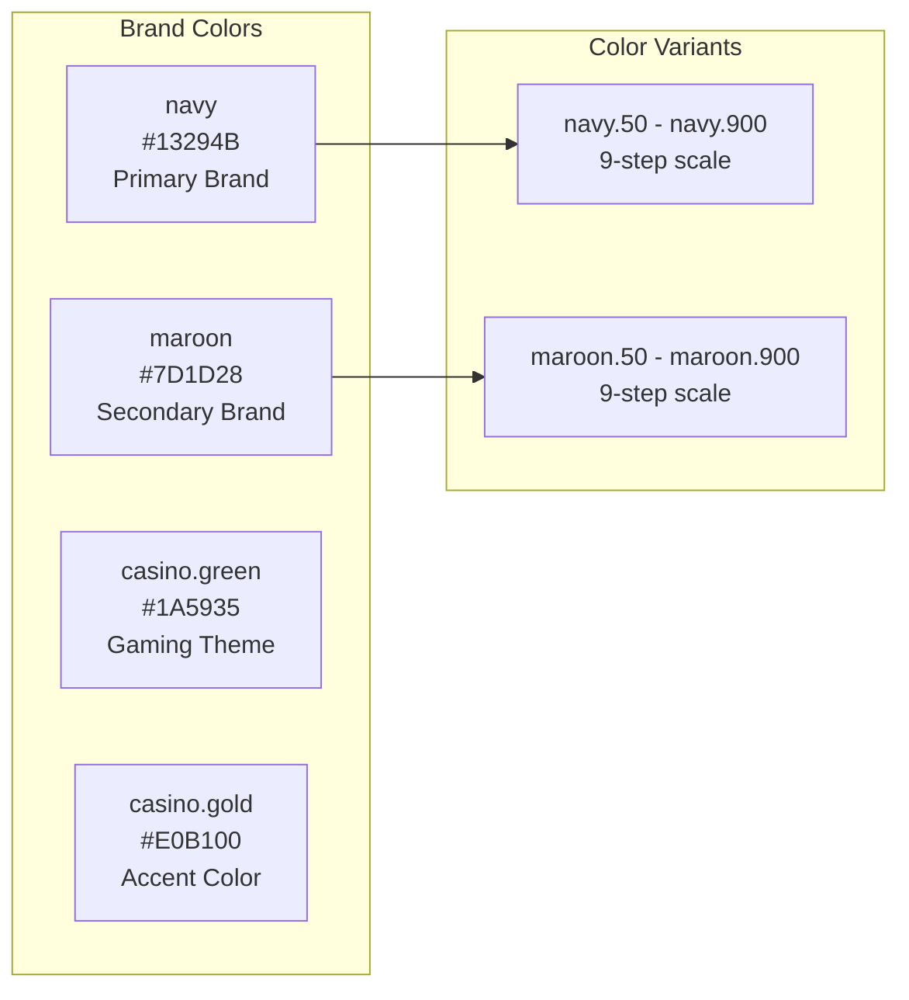
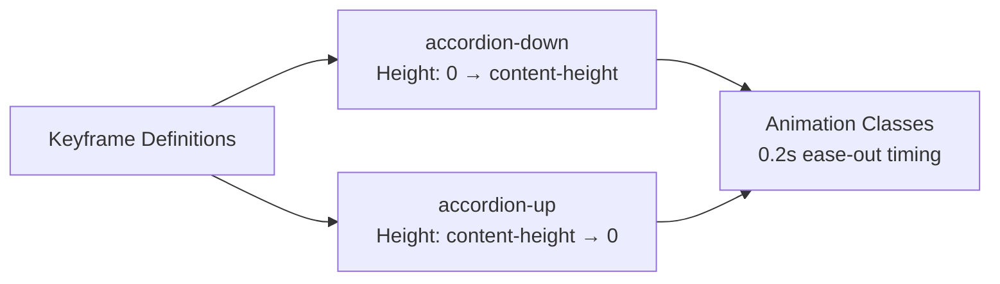

# Design System

<details>
<summary>Relevant source files</summary>

The following files were used as context for generating this wiki page:

- [tailwind.config.ts](/tailwind.config.ts)

</details>


This document covers the design system implementation for the CasinoVizion administrative panel, including color palette, typography, spacing, and styling architecture built on Tailwind CSS. The design system provides the foundation for all UI components and visual consistency across the application.

For information about specific UI components that implement this design system, see [Core UI Components](./16_Core_UI_Components.md) and [Application Components](./17_Application_Components.md).

## Design System Architecture

The design system is built using a layered approach that combines multiple styling technologies to provide flexibility and maintainability.



Sources: [tailwind.config.ts:1-128]()

## Color System

The design system implements a comprehensive color palette using CSS custom properties for theme consistency and dark mode support.

### Semantic Color Tokens

The color system uses semantic naming conventions that map to HSL-based CSS custom properties:

| Token Category | Purpose | CSS Variable Pattern |
|----------------|---------|---------------------|
| `border` | Element borders | `hsl(var(--border))` |
| `input` | Form input styling | `hsl(var(--input))` |
| `ring` | Focus indicators | `hsl(var(--ring))` |
| `background` | Page backgrounds | `hsl(var(--background))` |
| `foreground` | Text colors | `hsl(var(--foreground))` |

### Brand Color Palette

The design system includes custom brand colors specific to the CasinoVizion application:



Sources: [tailwind.config.ts:67-96]()

### Component Color System

The design system defines color tokens for specific component types:

| Component Type | Color Tokens | Usage |
|----------------|--------------|-------|
| `primary` | DEFAULT, foreground | Primary actions, links |
| `secondary` | DEFAULT, foreground | Secondary actions |
| `destructive` | DEFAULT, foreground | Error states, delete actions |
| `muted` | DEFAULT, foreground | Disabled states, subtle text |
| `accent` | DEFAULT, foreground | Highlights, emphasis |
| `card` | DEFAULT, foreground | Card components |
| `popover` | DEFAULT, foreground | Overlay components |
| `sidebar` | Multiple variants | Navigation components |

Sources: [tailwind.config.ts:28-65]()

## Dark Mode Implementation

The design system supports dark mode through a class-based approach configured in the Tailwind configuration:

```typescript
darkMode: ["class"]
```

This enables dark mode toggling by adding/removing a `dark` class to the document root, allowing for programmatic theme switching.

Sources: [tailwind.config.ts:5]()

## Responsive Design System

### Container Configuration

The design system implements a responsive container system with center alignment and responsive padding:

```typescript
container: {
    center: true,
    padding: '2rem',
    screens: {
        '2xl': '1400px'
    }
}
```

This provides:
- Automatic centering of container content
- Consistent 2rem padding on all screen sizes
- Custom breakpoint at 1400px for extra-large screens

Sources: [tailwind.config.ts:14-20]()

### Content Source Configuration

The Tailwind configuration includes comprehensive content scanning for all relevant file types:

- `./pages/**/*.{ts,tsx}` - Page components
- `./components/**/*.{ts,tsx}` - Reusable components  
- `./app/**/*.{ts,tsx}` - App-level components
- `./src/**/*.{ts,tsx}` - Source directory files

Sources: [tailwind.config.ts:6-11]()

## Border Radius System

The design system implements a CSS custom property-based border radius system:

| Size | Value | Usage |
|------|-------|-------|
| `lg` | `var(--radius)` | Large components, cards |
| `md` | `calc(var(--radius) - 2px)` | Medium components, buttons |
| `sm` | `calc(var(--radius) - 4px)` | Small components, inputs |

This approach allows for consistent border radius scaling while maintaining customization through CSS variables.

Sources: [tailwind.config.ts:98-102]()

## Animation System

The design system includes custom animations for interactive components, specifically accordion-style expand/collapse animations:



The animations use Radix UI's accordion content height variables for smooth transitions:
- `--radix-accordion-content-height` for dynamic height calculations
- 0.2 second duration with ease-out timing
- Integrated through the `tailwindcss-animate` plugin

Sources: [tailwind.config.ts:103-124](), [tailwind.config.ts:127]()

## Plugin Integration

The design system integrates with the `tailwindcss-animate` plugin to provide additional animation utilities and smooth transitions for component interactions.

Sources: [tailwind.config.ts:2](), [tailwind.config.ts:127]()