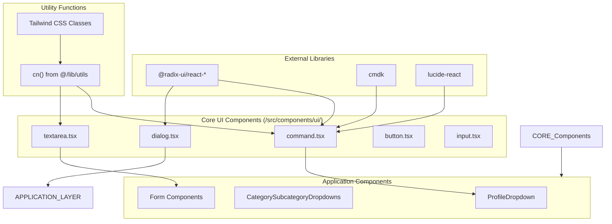
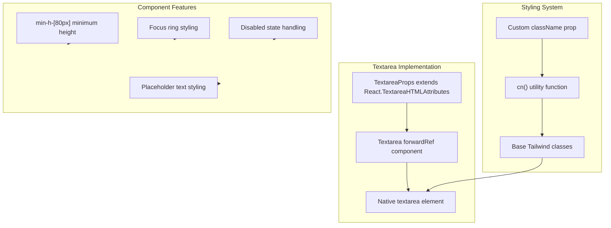

# Core UI Components

Relevant source files

The following files were used as context for generating this wiki page:

- [src/components/ui/command.tsx](/src/components/ui/command.tsx)
- [src/components/ui/textarea.tsx](/src/components/ui/textarea.tsx)

This document covers the foundational UI components that serve as building blocks for the CasinoVizion administrative panel. These components provide consistent, accessible interfaces built on top of Radix UI primitives and styled with Tailwind CSS. For information about the overall design system and styling configuration, see [Design System](./15_Design_System.md). For higher-level application-specific components, see [Application Components](./17_Application_Components.md).

## Component Architecture Overview

The core UI components are organized into a systematic hierarchy where primitive components are enhanced with consistent styling and behavior patterns. These components form the foundation that application-specific components build upon.

### Component System Structure

Sources: [src/components/ui/command.tsx:1-155](), [src/components/ui/textarea.tsx:1-23]()

## Command Palette System

The Command component provides a powerful search and navigation interface built on the `cmdk` library with Radix UI integration. This component system enables quick access to application features through keyboard-driven interaction.

### Command Component Structure

```mermaid
graph TD
    subgraph "CommandPrimitive_Layer" ["CommandPrimitive from cmdk"]
        CMD_ROOT["CommandPrimitive"]
        CMD_INPUT["CommandPrimitive.Input"]
        CMD_LIST["CommandPrimitive.List"]
        CMD_EMPTY["CommandPrimitive.Empty"]
        CMD_GROUP["CommandPrimitive.Group"]
        CMD_ITEM["CommandPrimitive.Item"]
        CMD_SEPARATOR["CommandPrimitive.Separator"]
    end
    
    subgraph "Custom_Wrapper_Components" ["Custom Wrapper Components"]
        COMMAND["Command"]
        COMMAND_DIALOG["CommandDialog"]
        COMMAND_INPUT["CommandInput"]
        COMMAND_LIST["CommandList"]
        COMMAND_EMPTY["CommandEmpty"]
        COMMAND_GROUP["CommandGroup"]
        COMMAND_ITEM["CommandItem"]
        COMMAND_SHORTCUT["CommandShortcut"]
        COMMAND_SEPARATOR["CommandSeparator"]
    end
    
    subgraph "Dialog_Integration" ["Dialog Integration"]
        DIALOG["Dialog from @/components/ui/dialog"]
        DIALOG_CONTENT["DialogContent"]
    end
    
    CMD_ROOT --> COMMAND
    CMD_INPUT --> COMMAND_INPUT
    CMD_LIST --> COMMAND_LIST
    CMD_EMPTY --> COMMAND_EMPTY
    CMD_GROUP --> COMMAND_GROUP
    CMD_ITEM --> COMMAND_ITEM
    CMD_SEPARATOR --> COMMAND_SEPARATOR
    
    COMMAND_DIALOG --> DIALOG
    COMMAND_DIALOG --> DIALOG_CONTENT
    COMMAND_DIALOG --> COMMAND
    
    COMMAND_INPUT -.-> Search_Icon["Search from lucide-react"]
```

Sources: [src/components/ui/command.tsx:9-155]()

### Component Specifications

| Component | Purpose | Key Props | Styling Features |
|-----------|---------|-----------|------------------|
| `Command` | Root container | `className` | Flexbox layout, overflow handling, popover styling |
| `CommandDialog` | Modal wrapper | `children`, `DialogProps` | Shadow, padding reset, specialized group styling |
| `CommandInput` | Search input | `CommandPrimitive.Input` props | Search icon, border bottom, transparent background |
| `CommandList` | Results container | `className` | Max height 300px, scroll management |
| `CommandEmpty` | No results state | `CommandPrimitive.Empty` props | Centered text, padding |
| `CommandGroup` | Grouped results | `className` | Heading styles, text hierarchy |
| `CommandItem` | Individual result | `className` | Interactive states, accent colors |
| `CommandShortcut` | Keyboard hint | `HTMLAttributes<HTMLSpanElement>` | Muted text, auto-alignment |

Sources: [src/components/ui/command.tsx:24-143]()

### Key Implementation Details

The Command system implements several sophisticated patterns:

**ForwardRef Pattern**: All components use `React.forwardRef` for proper ref forwarding [src/components/ui/command.tsx:9-21]()

**Conditional Styling**: `CommandDialog` applies extensive conditional CSS classes for different command states [src/components/ui/command.tsx:32-33]()

**Accessibility Integration**: Components maintain Radix UI's built-in accessibility features while adding custom styling [src/components/ui/command.tsx:119-121]()

## Form Input Components

### Textarea Component

The Textarea component provides a consistent multi-line text input interface with proper focus management and accessibility features.

Sources: [src/components/ui/textarea.tsx:5-21]()

### Component Configuration

The Textarea component implements a comprehensive styling system:

**Base Styling** [src/components/ui/textarea.tsx:11-13]():
- Minimum height of 80px for adequate content space
- Full width with rounded borders
- Background and text color coordination

**Interactive States** [src/components/ui/textarea.tsx:12-13]():
- Focus ring with 2px thickness and offset
- Disabled state with reduced opacity and cursor changes
- Placeholder text with muted foreground color

**Type Safety**: Uses proper TypeScript integration extending native textarea attributes [src/components/ui/textarea.tsx:5]()

## Integration Patterns

### Common Usage Patterns

Both components follow consistent patterns for integration within the application:

**Utility Integration**: All components use the `cn()` utility function for conditional class merging [src/components/ui/command.tsx:6](), [src/components/ui/textarea.tsx:3]()

**Ref Forwarding**: Components properly forward refs for parent component access [src/components/ui/command.tsx:9](), [src/components/ui/textarea.tsx:7]()

**Props Spreading**: Maintain compatibility with native HTML attributes while adding custom functionality [src/components/ui/command.tsx:19](), [src/components/ui/textarea.tsx:16]()

### Export Strategy

Components are exported using named exports to maintain tree-shaking capabilities and clear import patterns [src/components/ui/command.tsx:145-155](), [src/components/ui/textarea.tsx:23]()

Sources: [src/components/ui/command.tsx:1-155](), [src/components/ui/textarea.tsx:1-23]()