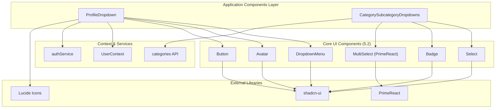
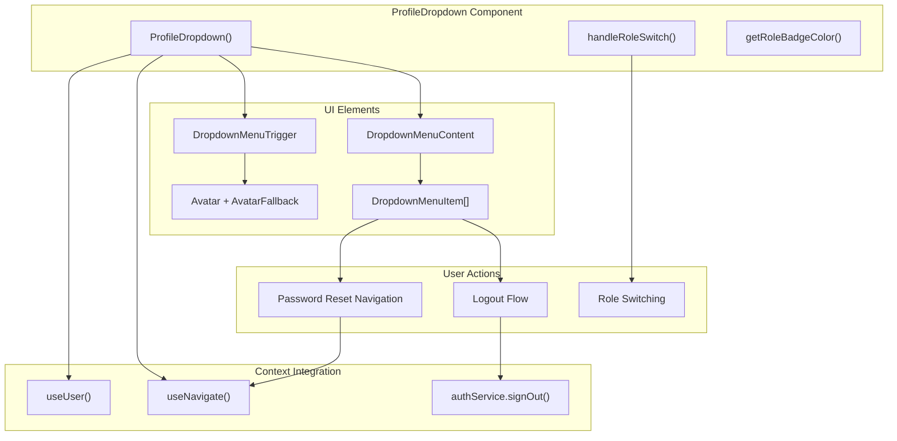
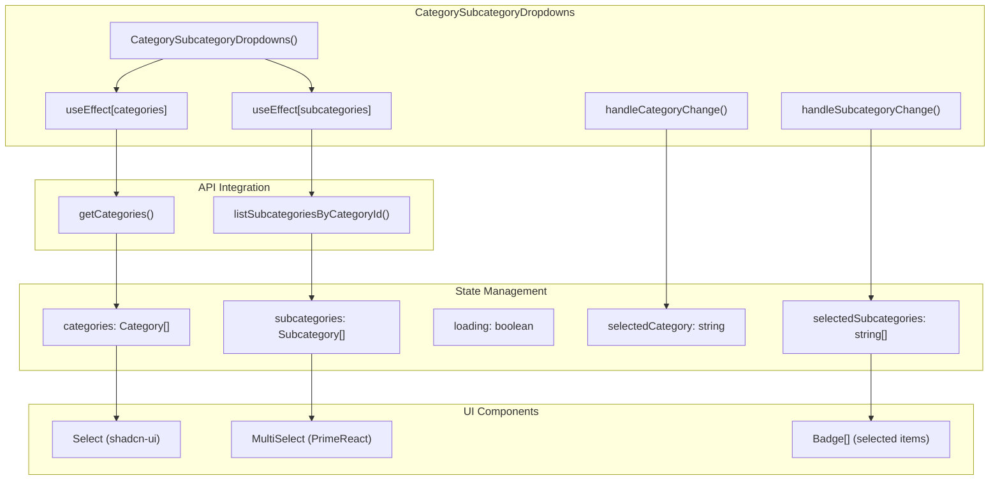
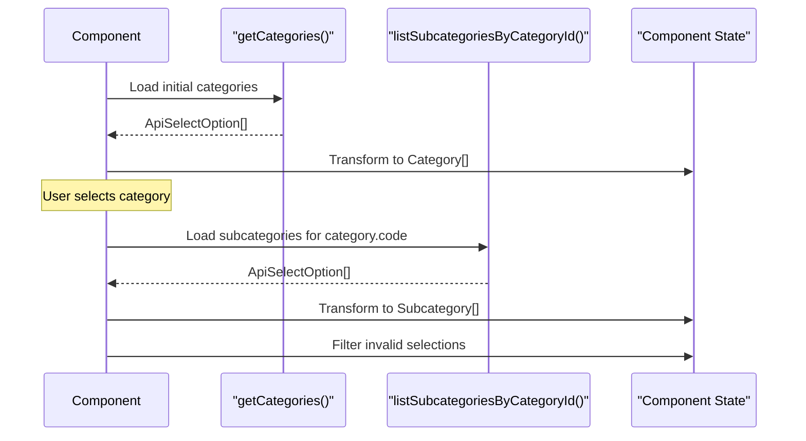
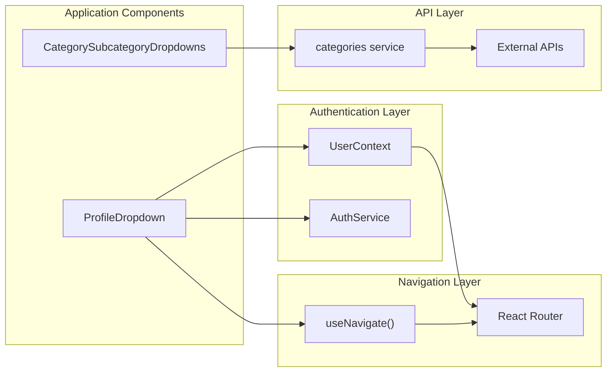

# Application Components

Relevant source files

The following files were used as context for generating this wiki page:

- [src/components/CategorySubcategoryDropdowns.tsx](/src/components/CategorySubcategoryDropdowns.tsx)
- [src/components/ProfileDropdown.tsx](/src/components/ProfileDropdown.tsx)

This document covers the higher-level application components that provide business-specific functionality within the CasinoVizion administrative panel. These components integrate with the authentication system, external APIs, and user interface libraries to deliver specialized features like user profile management and category selection. For information about foundational UI components, see [Core UI Components](./16_Core_UI_Components.md). For details about the overall design system, see [Design System](./15_Design_System.md).

## Component Overview

The application layer components serve as intermediate abstractions between the core UI components and the business logic. They encapsulate complex interactions, state management, and API integrations while maintaining reusability across different pages.

**Sources:** [src/components/ProfileDropdown.tsx:1-121](), [src/components/CategorySubcategoryDropdowns.tsx:1-315]()

## ProfileDropdown Component

The `ProfileDropdown` component provides a comprehensive user profile interface accessible from the application header. It displays user information, role badges, and provides navigation to account management functions.

### Component Structure and Dependencies

**Sources:** [src/components/ProfileDropdown.tsx:17-33](), [src/components/ProfileDropdown.tsx:35-42](), [src/components/ProfileDropdown.tsx:44-118]()

### Role Management System

The component implements a role-based access control system with visual indicators and switching capabilities:

| Role | Badge Color | Access Level |
|------|-------------|--------------|
| `admin` | `bg-red-100 text-red-800` | Full system access with role switching |
| `developer` | `bg-blue-100 text-blue-800` | Development environment access |
| `guest` | `bg-gray-100 text-gray-800` | Limited read-only access |

The role switching functionality is implemented through `handleRoleSwitch()` which currently uses a mock implementation with `window.location.reload()` for demonstration purposes.

**Sources:** [src/components/ProfileDropdown.tsx:23-33](), [src/components/ProfileDropdown.tsx:35-42](), [src/components/ProfileDropdown.tsx:78-97]()

### User Interface Features

The dropdown provides several key interface elements:

- **User Avatar**: Displays user image or initials fallback using [src/components/ProfileDropdown.tsx:48-53]()
- **User Information**: Shows username, email, and role badge using [src/components/ProfileDropdown.tsx:58-74]()
- **Role Switching Menu**: Available only for admin users using [src/components/ProfileDropdown.tsx:78-97]()
- **Settings Navigation**: Links to password reset functionality using [src/components/ProfileDropdown.tsx:100-106]()
- **Logout Action**: Calls `authService.signOut()` and redirects using [src/components/ProfileDropdown.tsx:107-115]()

**Sources:** [src/components/ProfileDropdown.tsx:44-118]()

## CategorySubcategoryDropdowns Component

The `CategorySubcategoryDropdowns` component manages hierarchical category and subcategory selection for casino management. It integrates with external APIs and provides a sophisticated multi-selection interface.

### Component Architecture and Data Flow

**Sources:** [src/components/CategorySubcategoryDropdowns.tsx:35-41](), [src/components/CategorySubcategoryDropdowns.tsx:47-63](), [src/components/CategorySubcategoryDropdowns.tsx:66-112]()

### API Integration Pattern

The component demonstrates a sophisticated API integration pattern with error handling and data transformation:

The data transformation process converts API responses from `ApiSelectOption` format to typed interfaces:

- **Category Interface**: `{ name: string, code: string }` using [src/components/CategorySubcategoryDropdowns.tsx:17-20]()
- **Subcategory Interface**: `{ name: string, code: string }` using [src/components/CategorySubcategoryDropdowns.tsx:22-25]()
- **API Response**: `{ key: string | number, value: string }` using [src/components/CategorySubcategoryDropdowns.tsx:12-15]()

**Sources:** [src/components/CategorySubcategoryDropdowns.tsx:48-62](), [src/components/CategorySubcategoryDropdowns.tsx:66-112]()

### Multi-Selection UI Implementation

The component uses PrimeReact's `MultiSelect` with extensive customization through the `pt` (passthrough) prop system:

| UI Element | Styling Configuration |
|------------|----------------------|
| Root Container | `width: 90%, minHeight: 50px` |
| Input Field | `padding: 10px, fontSize: 10px, border: none` |
| Dropdown Panel | `backgroundColor: white, borderRadius: 8px, maxHeight: 150px` |
| Selection Items | `padding: 12px, fontSize: 14px, borderBottom: 1px solid #f3f4f6` |
| Filter Input | `padding: 8px 12px, border: 1px solid #d1d5db` |

The selected items are displayed as badges with a responsive design that shows individual badges for small selections and a "+N more" indicator for larger selections.

**Sources:** [src/components/CategorySubcategoryDropdowns.tsx:192-281](), [src/components/CategorySubcategoryDropdowns.tsx:285-302]()

## Component Integration Patterns

### Context and Service Dependencies

Both application components follow consistent patterns for integrating with the broader application architecture:

**Sources:** [src/components/ProfileDropdown.tsx:13-19](), [src/components/CategorySubcategoryDropdowns.tsx:6-6]()

### Event Handling and State Propagation

The components implement controlled component patterns with callback-based state management:

- **ProfileDropdown**: Uses `useUser()` hook for global state and local event handlers for UI interactions
- **CategorySubcategoryDropdowns**: Accepts `onCategoryChange` and `onSubcategoriesChange` callbacks for parent component integration

**Sources:** [src/components/ProfileDropdown.tsx:18-18](), [src/components/CategorySubcategoryDropdowns.tsx:27-33](), [src/components/CategorySubcategoryDropdowns.tsx:114-124]()