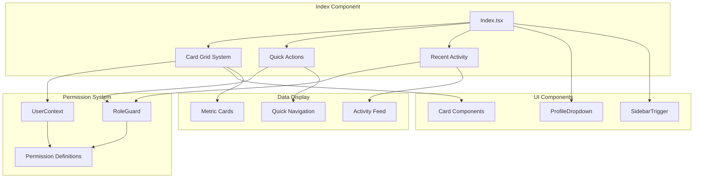
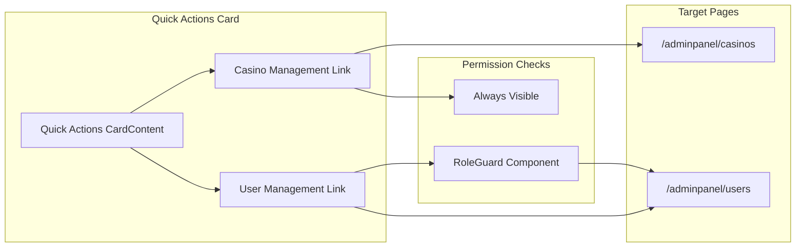
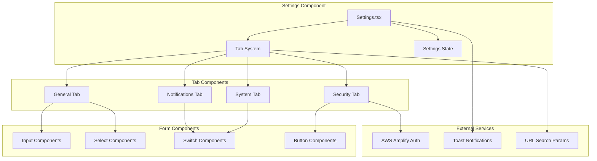
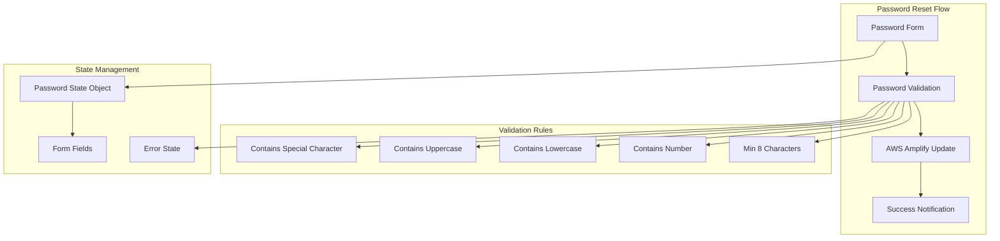
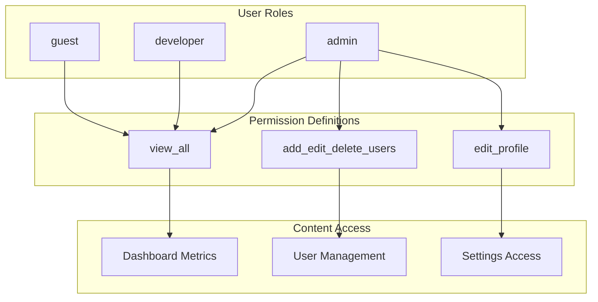

# Dashboard and Administration

Relevant source files

The following files were used as context for generating this wiki page:

- [src/pages/Index.tsx](/src/pages/Index.tsx)
- [src/pages/settings/Settings.tsx](/src/pages/settings/Settings.tsx)

This document covers the main administrative interface of the CasinoVizion system, including the dashboard overview page and system settings management. The dashboard provides role-based summary metrics and quick access to primary functions, while the settings system handles system configuration, user preferences, and administrative controls.

For authentication-related user management, see [Authentication System](./5_Authentication_System.md). For specific casino management functionality, see [Casino Management](./22_Casino_Management.md). For UI components used throughout these interfaces, see [User Interface Components](./14_User_Interface_Components.md).

## Dashboard Overview

The main dashboard serves as the primary landing page for authenticated users, providing a role-based overview of system metrics and quick access to key functionality.

### Dashboard Architecture

Sources: [src/pages/Index.tsx:1-218]()

### Role-Based Card System

The dashboard displays different metric cards based on user permissions. The system defines cards with associated permissions and filters them based on the current user's role.

| Card Type | Metric | Permission Required | Available Roles |
|-----------|--------|-------------------|-----------------|
| Total Casinos | Building count | `view_all` | admin, developer, guest |
| Total Hotels | Hotel count | `view_all` | admin, developer, guest |
| Total Restaurants | Restaurant count | `view_all` | admin, developer, guest |
| Active Customers | User count | `add_edit_delete_users` | admin only |

The permission filtering logic is implemented in [src/pages/Index.tsx:77-86](), where cards are filtered based on role-specific permission arrays.

### Quick Actions System

The dashboard provides contextual quick actions that adapt to user permissions:

Sources: [src/pages/Index.tsx:148-176]()

## Settings Management

The settings system provides a comprehensive interface for system configuration, security settings, notifications, and administrative controls through a tabbed interface.

### Settings Architecture

Sources: [src/pages/settings/Settings.tsx:1-387]()

### Settings Categories

#### General Settings
Manages basic system configuration including company information, timezone, and currency settings. The general tab includes:

- Company logo upload functionality
- Company name configuration [src/pages/settings/Settings.tsx:169-175]()
- Admin email settings [src/pages/settings/Settings.tsx:177-185]()
- Timezone selection from predefined options [src/pages/settings/Settings.tsx:189-202]()
- Default currency configuration [src/pages/settings/Settings.tsx:204-218]()

#### Security Settings
Handles password management with comprehensive validation:

The password validation function [src/pages/settings/Settings.tsx:57-86]() enforces security requirements and provides specific error messages for each failed rule.

Sources: [src/pages/settings/Settings.tsx:40-109]()

#### Notification Settings
Configures system notification preferences:

- Push notifications toggle [src/pages/settings/Settings.tsx:296-305]()
- Email alerts configuration [src/pages/settings/Settings.tsx:307-316]()
- Email frequency selection [src/pages/settings/Settings.tsx:318-331]()

#### System Settings
Provides administrative controls for system-wide settings:

- Maintenance mode toggle [src/pages/settings/Settings.tsx:344-353]()
- Data backup controls [src/pages/settings/Settings.tsx:355-361]()
- API rate limiting configuration [src/pages/settings/Settings.tsx:363-376]()

### URL-Based Tab Navigation

The settings system supports deep linking to specific tabs through URL search parameters [src/pages/settings/Settings.tsx:17-23](), allowing direct navigation to specific configuration sections.

## Permission-Based Content Display

Both dashboard and administrative interfaces implement role-based content filtering through the permission system:

Sources: [src/pages/Index.tsx:80-85]()

## Integration Points

The dashboard and administration system integrates with several other system components:

- **User Context**: Provides current user information and role-based permissions [src/pages/Index.tsx:11]()
- **Profile Dropdown**: Accessible from dashboard header for account management [src/pages/Index.tsx:109]()
- **AWS Amplify**: Handles password updates in security settings [src/pages/settings/Settings.tsx:14]()
- **Toast System**: Provides user feedback for settings changes [src/pages/settings/Settings.tsx:13]()
- **React Router**: Enables navigation between dashboard sections and external pages [src/pages/Index.tsx:5]()

Sources: [src/pages/Index.tsx:1-218](), [src/pages/settings/Settings.tsx:1-387]()