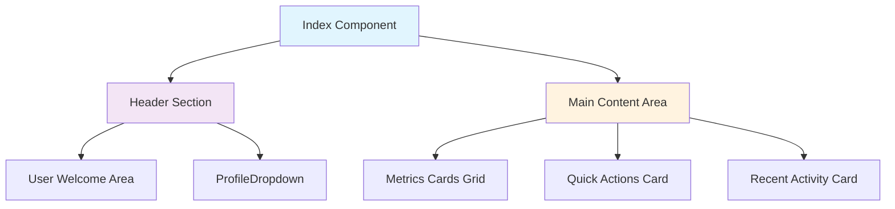
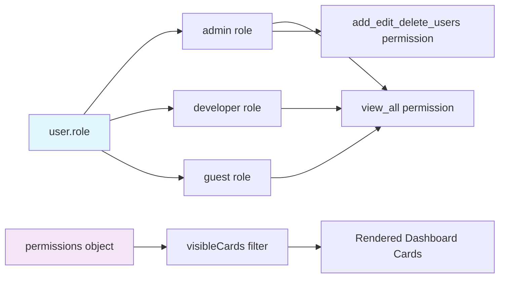
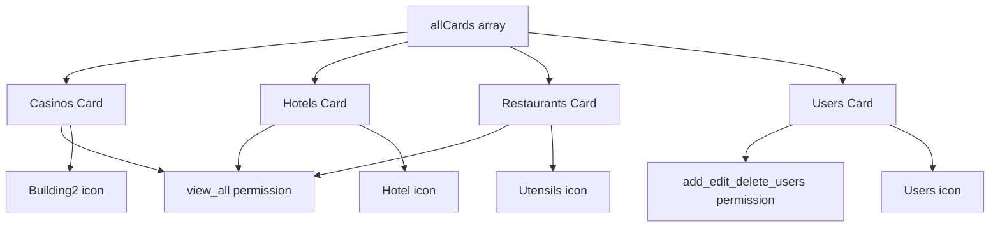
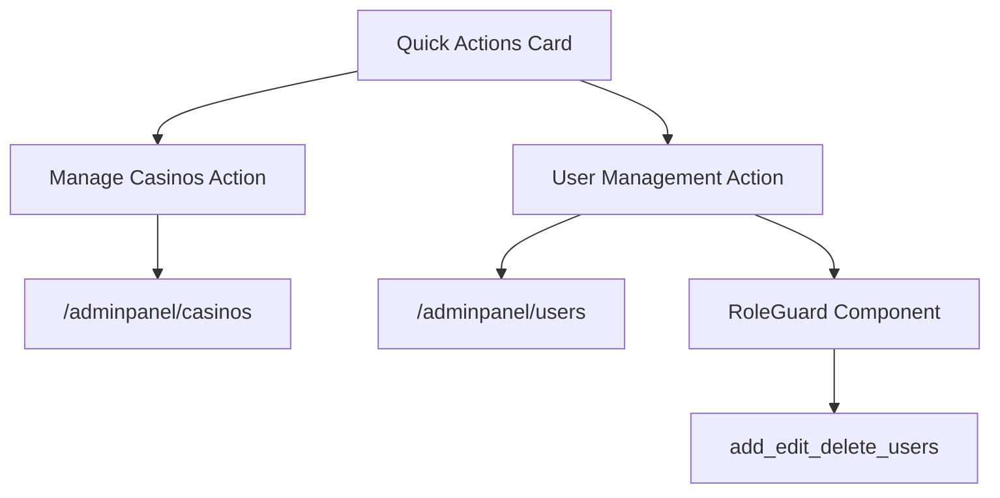
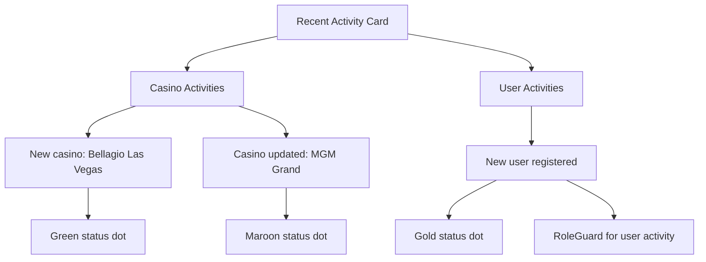

# Dashboard Overview

Relevant source files

The following files were used as context for generating this wiki page:

- [src/pages/Index.tsx](/src/pages/Index.tsx)

This document covers the main dashboard page (`Index.tsx`) of the CasinoVizion administrative panel, which serves as the primary landing page for authenticated users. The dashboard provides role-based content display, key metrics visualization, quick actions, and recent activity monitoring.

For authentication system details, see [Authentication System](./5_Authentication_System.md). For user role management, see [User Context and State Management](./13_User_Context_and_State_Management.md). For UI component documentation, see [Application Components](./17_Application_Components.md).

## Purpose and Functionality

The dashboard serves as the central hub for administrative operations, displaying different content based on user roles and permissions. It provides an overview of system metrics, quick navigation to key functions, and recent activity tracking.

**Dashboard Location**: `/adminpanel` route  
**Main Component**: `Index` in [src/pages/Index.tsx:10](/src/pages/Index.tsx)  
**Authentication**: Requires valid user session via `UserContext`

## Dashboard Layout Structure

The dashboard follows a three-tier layout structure with responsive design and role-based content filtering.

### Layout Architecture

Sources: [src/pages/Index.tsx:88-214]()

### Component Hierarchy

The dashboard integrates several key components and hooks:

| Component/Hook | Purpose | Location |
|----------------|---------|----------|
| `useUser` | User context and role management | [src/pages/Index.tsx:6,11]() |
| `ProfileDropdown` | User profile and logout functionality | [src/pages/Index.tsx:7,109]() |
| `RoleGuard` | Permission-based content rendering | [src/pages/Index.tsx:8,162,200]() |
| `Card` components | UI layout and content containers | [src/pages/Index.tsx:3,127,143,179]() |

## Role-Based Content Display

The dashboard implements a sophisticated permission system that filters content based on user roles and specific permissions.

### Permission Filtering System

Sources: [src/pages/Index.tsx:77-86]()

### Role Permission Matrix

| Role | `view_all` | `add_edit_delete_users` |
|------|------------|------------------------|
| `admin` | ✓ | ✓ |
| `developer` | ✓ | ✗ |
| `guest` | ✓ | ✗ |

The permission filtering logic is implemented in [src/pages/Index.tsx:78-86](), where `visibleCards` are determined by matching user role permissions against card requirements.

## Metrics Cards System

The dashboard displays business metrics through a responsive card grid system that adapts to the number of visible cards based on user permissions.

### Card Configuration

The metrics cards are defined in the `allCards` array [src/pages/Index.tsx:14-75]() with the following structure:

Sources: [src/pages/Index.tsx:14-75]()

### Active Metrics Cards

| Card | Value | Change | Icon | Permission Required |
|------|-------|--------|------|-------------------|
| Total Casinos | 24 | +2 from last month | `Building2` | `view_all` |
| Total Hotels | 18 | +3 from last month | `Hotel` | `view_all` |
| Total Restaurants | 42 | +5 from last month | `Utensils` | `view_all` |
| Active Customers | 1,247 | +180 from last month | `Users` | `add_edit_delete_users` |

### Responsive Grid Layout

The card grid dynamically adjusts its layout based on the number of visible cards [src/pages/Index.tsx:116-124]():

- 1 card: `grid-cols-1`
- 2 cards: `grid-cols-1 md:grid-cols-2`
- 3 cards: `grid-cols-1 md:grid-cols-3`
- 4 cards: `grid-cols-1 md:grid-cols-2 lg:grid-cols-4`

## Quick Actions Panel

The Quick Actions card provides navigation to key administrative functions with permission-based visibility.

### Actions Configuration

Sources: [src/pages/Index.tsx:142-177]()

### Available Actions

| Action | Route | Permission | Icon |
|--------|-------|------------|------|
| Manage Casinos | `/adminpanel/casinos` | Always visible | `Building2` |
| User Management | `/adminpanel/users` | `add_edit_delete_users` | `Users` |

The User Management action is wrapped in a `RoleGuard` component [src/pages/Index.tsx:162-175]() to ensure only users with appropriate permissions can see it.

## Recent Activity Feed

The Recent Activity card displays system activity with permission-based filtering for sensitive operations.

### Activity Structure

The activity feed shows predefined activities with timestamps and status indicators:

Sources: [src/pages/Index.tsx:179-212]()

The user registration activity is protected by a `RoleGuard` with `add_edit_delete_users` permission [src/pages/Index.tsx:200-208](), ensuring only authorized users can view user-related activities.

## Header and User Information

The dashboard header provides user identification and profile access:

### Header Components

| Element | Purpose | Location |
|---------|---------|----------|
| Dashboard Title | Page identification | [src/pages/Index.tsx:95]() |
| Welcome Message | User greeting with name | [src/pages/Index.tsx:96-99]() |
| User Info Display | Current user details | [src/pages/Index.tsx:103-108]() |
| ProfileDropdown | User menu and logout | [src/pages/Index.tsx:109]() |

The header displays the user's full name by concatenating `user.name` and `user.family_name` from the user context [src/pages/Index.tsx:98,106]().

Sources: [src/pages/Index.tsx:90-112]()