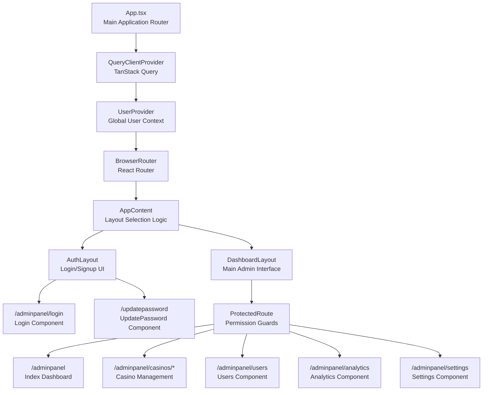
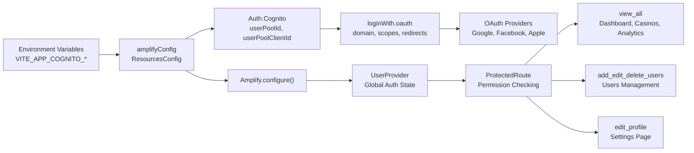

# Overview

Relevant source files

The following files were used as context for generating this wiki page:

- [README.md](/README.md)
- [package.json](/package.json)
- [src/App.tsx](/src/App.tsx)

## Purpose and Scope

CasinoVizion is a React-based administrative panel designed for managing casino operations with enterprise-grade authentication and role-based access control. This document provides a high-level overview of the system architecture, core technologies, and primary functionality.

The system implements AWS Cognito integration for user authentication, supports multiple OAuth providers, and provides granular permission-based access to casino management features. For detailed authentication implementation, see [Authentication System](./5_Authentication_System.md). For UI component documentation, see [User Interface Components](./14_User_Interface_Components.md). For casino-specific functionality, see [Casino Management](./22_Casino_Management.md).

## System Architecture

**High-Level Application Structure**

Sources: [src/App.tsx:1-129]()

## Technology Stack

CasinoVizion is built on a modern React ecosystem with the following core technologies:

| Category | Technology | Purpose |
|----------|------------|---------|
| **Frontend Framework** | React 18.3.1 | Component-based UI development |
| **Build Tool** | Vite | Fast development server and build system |
| **Language** | TypeScript | Type-safe JavaScript development |
| **Routing** | React Router 6.26.2 | Client-side navigation and route protection |
| **Authentication** | AWS Amplify 6.15.3 | Cognito integration and OAuth providers |
| **State Management** | TanStack Query 5.56.2 | Server state and caching |
| **UI Framework** | shadcn-ui + Radix UI | Accessible component primitives |
| **Styling** | Tailwind CSS 3.4.11 | Utility-first CSS framework |
| **Additional UI** | PrimeReact 10.9.6 | Specialized casino management components |

Sources: [package.json:14-68](), [README.md:54-62]()

## Authentication and Configuration

**AWS Cognito Integration Architecture**

The system requires three environment variables for AWS Cognito configuration:
- `VITE_APP_COGNITO_USER_POOL_ID`
- `VITE_APP_COGNITO_CLIENT_ID` 
- `VITE_APP_COGNITO_DOMAIN`

Sources: [src/App.tsx:31-58](), [src/App.tsx:67-104]()

## Core Application Features

### Route-Based Functionality

The application implements a permission-based routing system with the following primary routes:

| Route | Component | Required Permission | Purpose |
|-------|-----------|-------------------|---------|
| `/adminpanel/login` | `Login` | None | User authentication |
| `/updatepassword` | `UpdatePassword` | None | Password management |
| `/adminpanel` | `Index` | `view_all` | Main dashboard |
| `/adminpanel/casinos/*` | Casino components | `view_all` | Casino CRUD operations |
| `/adminpanel/users` | `Users` | `add_edit_delete_users` | User management |
| `/adminpanel/analytics` | `Analytics` | `view_all` | Data analytics |
| `/adminpanel/settings` | `Settings` | `edit_profile` | User preferences |

### Component Architecture

The application uses a layered component architecture:

1. **Layout Components**: `AuthLayout` and `DashboardLayout` provide different UI structures
2. **Route Protection**: `ProtectedRoute` component enforces permission-based access
3. **Context Providers**: `UserProvider` manages global authentication state
4. **UI Components**: Combination of shadcn-ui, Radix UI, and PrimeReact components

### Permission System

Three primary permission levels control access:
- `view_all`: Access to dashboard, casino management, and analytics
- `add_edit_delete_users`: Full user management capabilities  
- `edit_profile`: Personal settings and profile management

Sources: [src/App.tsx:66-105]()

## Development Environment

The application supports multiple development approaches:
- Local development with Node.js and npm
- GitHub Codespaces for cloud-based development
- Direct GitHub file editing for quick changes

Key setup steps include dependency installation, environment configuration from `.env.example`, and running the Vite development server.

Sources: [README.md:14-38](/README.md)