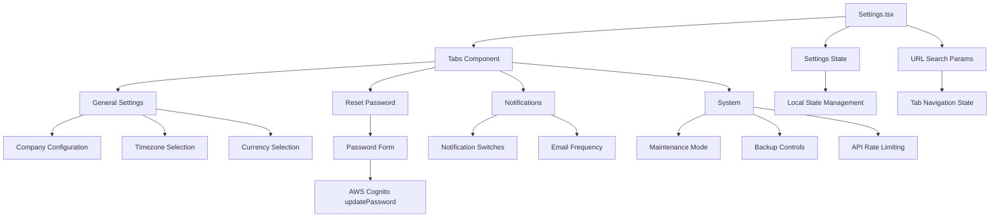
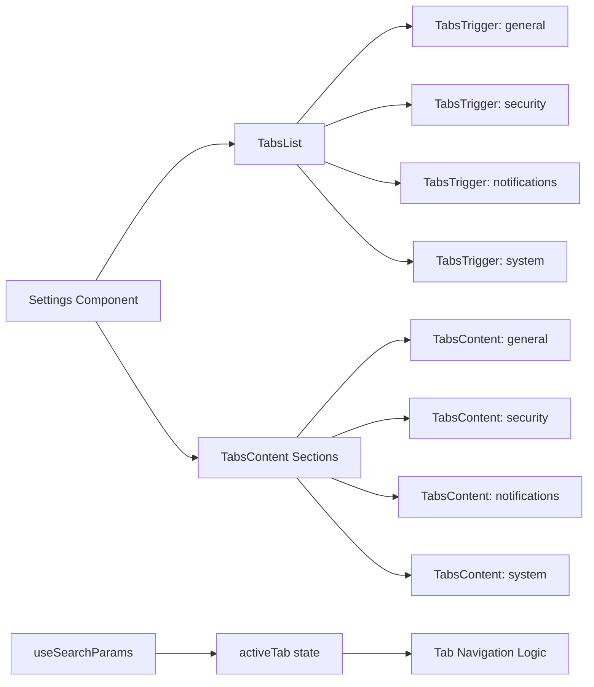
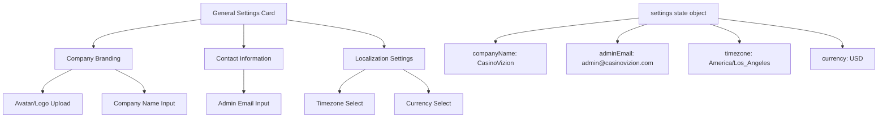
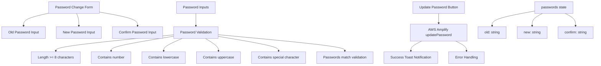
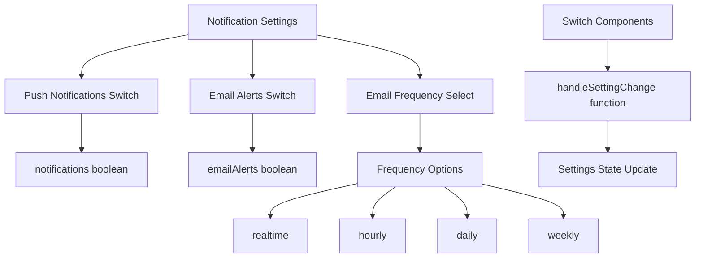
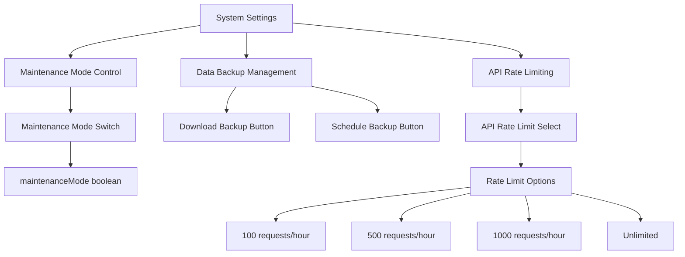
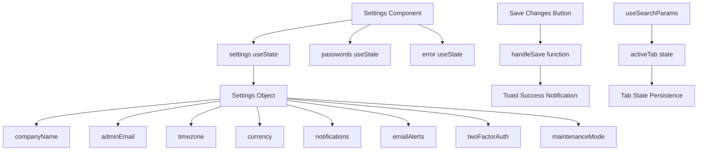

# Settings Management

<details>
<summary>Relevant source files</summary>

The following files were used as context for generating this wiki page:

- [src/pages/settings/Settings.tsx](/src/pages/settings/Settings.tsx)

</details>


## Purpose and Scope

The Settings Management system provides centralized configuration for the CasinoVizion administrative panel. This system handles application preferences, user security settings, notification configurations, and system administration options through a tabbed interface. For user authentication flows, see [Authentication System](./5_Authentication_System.md). For user profile management, see [User Profile](./21_User_Profile.md).

## Settings System Architecture

The settings system is implemented as a single-page application component with tab-based navigation, managing both user preferences and system-wide configurations.



Sources: [src/pages/settings/Settings.tsx:1-387]()

## Tab-Based Interface Structure

The settings interface uses a four-tab layout with URL-based navigation state management. Each tab handles a specific category of settings with dedicated form controls and validation.



Sources: [src/pages/settings/Settings.tsx:17-23](), [src/pages/settings/Settings.tsx:137-143]()

The tab navigation is synchronized with URL parameters using React Router's `useSearchParams` hook:

| Tab Value | Display Name | Purpose |
|-----------|--------------|---------|
| `general` | General | Company information, timezone, currency |
| `security` | Reset Password | Password change functionality |
| `notifications` | Notifications | Email and push notification preferences |
| `system` | System | Maintenance mode, backups, API settings |

## General Settings Management

The general settings tab manages company-wide configuration including branding, contact information, and localization preferences.



Sources: [src/pages/settings/Settings.tsx:25-34](), [src/pages/settings/Settings.tsx:146-221]()

The settings state is managed through the `handleSettingChange` function which updates the local state object:

```typescript
const handleSettingChange = (key: string, value: string | boolean) => {
  setSettings(prev => ({ ...prev, [key]: value }));
};
```

## Password Reset Functionality

The password reset system integrates with AWS Cognito's authentication service to provide secure password updates with comprehensive validation.



Sources: [src/pages/settings/Settings.tsx:40-109](), [src/pages/settings/Settings.tsx:224-285]()

The password validation function `validatePassword` enforces AWS Cognito password policy requirements:

| Requirement | Validation Rule |
|-------------|----------------|
| Minimum Length | 8 characters |
| Numbers | At least 1 digit |
| Lowercase | At least 1 lowercase letter |
| Uppercase | At least 1 uppercase letter |
| Special Characters | At least 1 special character or space |

## Notification Preferences

The notification system manages user preferences for receiving alerts and updates through multiple channels.



Sources: [src/pages/settings/Settings.tsx:289-334]()

The notification preferences are controlled through `Switch` components that toggle boolean values in the settings state.

## System Administration Settings

System settings provide administrative controls for maintenance operations, data management, and API configuration.



Sources: [src/pages/settings/Settings.tsx:337-379]()

System settings include:

| Setting | Type | Purpose |
|---------|------|---------|
| Maintenance Mode | Boolean Switch | Temporarily disable system access |
| Data Backup | Action Buttons | Manual and scheduled backup operations |
| API Rate Limiting | Select Dropdown | Configure request rate limits |

## State Management and Persistence

The settings system uses local React state management with a centralized save mechanism and toast notifications for user feedback.



Sources: [src/pages/settings/Settings.tsx:16-23](), [src/pages/settings/Settings.tsx:25-34](), [src/pages/settings/Settings.tsx:111-116]()

The settings persistence flow includes:
1. Local state management for immediate UI updates
2. Centralized save function with success feedback
3. URL parameter synchronization for tab navigation
4. Error handling with user-visible error messages

The `handleSave` function currently displays a success toast but would typically integrate with a backend API for persistent storage.