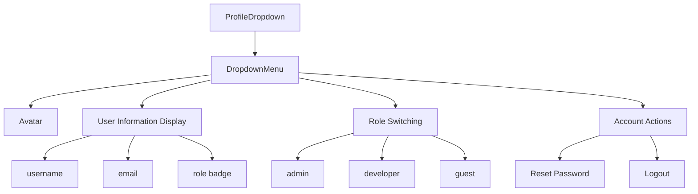
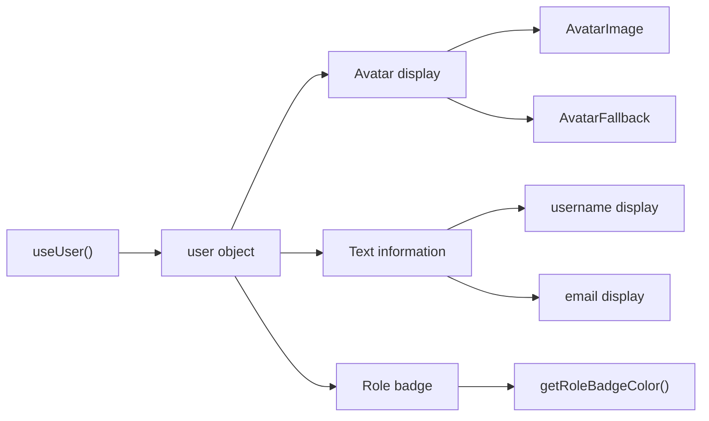
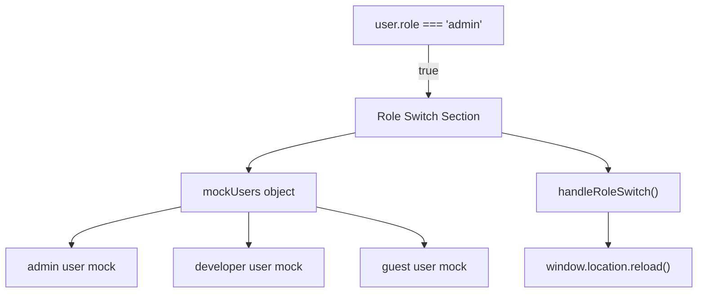
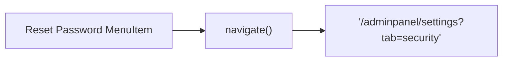
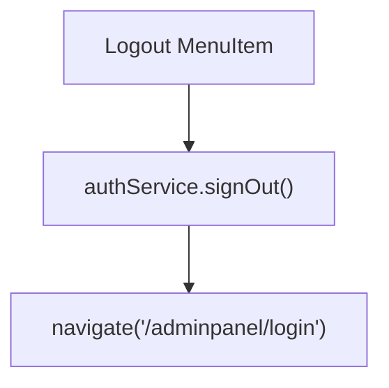
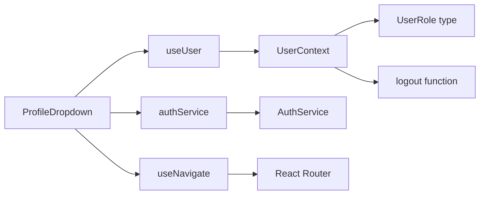

# User Profile

Relevant source files

The following files were used as context for generating this wiki page:

- [src/components/ProfileDropdown.tsx](/src/components/ProfileDropdown.tsx)

## Purpose and Scope

This document covers the user profile functionality in the CasinoVizion administrative panel, specifically the `ProfileDropdown` component that provides user account management, role switching, and authentication actions. The user profile system displays current user information, enables role-based demonstrations, and provides quick access to account settings and logout functionality.

For general authentication flows, see [Authentication System](./5_Authentication_System.md). For settings management functionality, see [Settings Management](./20_Settings_Management.md).

## Component Architecture

The user profile system is centered around the `ProfileDropdown` component, which integrates with the global user context and authentication services to provide a comprehensive user account interface.

### ProfileDropdown Component Structure

Sources: [src/components/ProfileDropdown.tsx:1-121]()

## User Information Display

The profile dropdown displays comprehensive user information including avatar, username, email, and role designation with visual styling based on the user's current role.

### User Data Structure

| Field | Source | Display Location |
|-------|--------|------------------|
| `username` | UserContext | Header and fallback avatar |
| `email` | UserContext | Below username |
| `role` | UserContext | Colored badge |
| `avatar` | UserContext | Profile image or initials |

The component retrieves user data from the `useUser` hook and renders it in a structured dropdown interface:

Sources: [src/components/ProfileDropdown.tsx:18-19](), [src/components/ProfileDropdown.tsx:58-74]()

### Role Badge Styling

The `getRoleBadgeColor` function provides role-specific visual styling:

| Role | CSS Classes | Color Scheme |
|------|-------------|--------------|
| `admin` | `bg-red-100 text-red-800` | Red |
| `developer` | `bg-blue-100 text-blue-800` | Blue |
| `guest` | `bg-gray-100 text-gray-800` | Gray |

Sources: [src/components/ProfileDropdown.tsx:35-42]()

## Role Management System

The profile dropdown includes a demonstration role switching feature available to admin users, allowing them to switch between different user roles for testing and demonstration purposes.

### Role Switching Implementation

The role switching functionality is implemented as a demonstration feature:

- Only visible to users with `admin` role
- Provides mock user data for each role type
- Uses `window.location.reload()` to simulate role changes
- Menu items for `admin`, `developer`, and `guest` roles

Sources: [src/components/ProfileDropdown.tsx:23-33](), [src/components/ProfileDropdown.tsx:78-97]()

## Account Actions

The profile dropdown provides two primary account management actions: password reset navigation and user logout functionality.

### Password Reset Integration

The reset password option navigates to the settings page with a specific security tab:

Sources: [src/components/ProfileDropdown.tsx:100-106]()

### Logout Implementation

The logout functionality integrates with the authentication service and routing system:

The logout process:
1. Calls `authService.signOut()` to clear authentication state
2. Navigates to the login page at `/adminpanel/login`
3. Uses red text styling to indicate destructive action

Sources: [src/components/ProfileDropdown.tsx:107-115]()

## Integration Dependencies

The `ProfileDropdown` component integrates with several system components and services:

### External Dependencies

| Dependency | Usage | Import Source |
|------------|-------|---------------|
| `useUser` | User context access | `@/contexts/UserContext` |
| `useNavigate` | React Router navigation | `react-router-dom` |
| `authService` | Authentication operations | `@/contexts/AuthService` |
| UI Components | Dropdown, Avatar, Button | `@/components/ui/*` |
| Icons | User, LogOut, Lock | `lucide-react` |

### Context Integration

Sources: [src/components/ProfileDropdown.tsx:12-15]()

The component follows a conditional rendering pattern, returning `null` when no user is authenticated, ensuring it only displays for authenticated users.

Sources: [src/components/ProfileDropdown.tsx:21]()