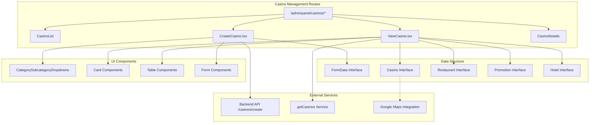
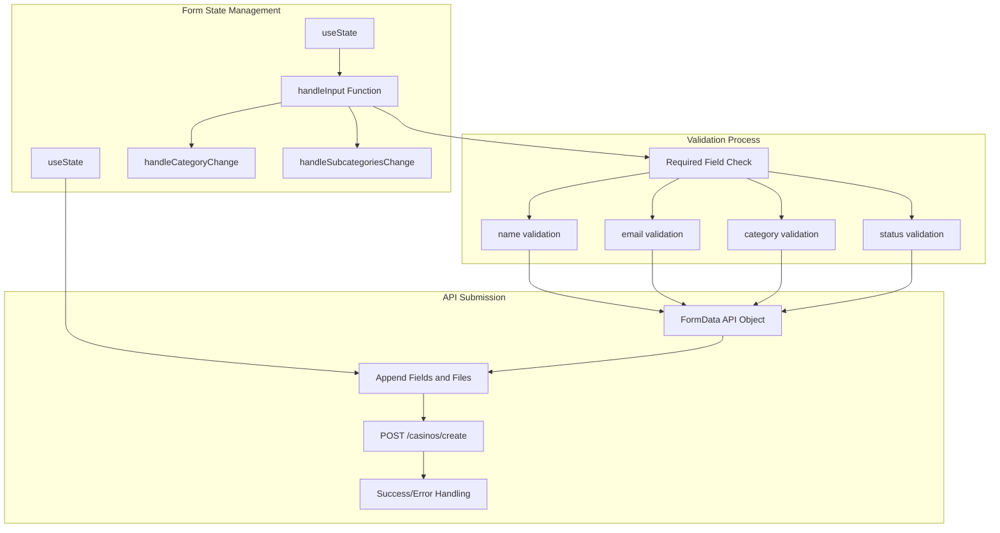
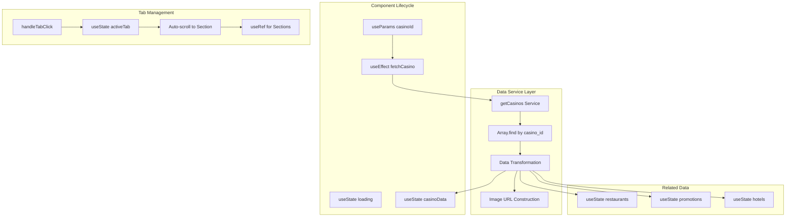
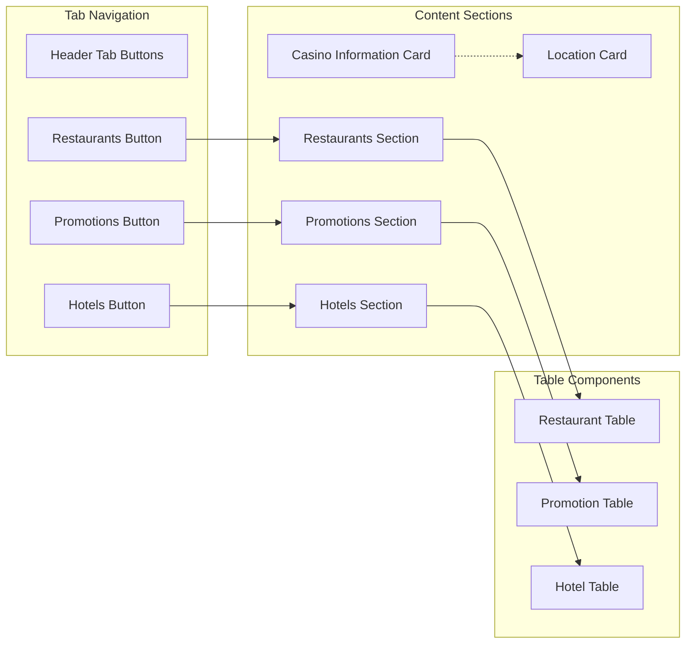
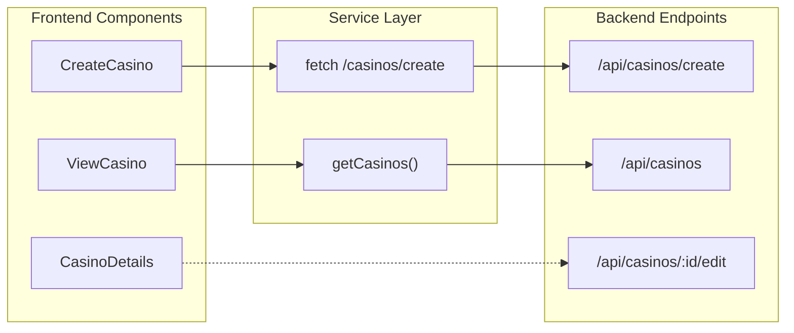

# Casino Management

Relevant source files

The following files were used as context for generating this wiki page:

- [src/pages/casinos/CreateCasino.tsx](/src/pages/casinos/CreateCasino.tsx)
- [src/pages/casinos/ViewCasino.tsx](/src/pages/casinos/ViewCasino.tsx)

This document covers the casino management functionality within the CasinoVizion administrative panel. The casino management system provides comprehensive CRUD (Create, Read, Update, Delete) operations for casino entities, including detailed information management and related sub-entities like restaurants, promotions, and hotels.

For user access control and authentication, see [Authentication System](./5_Authentication_System.md). For UI component details, see [User Interface Components](./14_User_Interface_Components.md). For casino creation workflows specifically, see [Casino Creation](./23_Casino_Creation.md). For casino viewing and data management, see [Casino Viewing and Management](./24_Casino_Viewing_and_Management.md).

## System Overview

The casino management system consists of two primary components that handle the full lifecycle of casino data within the administrative panel. The system integrates with external APIs for geolocation services and maintains relationships with sub-entities including dining establishments, promotional offers, and accommodation facilities.

Sources: [src/pages/casinos/CreateCasino.tsx:1-222](), [src/pages/casinos/ViewCasino.tsx:1-420]()

## Data Model and Interfaces

The casino management system uses several TypeScript interfaces to ensure type safety and data consistency across components.

### Core Casino Data Structure

| Field | Type | Required | Description |
|-------|------|----------|-------------|
| `casino_id` | `string \| number` | Yes | Unique identifier |
| `casino_name` | `string` | Yes | Display name |
| `category` | `string` | Yes | Primary classification |
| `subcategories` | `string[]` | No | Secondary classifications |
| `email` | `string` | Yes | Contact email |
| `address` | `string` | No | Primary address |
| `address2` | `string` | No | Secondary address line |
| `address3` | `string` | No | Tertiary address line |
| `latitude` | `number` | No | Geographic coordinate |
| `longitude` | `number` | No | Geographic coordinate |
| `status` | `string` | Yes | Operational status |
| `description` | `string` | No | Detailed description |
| `image` | `string` | No | Image file path |

```mermaid
graph LR
    subgraph "FormData Interface (Creation)"
        NAME["name: string"]
        DESC["description: string"]
        ADDR["address: string"]
        ADDR2["address2: string"]
        ADDR3["address3: string"]
        EMAIL["email: string"]
        IMG["image: string"]
        LAT["latitude: number"]
        LONG["longitude: number"]
        CAT["category: string"]
        SUBCAT["subcategories: string[]"]
        STATUS["status: string"]
    end
    
    subgraph "Casino Interface (Display)"
        CID["casino_id: string | number"]
        CNAME["casino_name: string"]
        CCATEGORY["category: string"]
        CSUBCAT["subcategories: string[]"]
        CIMAGE["image: string"]
        CADDRESS["address: string"]
        CLAT["latitude: number"]
        CLONG["longitude: number"]
        CREATED["created_at: string"]
        CONTACT["Contact: string"]
        CEMAIL["email: string"]
        PHONE["phone: string"]
        CSTATUS["status: string"]
        CDESC["description: string"]
        TIMINGS["timings: string"]
    end
    
    subgraph "Related Entities"
        REST["restaurants: Restaurant[]"]
        PROMO["promotions: Promotion[]"]
        HOTELS["hotels: Hotel[]"]
    end
    
    FormData -.-> Casino
    Casino --> REST
    Casino --> PROMO
    Casino --> HOTELS
```

Sources: [src/pages/casinos/CreateCasino.tsx:15-28](), [src/pages/casinos/ViewCasino.tsx:11-30]()

## Casino Creation Workflow

The `CreateCasino` component provides a comprehensive form interface for adding new casino entities to the system. The component implements client-side validation, file upload handling, and API integration.

### Form Validation and Submission

The validation logic ensures all required fields are populated before submission:

- `name`: Casino display name (required)
- `email`: Contact email address (required)  
- `category`: Primary classification (required)
- `status`: Operational status from predefined options (required)

Sources: [src/pages/casinos/CreateCasino.tsx:60-90](), [src/pages/casinos/CreateCasino.tsx:48-58]()

### Category and Subcategory Management

The creation form integrates with the `CategorySubcategoryDropdowns` component to provide hierarchical classification selection. This component maintains the relationship between primary categories and their associated subcategories.

Sources: [src/pages/casinos/CreateCasino.tsx:138-143](), [src/pages/casinos/CreateCasino.tsx:52-58]()

## Casino Viewing and Management

The `ViewCasino` component provides a comprehensive interface for displaying casino information and managing related entities. The component uses a tabbed interface to organize different aspects of casino data.

### Data Fetching and Display

Sources: [src/pages/casinos/ViewCasino.tsx:67-104](), [src/pages/casinos/ViewCasino.tsx:121-123]()

### Tabbed Interface Architecture

The viewing component implements a dynamic tabbed interface that allows users to navigate between different casino-related data sections:

| Tab | Purpose | Components | Status |
|-----|---------|------------|---------|
| Default | Casino info and location | Cards, Badges | Always visible |
| `restaurants` | Dining establishments | Table, action buttons | Dynamic |
| `promotions` | Marketing campaigns | Table, status badges | Dynamic |
| `hotels` | Accommodation facilities | Table, rating displays | Dynamic |

Sources: [src/pages/casinos/ViewCasino.tsx:147-166](), [src/pages/casinos/ViewCasino.tsx:253-414]()

## API Integration

The casino management system integrates with backend services through RESTful API endpoints and service abstractions.

### Environment Configuration

The system uses environment variables to configure API endpoints:

- `VITE_API_BASE`: Base URL for casino management API (defaults to `http://localhost:5000/api/`)

### Service Methods

| Service | Method | Endpoint | Purpose |
|---------|--------|----------|---------|
| Create | `POST` | `/casinos/create` | Add new casino |
| Read | `GET` | via `getCasinos()` | Fetch casino data |
| Update | `PUT` | `/casinos/${id}/edit` | Modify casino |
| Delete | `DELETE` | Not implemented | Remove casino |

Sources: [src/pages/casinos/CreateCasino.tsx:13](), [src/pages/casinos/CreateCasino.tsx:78-81](), [src/pages/casinos/ViewCasino.tsx:9](), [src/pages/casinos/ViewCasino.tsx:71]()

## Related Entity Management

The casino management system provides interfaces for managing related entities including restaurants, promotions, and hotels. These entities are displayed in tabular format with action buttons for CRUD operations.

### Entity Data Structures

Each related entity follows a consistent interface pattern:

- **Restaurant**: `id`, `name`, `cuisine`, `rating`
- **Promotion**: `id`, `title`, `description`, `status` 
- **Hotel**: `id`, `name`, `rooms`, `rating`

The table implementations include edit and delete action buttons, though the actual CRUD functionality for these entities is not yet implemented in the current codebase.

Sources: [src/pages/casinos/ViewCasino.tsx:32-51](), [src/pages/casinos/ViewCasino.tsx:267-410]()