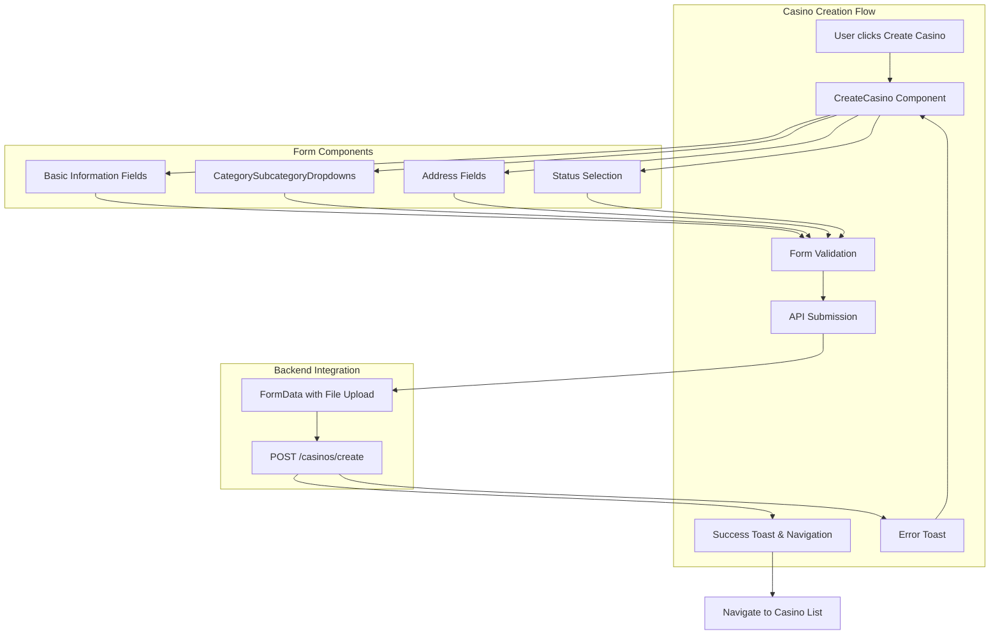
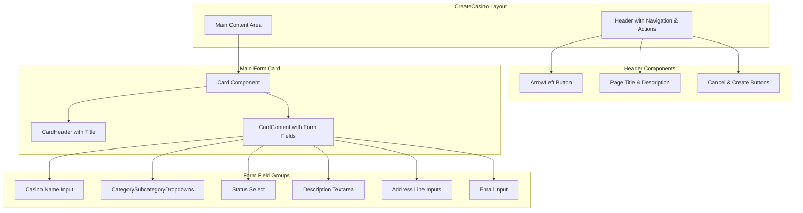
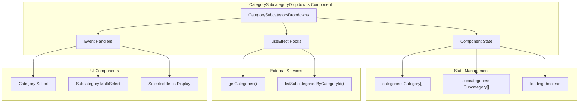
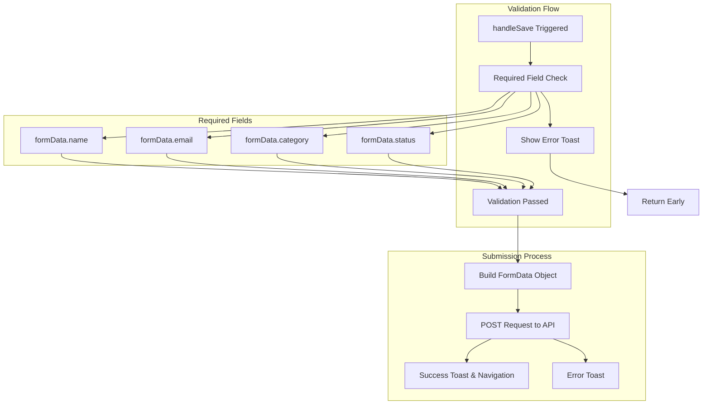

# Casino Creation

Relevant source files

The following files were used as context for generating this wiki page:

- [src/components/CategorySubcategoryDropdowns.tsx](/src/components/CategorySubcategoryDropdowns.tsx)
- [src/pages/casinos/CreateCasino.tsx](/src/pages/casinos/CreateCasino.tsx)

This document covers the casino creation functionality within the CasinoVizion administrative panel. It details the form-based interface, validation system, and category management components used to add new casino entries to the system.

For information about viewing and managing existing casinos, see [Casino Viewing and Management](./24_Casino_Viewing_and_Management.md). For general information about the casino management module, see [Casino Management](./22_Casino_Management.md).

## Overview

The casino creation system provides a comprehensive form interface allowing administrators to add new casino entries with detailed information including location data, categorization, and operational status. The creation process is implemented as a single-page form with real-time validation and category-based organization.

Sources: [src/pages/casinos/CreateCasino.tsx:1-222]()

## Form Structure and Components

The `CreateCasino` component implements a comprehensive form interface with multiple sections for different types of casino information. The form uses controlled components with a centralized state management pattern.

### Core Form Data Structure

The form manages a `FormData` interface containing all casino properties:

| Field | Type | Required | Description |
|-------|------|----------|-------------|
| `name` | string | Yes | Casino display name |
| `description` | string | No | Detailed casino description |
| `address`, `address2`, `address3` | string | No | Multi-line address fields |
| `email` | string | Yes | Contact email address |
| `image` | string | No | Image URL or file reference |
| `latitude`, `longitude` | number | No | Geographic coordinates |
| `category` | string | Yes | Primary category code |
| `subcategories` | string[] | No | Array of subcategory codes |
| `status` | string | Yes | Operational status |

The form state is managed through the `handleInput` function which provides type-safe updates to the form data structure at [src/pages/casinos/CreateCasino.tsx:48-50]().

### Form Layout and UI Components

The creation interface uses a card-based layout with the main form content organized in a responsive grid:

Sources: [src/pages/casinos/CreateCasino.tsx:92-218]()

## Category and Subcategory Selection System

The category selection functionality is implemented through the `CategorySubcategoryDropdowns` component, which provides a hierarchical selection interface with dependent dropdown behavior.

### Component Architecture

### Data Flow and Service Integration

The component follows a two-stage loading pattern where categories are loaded on mount, and subcategories are loaded when a category is selected:

1. **Initial Load**: Categories are fetched using `getCategories()` service at [src/components/CategorySubcategoryDropdowns.tsx:47-63]()
2. **Category Selection**: When a category is selected, subcategories are loaded using `listSubcategoriesByCategoryId()` at [src/components/CategorySubcategoryDropdowns.tsx:66-112]()
3. **Data Transformation**: API responses are transformed from `ApiSelectOption` format to internal `Category`/`Subcategory` interfaces

### Subcategory Multi-Selection

The subcategory selection uses PrimeReact's `MultiSelect` component with extensive customization:

- **Search Functionality**: Built-in filtering with placeholder text
- **Visual Feedback**: Selected items displayed as badges below the dropdown
- **Validation**: Invalid selections are filtered when category changes
- **Loading States**: Disabled state with loading indicator during API calls

The styling configuration at [src/components/CategorySubcategoryDropdowns.tsx:213-281]() provides custom theming to match the application's design system.

Sources: [src/components/CategorySubcategoryDropdowns.tsx:1-315]()

## Validation and Submission Process

### Form Validation

The casino creation form implements client-side validation checking for required fields before submission:

The validation logic at [src/pages/casinos/CreateCasino.tsx:61-64]() ensures that critical fields are populated before allowing submission.

### API Integration

The submission process constructs a `FormData` object to support file uploads and array data:

1. **Data Serialization**: Form fields are serialized with special handling for arrays and file uploads at [src/pages/casinos/CreateCasino.tsx:67-76]()
2. **API Endpoint**: Data is submitted to `${API_BASE}casinos/create` via POST request
3. **Response Handling**: Success results in navigation to the casino list, while errors display toast notifications

The API base URL is configurable through the `VITE_API_BASE` environment variable, providing flexibility for different deployment environments.

Sources: [src/pages/casinos/CreateCasino.tsx:60-90]()

## User Experience Features

### Navigation and Actions

The interface provides clear navigation controls:
- **Back Navigation**: Arrow button and cancel option return to casino list
- **Save Action**: Primary button triggers validation and submission
- **Breadcrumb Context**: Header clearly indicates the current action

### Real-time Feedback

The system provides immediate feedback through:
- **Toast Notifications**: Success and error messages using the toast hook
- **Loading States**: Visual indicators during category/subcategory loading
- **Form Validation**: Immediate validation feedback on required fields
- **Badge Display**: Real-time visualization of selected subcategories

### Responsive Design

The form layout adapts to different screen sizes using Tailwind CSS responsive classes, ensuring usability across desktop and mobile devices.

Sources: [src/pages/casinos/CreateCasino.tsx:94-118](), [src/components/CategorySubcategoryDropdowns.tsx:162-311]()