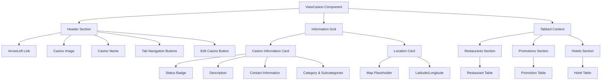
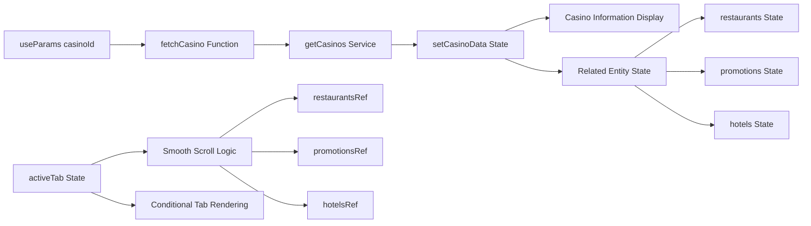
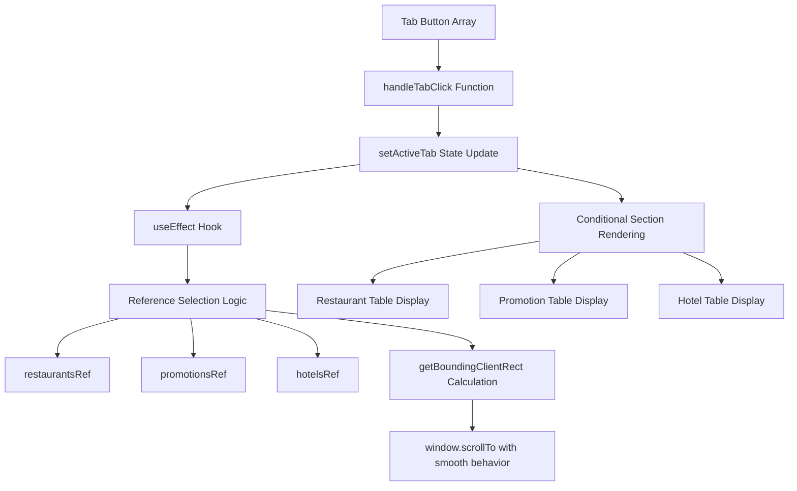
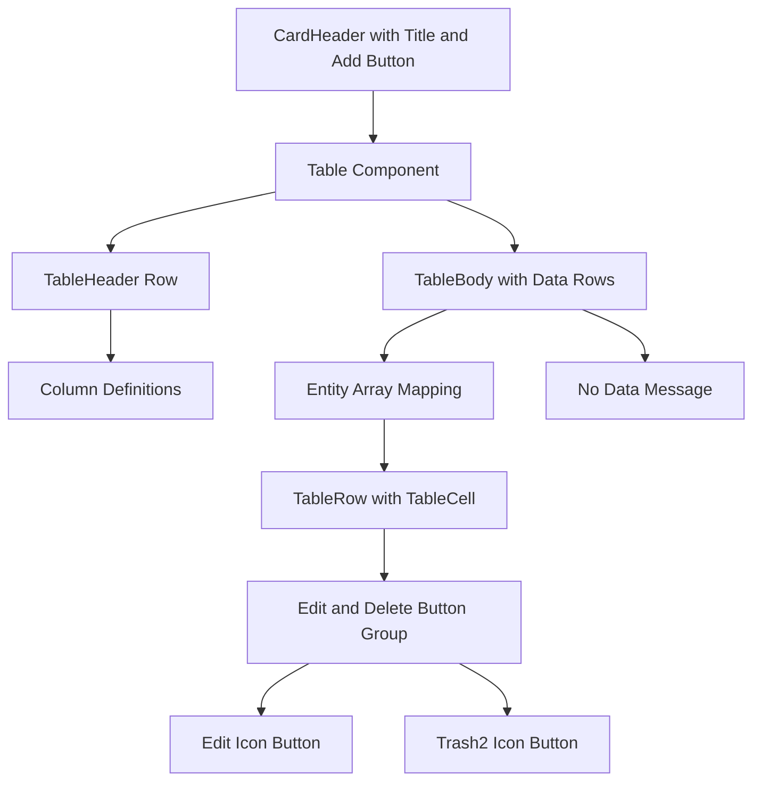

# Casino Viewing and Management

Relevant source files

The following files were used as context for generating this wiki page:

- [src/pages/casinos/ViewCasino.tsx](/src/pages/casinos/ViewCasino.tsx)

## Purpose and Scope

This document covers the casino detail viewing and management interface, specifically the `ViewCasino` component that provides comprehensive casino information display and management of related entities. This system allows administrators to view detailed casino information, manage restaurants, promotions, and hotels associated with each casino, and navigate between different data sections using a tabbed interface.

For information about creating new casinos, see [Casino Creation](./23_Casino_Creation.md). For general dashboard functionality, see [Dashboard Overview](./19_Dashboard_Overview.md).

## Component Architecture

The casino viewing system is built around a single comprehensive component that handles multiple data entities and provides tabbed navigation for different casino-related information sections.

### Core Component Structure

Sources: [src/pages/casinos/ViewCasino.tsx:1-420]()

### Data Flow and State Management

The component manages multiple types of state and handles data fetching from the casino service:

Sources: [src/pages/casinos/ViewCasino.tsx:54-104](), [src/pages/casinos/ViewCasino.tsx:106-123]()

## Data Structures

The casino viewing system handles several interconnected data types that represent the casino and its associated entities.

### Primary Data Interfaces

| Interface | Key Properties | Purpose |
|-----------|---------------|---------|
| `Casino` | `casino_id`, `casino_name`, `category`, `subcategories`, `image`, `address`, `latitude`, `longitude` | Main casino entity with location and categorization |
| `Restaurant` | `id`, `name`, `cuisine`, `rating` | Dining establishments within the casino |
| `Promotion` | `id`, `title`, `description`, `status` | Marketing promotions and special offers |
| `Hotel` | `id`, `name`, `rooms`, `rating` | Accommodation facilities in the casino complex |

Sources: [src/pages/casinos/ViewCasino.tsx:11-51]()

### Data Fetching and Processing

The component implements a centralized data fetching pattern:

1. **URL Parameter Extraction**: Uses `useParams` to get `casinoId` from the route
2. **Service Integration**: Calls `getCasinos` service to retrieve all casinos
3. **Data Filtering**: Finds the specific casino by matching `casino_id` with URL parameter
4. **Image URL Processing**: Transforms backend image paths to accessible URLs
5. **Related Data Population**: Sets restaurant, promotion, and hotel data if available

Sources: [src/pages/casinos/ViewCasino.tsx:67-104]()

## Navigation and Tab System

The casino viewing interface implements a sophisticated tab-based navigation system with smooth scrolling behavior.

### Tab Navigation Implementation

Sources: [src/pages/casinos/ViewCasino.tsx:106-123](), [src/pages/casinos/ViewCasino.tsx:147-166]()

### Tab Button Configuration

The header contains navigation buttons for each content section:

- **Restaurants Button**: Triggers restaurant table display with maroon-themed styling
- **Promotions Button**: Shows promotion management interface with green styling  
- **Hotels Button**: Displays hotel information with gold-themed styling
- **Edit Casino Button**: Links to casino editing interface

Sources: [src/pages/casinos/ViewCasino.tsx:147-173]()

## Information Display Sections

The casino viewing interface is organized into several distinct information display areas.

### Casino Information Card

The primary information card displays essential casino details in a structured format:

- **Status Badge**: Visual indicator showing casino operational status (Active/Inactive)
- **Description**: Detailed text description of the casino
- **Contact Information**: Address, contact person, email, and phone number with icons
- **Category Display**: Primary category and subcategory badges
- **Coordinate Information**: Latitude and longitude values

Sources: [src/pages/casinos/ViewCasino.tsx:180-228]()

### Location Card

The location section provides geographic information:

- **Map Placeholder**: Reserved area for future map integration
- **Coordinate Display**: Formatted latitude and longitude values
- **Address Information**: Full address display with location icon

Sources: [src/pages/casinos/ViewCasino.tsx:230-251]()

## Entity Management Tables

Each tab displays a data table with consistent styling and functionality for managing related casino entities.

### Table Structure Pattern

Sources: [src/pages/casinos/ViewCasino.tsx:253-414]()

### Restaurant Management

The restaurant section displays dining establishment information:

| Column | Data Type | Display Format |
|--------|-----------|----------------|
| Name | String | Bold font weight |
| Cuisine | String | Standard text |
| Rating | Number | Star badge with gold styling |
| Actions | Buttons | Edit and delete icon buttons |

Sources: [src/pages/casinos/ViewCasino.tsx:267-302]()

### Promotion Management

The promotion section manages marketing offers:

| Column | Data Type | Display Format |
|--------|-----------|----------------|
| Title | String | Bold font weight |
| Description | String | Standard text |
| Status | String | Status badge (Active/Inactive) |
| Actions | Buttons | Edit and delete icon buttons |

Sources: [src/pages/casinos/ViewCasino.tsx:320-358]()

### Hotel Management

The hotel section displays accommodation information:

| Column | Data Type | Display Format |
|--------|-----------|----------------|
| Name | String | Bold font weight |
| Rooms | Number | Room count with "rooms" suffix |
| Rating | Number | Star badge with gold styling |
| Actions | Buttons | Edit and delete icon buttons |

Sources: [src/pages/casinos/ViewCasino.tsx:376-412]()

## Integration Points

The casino viewing system integrates with several other parts of the application architecture.

### Service Layer Integration

- **Casino Service**: Uses `getCasinos` function for data retrieval
- **Backend API**: Processes image URLs from backend storage
- **Route Parameters**: Extracts casino ID from URL routing

### Navigation Integration

- **Back Navigation**: Links to `/adminpanel/casinos` casino list page
- **Edit Navigation**: Links to `/adminpanel/casinos/${casinoId}/edit` editing interface
- **Router Integration**: Uses React Router's `Link` and `useParams` hooks

### UI Component Integration

- **Card Components**: Uses shadcn-ui `Card`, `CardHeader`, `CardTitle`, `CardContent`, `CardDescription`
- **Table Components**: Implements `Table`, `TableBody`, `TableCell`, `TableHead`, `TableHeader`, `TableRow`
- **Interactive Elements**: Integrates `Button`, `Badge` components with consistent theming
- **Icon System**: Uses Lucide React icons (`Plus`, `Edit`, `Trash2`, `ArrowLeft`)

Sources: [src/pages/casinos/ViewCasino.tsx:1-10](), [src/pages/casinos/ViewCasino.tsx:136-174]()