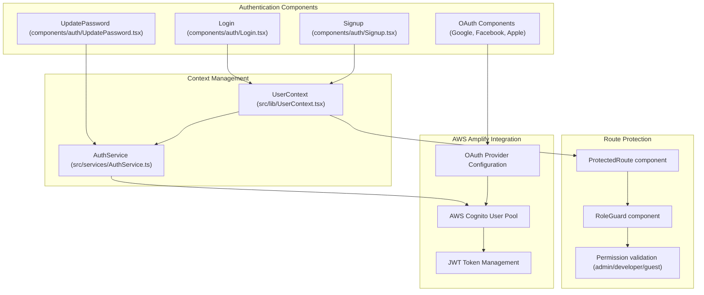
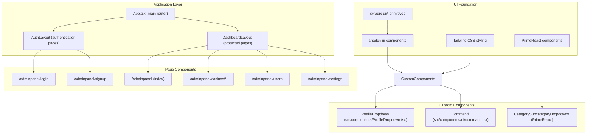

# Development Guide

Relevant source files

The following files were used as context for generating this wiki page:

- [README.md](/README.md)
- [package-lock.json](/package-lock.json)
- [package.json](/package.json)

## Purpose and Scope

This document provides comprehensive guidance for developers working on the CasinoVizion administrative panel codebase. It covers development environment setup, code architecture patterns, build processes, and common development workflows specific to this React-based casino management application.

For information about the overall system architecture and component relationships, see [Application Architecture](./11_Application_Architecture.md). For specific authentication implementation details, see [Authentication System](./5_Authentication_System.md). For UI component usage, see [User Interface Components](./14_User_Interface_Components.md).

## Development Environment Setup

### Prerequisites and Dependencies

The project requires Node.js and npm for development. The technology stack includes React 18, TypeScript, Vite, and AWS Amplify for backend services.

**Core Dependencies:**
- `react` and `react-dom` ^18.3.1 for the UI framework
- `typescript` ^5.8.3 for type safety
- `vite` ^5.4.1 for build tooling and dev server
- `aws-amplify` ^6.15.3 for AWS services integration
- `@aws-amplify/backend` ^1.16.1 for backend infrastructure

**UI Libraries:**
- `@radix-ui/*` components for accessible primitives
- `tailwindcss` ^3.4.11 for styling
- `primereact` ^10.9.6 for additional UI components
- `lucide-react` ^0.462.0 for icons

### Environment Configuration

Environment variables must be configured in `./src/.env` based on the template at [./src/.env.example](). The setup process includes:

1. Clone the repository
2. Install dependencies with `npm i`
3. Add AWS Amplify backend dependencies: `npm add --save-dev @aws-amplify/backend@latest @aws-amplify/backend-cli@latest typescript`
4. Install additional required packages: `npm install --save-dev cross-env` and `npm install primereact`
5. Create environment file: `cp ./src/.env.example ./src/.env`
6. Start development server: `npm run dev`

**Available Scripts:**
- `npm run dev` - Start Vite development server
- `npm run build` - Production build
- `npm run build:dev` - Development build
- `npm run lint` - ESLint code analysis
- `npm run preview` - Preview production build

Sources: [README.md:12-38](), [package.json:6-12](), [package.json:14-69]()

## Code Architecture Patterns

### Authentication Flow Integration

The application implements a comprehensive authentication system using AWS Cognito with multiple patterns for different authentication scenarios.

### Component Architecture Pattern

The codebase follows a layered component architecture combining multiple UI libraries with custom business logic components.

### State Management Pattern

The application uses React Context for global state management rather than external state management libraries, with specific contexts for different concerns.

**Key Context Providers:**
- `UserContext` manages global user authentication state and permissions
- Component-level state using `useState` and `useEffect` for local UI state
- Form state managed with `react-hook-form` for complex forms

**Permission System:**
- Role-based access control with `admin`, `developer`, and `guest` roles
- Component-level permission guards using `RoleGuard`
- Route-level protection with `ProtectedRoute` wrapper

Sources: [package.json:44-68](), architectural diagrams from context

## Build System and Configuration

### Vite Configuration

The project uses Vite as the build tool with TypeScript support and React SWC plugin for fast compilation.

**Build Modes:**
- Development: `npm run dev` - Hot module replacement and source maps
- Production: `npm run build` - Optimized bundle with tree shaking
- Development Build: `npm run build:dev` - Unoptimized build for testing

**Key Build Dependencies:**
- `@vitejs/plugin-react-swc` for React compilation
- `typescript` for type checking
- `eslint` for code quality
- `tailwindcss` and `autoprefixer` for CSS processing

### Environment Variable Management

Environment variables follow the `VITE_` prefix pattern for client-side access. Configuration includes:

- `VITE_APP_COGNITO_*` variables for AWS Cognito setup
- `VITE_API_BASE` for backend API endpoint configuration
- AWS Amplify configuration variables

### Code Quality Tools

**ESLint Configuration:**
- `@eslint/js` for JavaScript rules
- `eslint-plugin-react-hooks` for React Hooks rules
- `eslint-plugin-react-refresh` for development optimizations
- `typescript-eslint` for TypeScript-specific linting

Sources: [package.json:70-91](), [README.md:54-63]()

## Development Workflow Patterns

### Component Development Pattern

When creating new components, follow the established patterns:

1. **Base Components**: Use Radix UI primitives wrapped with Tailwind CSS styling
2. **Business Components**: Combine base components with application-specific logic
3. **Page Components**: Compose business components with routing and state management

**File Structure Pattern:**
- `/src/components/ui/` - Base UI components (shadcn-ui style)
- `/src/components/auth/` - Authentication-specific components
- `/src/components/` - Business logic components
- `/src/pages/` - Page-level components with routing

### Authentication Integration Pattern

For components requiring authentication:

1. Wrap with `ProtectedRoute` for route-level protection
2. Use `UserContext` to access current user state
3. Implement `RoleGuard` for permission-based rendering
4. Handle authentication errors with appropriate fallbacks

### Form Development Pattern

The codebase uses `react-hook-form` with `zod` validation:

1. Define schema with `zod` for type-safe validation
2. Use `@hookform/resolvers` to integrate with `react-hook-form`
3. Implement form UI with shadcn-ui form components
4. Handle submission with proper error handling and loading states

### API Integration Pattern

For external API calls:
1. Use `@tanstack/react-query` for data fetching and caching
2. Implement proper error boundaries and loading states
3. Configure API base URL through environment variables
4. Handle authentication tokens through AWS Amplify integration

Sources: [package.json:15-43](), [package.json:44-68](), architectural diagrams from context

## Testing and Deployment Considerations

### Build Optimization

The production build process includes:
- Tree shaking for unused code elimination
- Asset optimization and compression
- TypeScript compilation and type checking
- CSS purging with Tailwind CSS

### Development Best Practices

**Code Organization:**
- Maintain clear separation between UI components and business logic
- Use TypeScript interfaces for prop definitions
- Implement proper error boundaries for robust error handling
- Follow consistent naming conventions for components and files

**Performance Considerations:**
- Leverage React.lazy() for code splitting where appropriate
- Use React.memo() for expensive component re-renders
- Optimize asset loading with proper bundling strategies
- Implement proper loading states for async operations

### Deployment Configuration

The application can be deployed to various platforms supporting static site hosting:
- Custom domain configuration supported through build settings
- Environment-specific builds using different build modes
- AWS Amplify backend deployment through CLI tools

Sources: [README.md:64-72](), [package.json:6-12]()