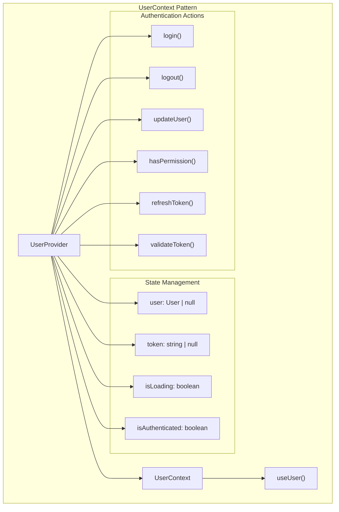
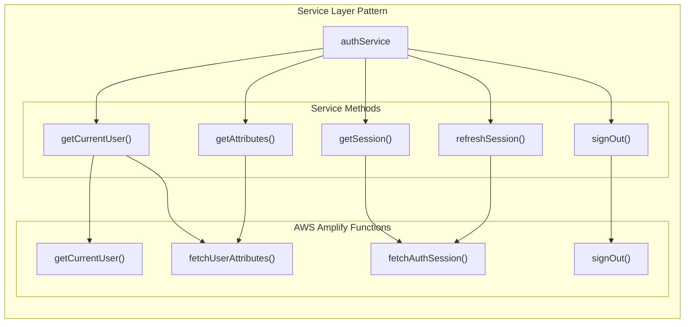
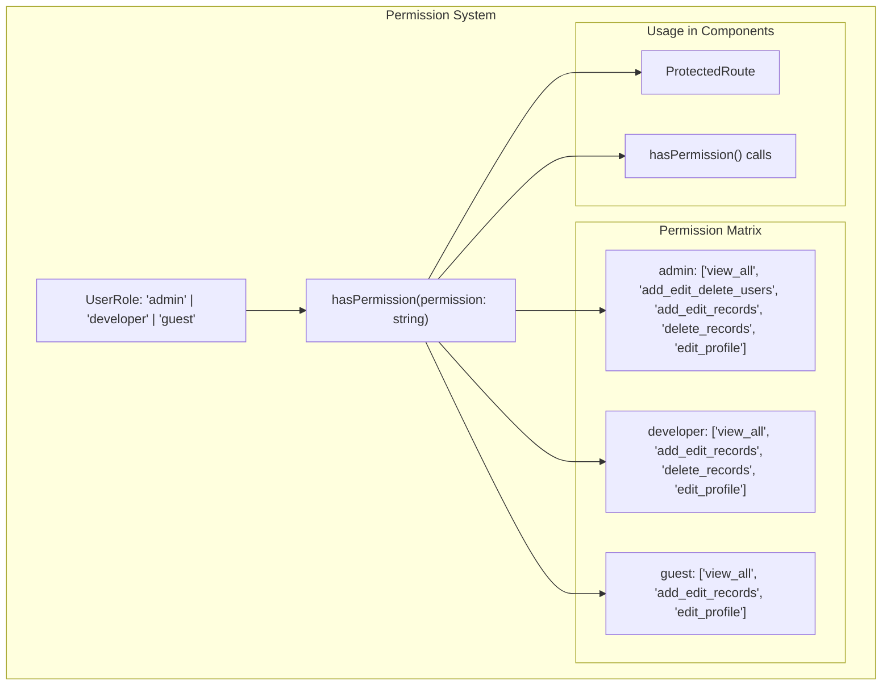
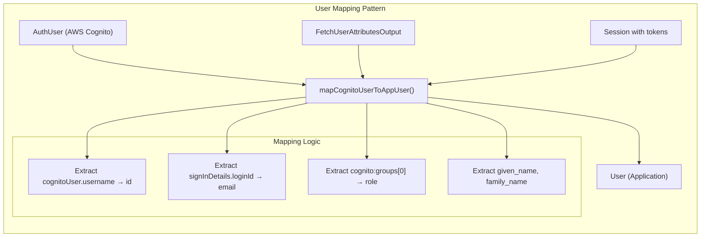
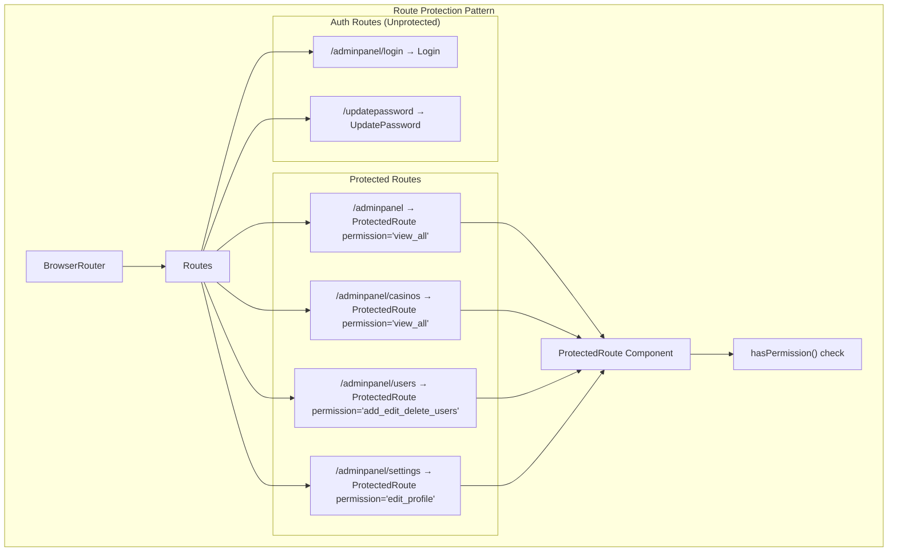
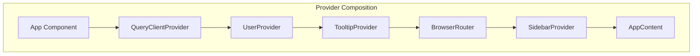
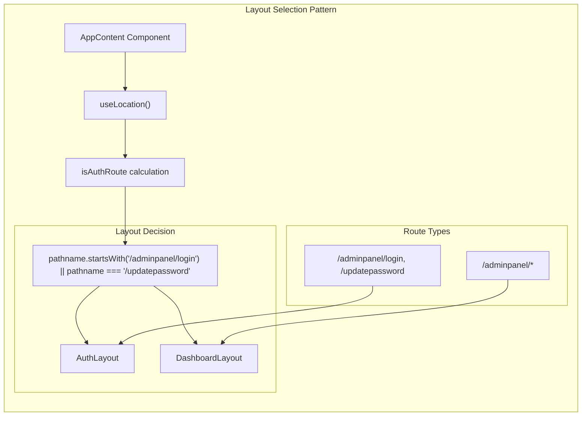
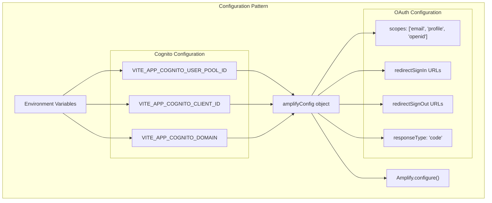

# Code Architecture Patterns

Relevant source files

The following files were used as context for generating this wiki page:

- [src/App.tsx](/src/App.tsx)
- [src/contexts/AuthService.ts](/src/contexts/AuthService.ts)
- [src/contexts/UserContext.tsx](/src/contexts/UserContext.tsx)

This document describes the common architectural patterns used throughout the CasinoVizion codebase. These patterns provide consistent approaches to authentication, state management, component design, and application structure. For specific implementation details of the authentication system, see [Authentication System](./5_Authentication_System.md). For UI component patterns, see [User Interface Components](./14_User_Interface_Components.md).

## Context Provider Pattern

The application uses React Context extensively for global state management, particularly for user authentication and authorization state.

### UserContext Implementation

The `UserContext` follows a standard provider pattern with typed interfaces and custom hooks for type-safe access.

The pattern includes:
- **Context Creation**: [src/contexts/UserContext.tsx:49]() creates the context with undefined default
- **Provider Component**: [src/contexts/UserContext.tsx:82-208]() wraps children with context value
- **Custom Hook**: [src/contexts/UserContext.tsx:211-217]() provides type-safe access with error handling
- **Type Safety**: [src/contexts/UserContext.tsx:20-31]() defines comprehensive interface for context value

**Sources:** [src/contexts/UserContext.tsx:1-217](), [src/App.tsx:115]()

## Service Layer Pattern

The application abstracts external dependencies through service layers, particularly for AWS Amplify authentication.

### AuthService Implementation

The `authService` provides a clean abstraction over AWS Amplify authentication functions:

Key characteristics:
- **Error Handling**: Each method includes try-catch blocks with console logging
- **Return Consistency**: Methods return null on error for consistent error handling
- **Async/Await**: All methods use async/await pattern for clean promise handling
- **Single Responsibility**: Each method has a focused purpose

**Sources:** [src/contexts/AuthService.ts:1-62]()

## Authentication & Authorization Patterns

### Role-Based Permission System

The application implements a role-based access control system with granular permissions:

Permission checking pattern:
- **Type Safety**: [src/contexts/UserContext.tsx:5]() defines UserRole as string literal union
- **Permission Map**: [src/contexts/UserContext.tsx:158-162]() maps roles to permission arrays
- **Permission Validation**: [src/contexts/UserContext.tsx:155-165]() checks user role against required permission

**Sources:** [src/contexts/UserContext.tsx:5](), [src/contexts/UserContext.tsx:155-165]()

### User Mapping Pattern

The application transforms AWS Cognito user data into application-specific user objects:

**Sources:** [src/contexts/UserContext.tsx:88-107]()

## Route Protection Pattern

The application uses a consistent pattern for protecting routes based on user permissions:

### ProtectedRoute Component Usage

Protection patterns:
- **Declarative Protection**: Each route declares required permission as prop
- **Permission Granularity**: Different routes require different permissions
- **Fallback Behavior**: Unauthenticated users redirected to login

**Sources:** [src/App.tsx:66-105]()

## State Management Patterns

### Provider Composition Pattern

The application composes multiple providers to create a comprehensive application context:

Each provider serves a specific purpose:
- **QueryClientProvider**: React Query for server state management
- **UserProvider**: User authentication and authorization state
- **TooltipProvider**: UI tooltip functionality
- **SidebarProvider**: Sidebar state management

**Sources:** [src/App.tsx:113-127]()

### Loading State Pattern

The UserContext implements a comprehensive loading state pattern:

| State | Purpose | Initial Value |
|-------|---------|---------------|
| `isLoading` | Indicates user data fetch in progress | `true` |
| `isAuthenticated` | Tracks authentication status | `false` |
| `user` | Current user object | `mockUsers.guest` |
| `token` | Authentication token | `null` |

Loading flow:
1. **Initial Load**: [src/contexts/UserContext.tsx:188-190]() triggers `loadUser()` on mount
2. **Loading State**: [src/contexts/UserContext.tsx:110]() sets loading to true
3. **User Fetch**: [src/contexts/UserContext.tsx:113-121]() attempts to get current user
4. **State Update**: [src/contexts/UserContext.tsx:117-120]() updates user, token, and auth status
5. **Loading Complete**: [src/contexts/UserContext.tsx:125]() sets loading to false

**Sources:** [src/contexts/UserContext.tsx:82-127](), [src/contexts/UserContext.tsx:188-190]()

## Layout Selection Pattern

The application dynamically selects layouts based on the current route:

### Dynamic Layout Selection

Pattern implementation:
- **Route Detection**: [src/App.tsx:37]() determines if current path is auth-related
- **Layout Selection**: [src/App.tsx:39]() selects appropriate layout component
- **Conditional Rendering**: [src/App.tsx:61]() renders selected layout with children

**Sources:** [src/App.tsx:35-39](), [src/App.tsx:61]()

## Configuration Pattern

### Environment-Based Configuration

The application uses environment variables for external service configuration:

Configuration characteristics:
- **Environment Variables**: [src/App.tsx:31-33]() imports configuration from environment
- **Type Safety**: Configuration object follows `ResourcesConfig` interface
- **OAuth Setup**: [src/App.tsx:45-53]() configures OAuth providers and redirect URLs
- **Runtime Configuration**: [src/App.tsx:58]() configures Amplify at application startup

**Sources:** [src/App.tsx:31-58]()