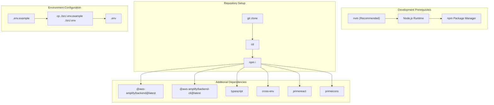
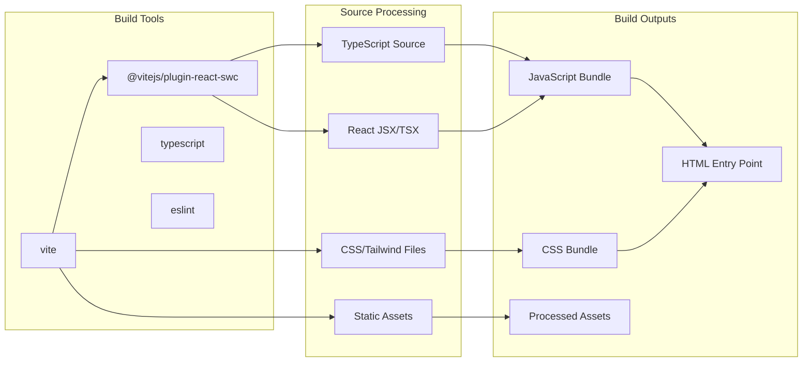
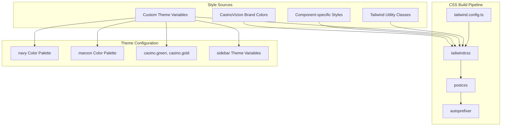
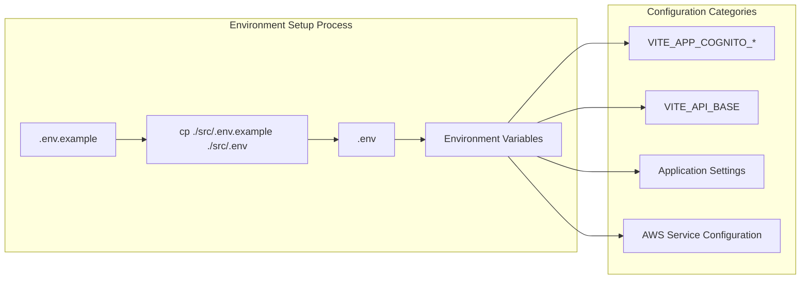
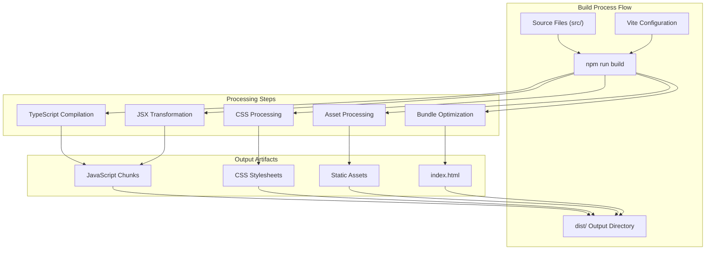
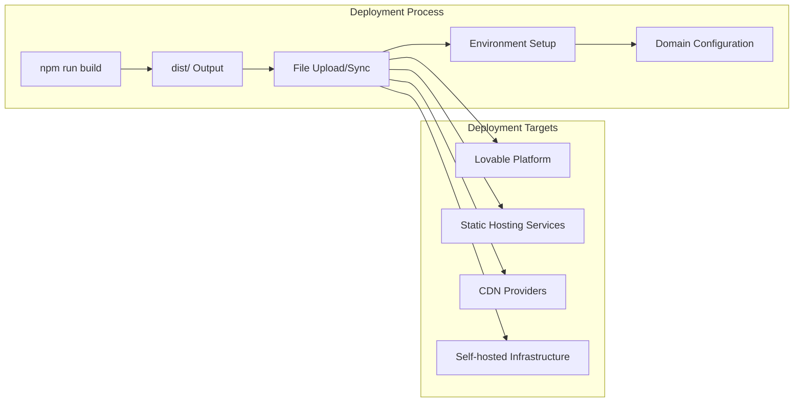

# Build and Deployment

Relevant source files

The following files were used as context for generating this wiki page:

- [README.md](README.md)
- [package.json](package.json)
- [tailwind.config.ts](tailwind.config.ts)

This document covers the build configuration, development setup, and deployment procedures for the CasinoVizion administrative panel. It provides technical details on the Vite-based build system, environment configuration, dependency management, and deployment options available through the Lovable platform.

For information about code architecture patterns and development practices, see [Code Architecture Patterns](#8.1). For environment variable configuration specifics, see [Environment Configuration](#2.1).

## Development Environment Setup

The CasinoVizion application uses a modern JavaScript development stack built around Vite, React, and TypeScript. The development environment requires Node.js and npm for package management and build tooling.

### Prerequisites and Installation

The project requires Node.js with npm package manager. The recommended installation method uses nvm (Node Version Manager) for version consistency across development environments.

Sources: [README.md:12-38](), [package.json:70-91]()

### Package Scripts and Development Workflow

The project defines several npm scripts for different development and build scenarios through the `package.json` configuration.

| Script | Command | Purpose |
|--------|---------|---------|
| `start` | `vite` | Alias for development server |
| `dev` | `vite` | Start development server with hot reload |
| `build` | `vite build` | Production build |
| `build:dev` | `vite build --mode development` | Development mode build |
| `lint` | `eslint .` | Code linting with ESLint |
| `preview` | `vite preview` | Preview production build locally |

Sources: [package.json:6-12]()

## Build Configuration

### Vite Build System

The application uses Vite as the primary build tool, configured for React with TypeScript support. Vite provides fast development server startup and optimized production builds through ES modules and esbuild.

Sources: [package.json:78](), [package.json:88-90]()

### TypeScript Configuration

The project includes TypeScript support with strict type checking enabled. TypeScript compilation is handled by Vite during both development and production builds.

### CSS and Styling Build Process

The styling system combines Tailwind CSS with custom theme configuration and CSS-in-JS components from the UI library ecosystem.

Sources: [tailwind.config.ts:1-128](), [package.json:74](), [package.json:79](), [package.json:86-87]()

## Dependency Management

### Production Dependencies

The application relies on several key dependency categories for functionality:

| Category | Key Dependencies | Purpose |
|----------|------------------|---------|
| **React Ecosystem** | `react`, `react-dom`, `react-router-dom` | Core framework and routing |
| **UI Components** | `@radix-ui/*`, `primereact`, `lucide-react` | Component libraries and icons |
| **AWS Integration** | `aws-amplify` | Authentication and cloud services |
| **Form Management** | `react-hook-form`, `@hookform/resolvers`, `zod` | Form handling and validation |
| **Styling** | `tailwind-merge`, `class-variance-authority`, `clsx` | CSS utility management |
| **Data Fetching** | `@tanstack/react-query` | Server state management |

Sources: [package.json:14-68]()

### Development Dependencies

Development-time dependencies focus on build tooling, type checking, and code quality:

| Category | Dependencies | Purpose |
|----------|--------------|---------|
| **Build Tools** | `vite`, `@vitejs/plugin-react-swc` | Build system and React plugin |
| **TypeScript** | `typescript`, `@types/*` | Type checking and definitions |
| **AWS Amplify** | `@aws-amplify/backend`, `@aws-amplify/backend-cli` | Backend development tools |
| **Code Quality** | `eslint`, `eslint-plugin-*` | Linting and code standards |
| **Styling Tools** | `tailwindcss`, `postcss`, `autoprefixer` | CSS processing |

Sources: [package.json:70-91]()

## Environment Configuration

### Environment Variables Setup

The application requires environment-specific configuration through `.env` files located in the `src` directory. The setup process involves copying the example configuration and updating values for the target environment.

Sources: [README.md:30-33]()

### Build Mode Configuration

The build system supports multiple build modes through Vite's mode configuration:

- **Development Mode**: `npm run build:dev` - Builds with development optimizations
- **Production Mode**: `npm run build` - Optimized production build with minification

Sources: [package.json:9-10]()

## Build Process

### Development Build Process

The development build process emphasizes fast rebuild times and comprehensive debugging capabilities:

1. **Source Processing**: TypeScript compilation with source maps
2. **Hot Module Replacement**: Live code updates without page refresh
3. **Development Server**: Local server with proxy capabilities for API calls
4. **Asset Processing**: Unminified assets for debugging

### Production Build Process

The production build process optimizes for performance and deployment:

1. **Code Minification**: JavaScript and CSS minification
2. **Tree Shaking**: Unused code elimination
3. **Asset Optimization**: Image and asset compression
4. **Bundle Splitting**: Code splitting for optimal loading

Sources: [package.json:9](), [README.md:37]()

## Deployment Options

### Lovable Platform Deployment

The primary deployment method uses the Lovable platform, which provides integrated hosting with custom domain support:

1. **Automatic Deployment**: Git push triggers automatic builds and deployments
2. **Custom Domain**: Connect custom domains through Project > Settings > Domains
3. **Environment Management**: Platform-managed environment variable configuration

### Manual Deployment Process

For alternative deployment targets, the standard process involves:

1. **Build Generation**: `npm run build` creates production-ready artifacts in `dist/`
2. **Static File Hosting**: Deploy contents of `dist/` directory to static hosting service
3. **Environment Configuration**: Configure environment variables on target platform
4. **Domain Configuration**: Set up DNS and SSL certificates as needed

Sources: [README.md:64-70]()

### Environment-Specific Deployments

Different deployment environments require appropriate build configurations:

- **Development**: Use `npm run build:dev` for debugging-friendly builds
- **Staging**: Production build with staging environment variables
- **Production**: Optimized production build with production environment variables

Sources: [package.json:10]()