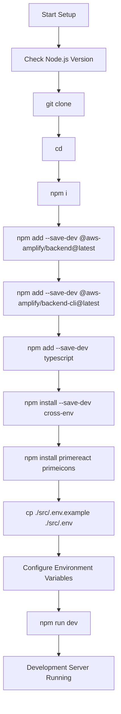
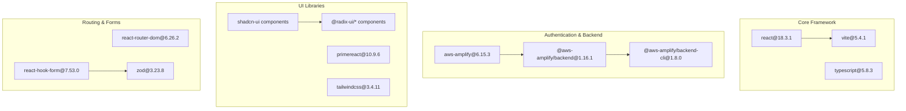
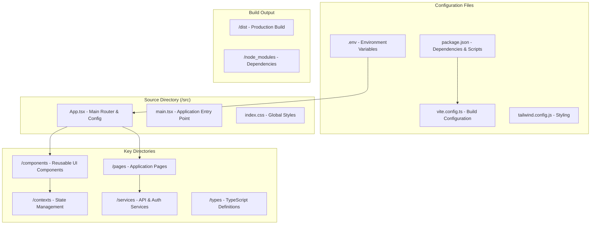
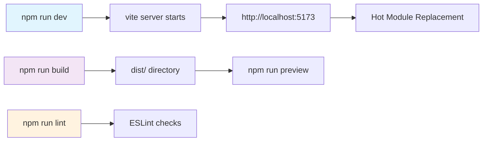

# Getting Started

<details>
<summary>Relevant source files</summary>

The following files were used as context for generating this wiki page:

- [README.md](/README.md)
- [package-lock.json](/package-lock.json)
- [package.json](/package.json)
- [src/.env.example](/src/.env.example)

</details>


This document provides step-by-step instructions for setting up the CasinoVizion administrative panel development environment. It covers installation of dependencies, environment configuration, and initial project setup to get the application running locally.

For information about the authentication system implementation, see [Authentication System](./5_Authentication_System.md). For details about the application architecture and routing, see [Application Architecture](./11_Application_Architecture.md).

## Prerequisites

Before setting up the project, ensure your development environment meets these requirements:

| Requirement | Version | Installation Method |
|-------------|---------|-------------------|
| Node.js | >= 18.19.0 | [Install with nvm](https://github.com/nvm-sh/nvm#installing-and-updating) |
| npm | Latest | Included with Node.js |
| Git | Latest | Platform-specific installer |

**Development Environment Setup Flow**



Sources: [README.md:12-38](), [package.json:6-12]()

## Installation

### 1. Clone the Repository

```bash
git clone <YOUR_GIT_URL>
cd <YOUR_PROJECT_NAME>
```

### 2. Install Dependencies

The project requires several dependency installations in a specific order:

```bash
# Core dependencies
npm i

# AWS Amplify backend tools
npm add --save-dev @aws-amplify/backend@latest @aws-amplify/backend-cli@latest typescript

# Cross-platform environment support
npm install --save-dev cross-env

# PrimeReact UI components
npm install primereact
npm i primeicons
```

**Key Dependencies Overview**



Sources: [package.json:14-69](), [README.md:23-28]()

### 3. Environment Configuration

Copy the environment template and configure AWS Cognito settings:

```bash
cp ./src/.env.example ./src/.env
```

Edit the created `.env` file with your AWS Cognito configuration:

| Variable | Description | Example |
|----------|-------------|---------|
| `VITE_API_BASE` | Backend API base URL | `http://localhost:5000/api/` |
| `VITE_APP_COGNITO_USER_POOL_ID` | AWS Cognito User Pool ID | `us-east-1_*******` |
| `VITE_APP_COGNITO_CLIENT_ID` | AWS Cognito App Client ID | `*********` |
| `VITE_APP_COGNITO_DOMAIN` | Cognito Hosted UI domain | `us-****-*********.auth.********.amazoncognito.com/` |

Sources: [src/.env.example:1-5](), [README.md:30-33]()

## Project Structure Overview

The application follows a standard React + Vite project structure with specific organization for authentication, components, and pages:

**Core Project Files and Structure**



Sources: [package.json:1-92](), [README.md:54-63]()

## Running the Application

### Development Server

Start the development server with hot reloading:

```bash
npm run dev
# or
npm start
```

Both commands execute `vite` and start the development server with auto-reloading.

### Available Scripts

| Script | Command | Purpose |
|--------|---------|---------|
| `dev` | `vite` | Start development server |
| `start` | `vite` | Alias for dev command |
| `build` | `vite build` | Production build |
| `build:dev` | `vite build --mode development` | Development build |
| `lint` | `eslint .` | Code linting |
| `preview` | `vite preview` | Preview production build |

**Development Workflow**



Sources: [package.json:6-12](), [README.md:37]()

## Technology Stack

The project uses a modern React development stack:

**Core Technologies**
- **React 18.3.1**: UI framework with hooks and context
- **TypeScript 5.8.3**: Type-safe JavaScript development  
- **Vite 5.4.1**: Fast build tool and development server
- **Tailwind CSS 3.4.11**: Utility-first CSS framework

**Authentication & Backend**
- **AWS Amplify 6.15.3**: Authentication and backend services
- **AWS Cognito**: User management and OAuth integration

**UI Component Libraries**
- **shadcn-ui**: Accessible component primitives built on Radix UI
- **Radix UI**: Low-level accessible components
- **PrimeReact 10.9.6**: Additional UI components and utilities
- **Lucide React**: Icon library

**Routing & State Management**
- **React Router DOM 6.26.2**: Client-side routing
- **React Context**: Global state management
- **React Hook Form 7.53.0**: Form handling and validation
- **Zod 3.23.8**: Schema validation

Sources: [package.json:14-69](), [README.md:56-62]()

## Next Steps

After successful setup, explore these areas:

1. **Authentication Configuration**: Set up AWS Cognito user pools and configure OAuth providers - see [Environment Configuration](#2.1)
2. **Understanding Dependencies**: Learn about the UI component libraries and their usage - see [Dependencies and Tech Stack](#2.2)  
3. **Application Architecture**: Explore the routing system and component organization - see [Application Architecture](#4)
4. **Authentication System**: Understand login flows and user management - see [Authentication System](#3)

The development server should now be running at `http://localhost:5173` with the CasinoVizion administrative panel ready for development.

Sources: [README.md:1-72](/README.md), [package.json:1-92](/package.json)