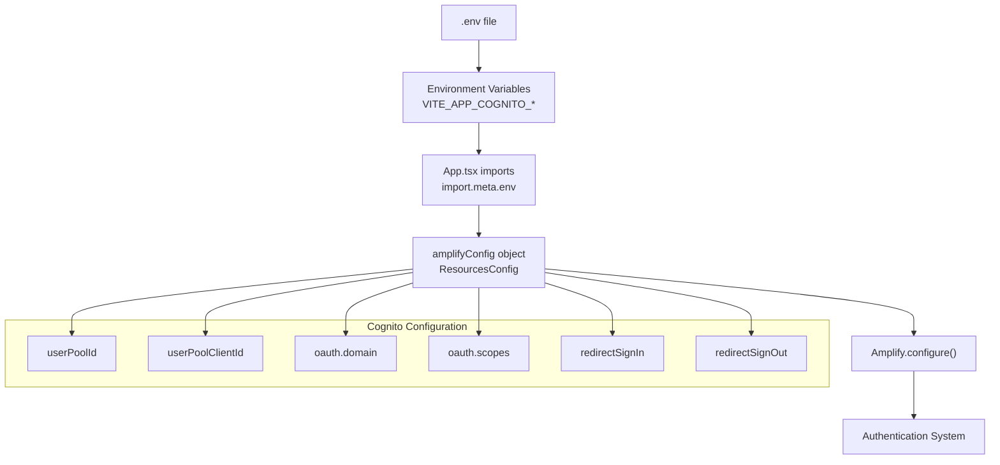
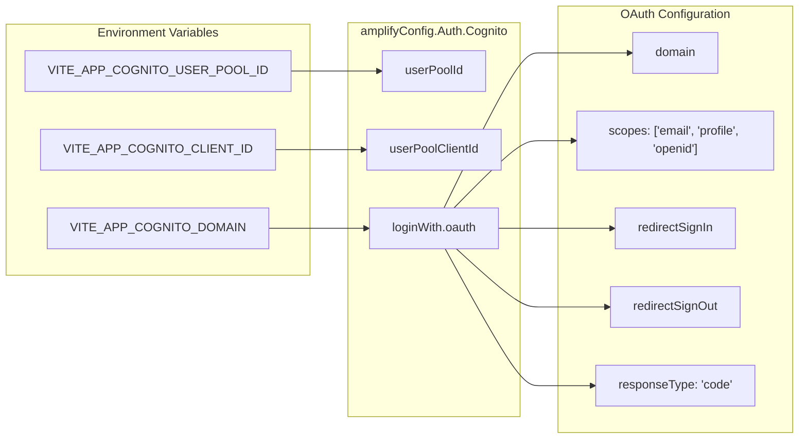
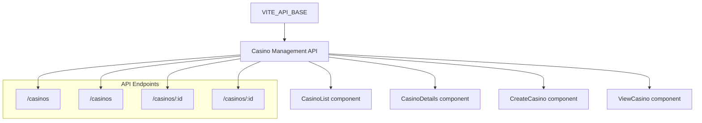

# Environment Configuration

<details>
<summary>Relevant source files</summary>

The following files were used as context for generating this wiki page:

- [src/.env.example](/src/.env.example)
- [src/App.tsx](/src/App.tsx)

</details>


This document covers the environment variable setup and configuration required to run the CasinoVizion administrative panel. It explains how to configure AWS Cognito authentication, API endpoints, and other environment-specific settings.

For information about the overall authentication system architecture, see [Authentication System](./3_Environment_Configuration.md). For details about the build and deployment process, see [Build and Deployment](./27_Build_and_Deployment.md).

## Purpose and Scope

The CasinoVizion application requires specific environment variables to connect to AWS Cognito for authentication and external APIs for casino data management. This configuration enables the application to operate in different environments (development, staging, production) with appropriate service endpoints and credentials.

## Environment Variables Overview

The application uses Vite's environment variable system, which requires variables to be prefixed with `VITE_` to be accessible in the client-side code. All configuration is managed through environment variables for security and flexibility across deployment environments.

### Required Environment Variables

| Variable | Purpose | Example Value |
|----------|---------|---------------|
| `VITE_API_BASE` | Backend API base URL | `http://localhost:5000/api/` |
| `VITE_APP_COGNITO_USER_POOL_ID` | AWS Cognito User Pool identifier | `us-east-1_*******` |
| `VITE_APP_COGNITO_CLIENT_ID` | AWS Cognito App Client ID | `*********` |
| `VITE_APP_COGNITO_DOMAIN` | AWS Cognito hosted UI domain | `us-****-*********.auth.********.amazoncognito.com/` |

Sources: [src/.env.example:1-4]()

## AWS Cognito Configuration Flow



Sources: [src/App.tsx:31-58]()

## Environment Variable Usage in Code

The application imports environment variables using Vite's `import.meta.env` interface and transforms them into AWS Amplify configuration:

```typescript
// Environment variable imports
const REACT_APP_COGNITO_USER_POOL_ID = import.meta.env.VITE_APP_COGNITO_USER_POOL_ID;
const REACT_APP_COGNITO_CLIENT_ID = import.meta.env.VITE_APP_COGNITO_CLIENT_ID;
const REACT_APP_COGNITO_DOMAIN = import.meta.env.VITE_APP_COGNITO_DOMAIN;
```

These variables are then used to construct the `amplifyConfig` object that configures AWS Amplify authentication services.

Sources: [src/App.tsx:31-33]()

## AWS Amplify Configuration Structure



Sources: [src/App.tsx:40-56]()

## OAuth Redirect Configuration

The application configures OAuth redirect URLs dynamically based on the current environment:

- **Sign-in redirects**: `[window.location.origin + '/login', 'http://localhost:3000/adminpanel/login']`
- **Sign-out redirects**: `[window.location.origin + '/login', 'http://localhost:3000/adminpanel/login']`

This configuration supports both production deployments (using `window.location.origin`) and local development (hardcoded localhost URL).

Sources: [src/App.tsx:49-50]()

## API Base URL Configuration

The `VITE_API_BASE` environment variable configures the backend API endpoint for casino data operations. This variable is used throughout the application to make HTTP requests to the casino management backend.



Sources: [src/.env.example:1]()

## Local Development Setup

1. **Create environment file**: Copy `src/.env.example` to `src/.env` in the src folder
2. **Configure AWS Cognito**: Replace placeholder values with actual AWS Cognito User Pool details
3. **Set API endpoint**: Configure `VITE_API_BASE` to point to your local or remote backend API
4. **Verify configuration**: Ensure all required environment variables are set before starting the application

The application will fail to authenticate properly if any of the AWS Cognito environment variables are missing or incorrect.

Sources: [src/.env.example:1-4]()

## Environment Variable Validation

The application uses fallback empty strings for missing environment variables, but AWS Amplify will fail to initialize properly without valid values:

```typescript
userPoolId: REACT_APP_COGNITO_USER_POOL_ID || '',
userPoolClientId: REACT_APP_COGNITO_CLIENT_ID || '',
// ...
domain: REACT_APP_COGNITO_DOMAIN || '',
```

This pattern prevents runtime errors but requires proper configuration for functional authentication.

Sources: [src/App.tsx:43-47]()