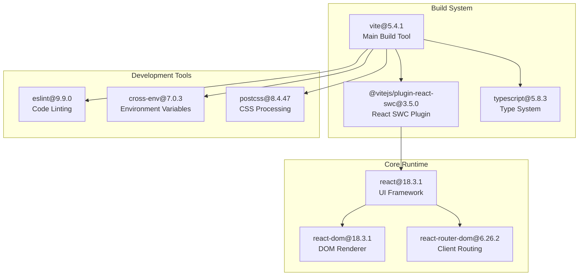
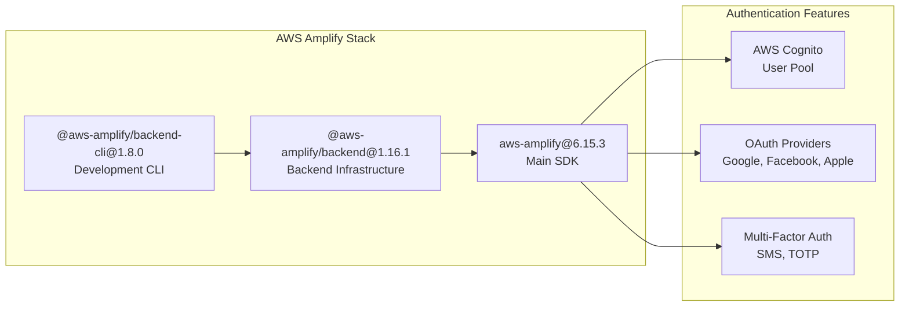
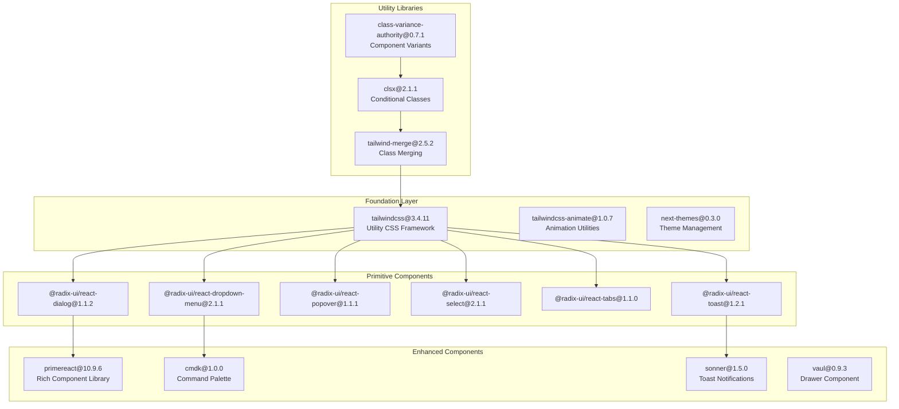
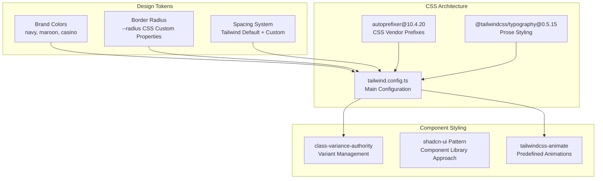
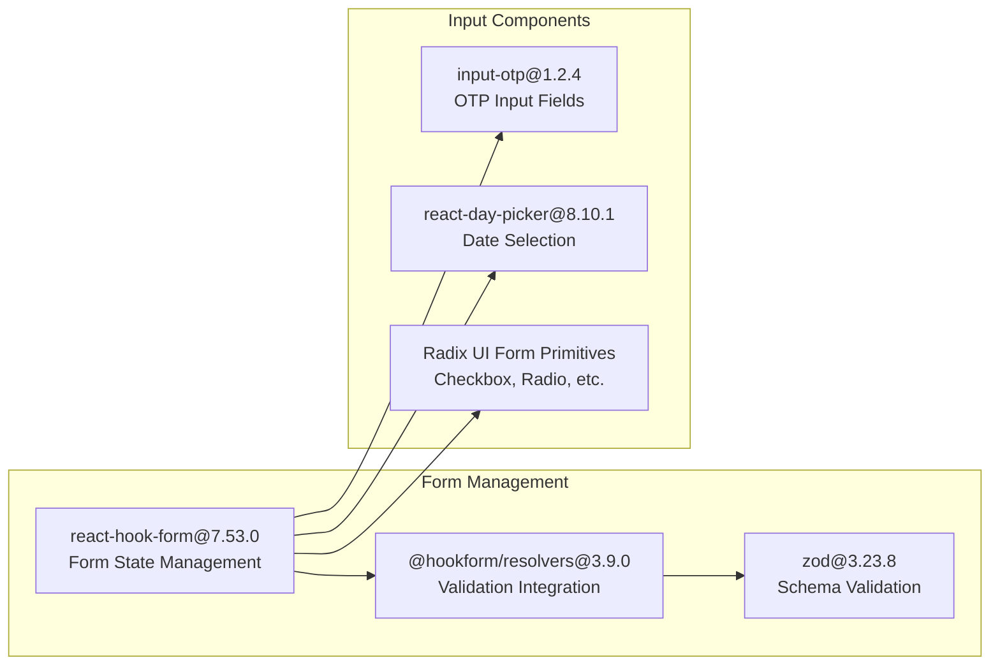
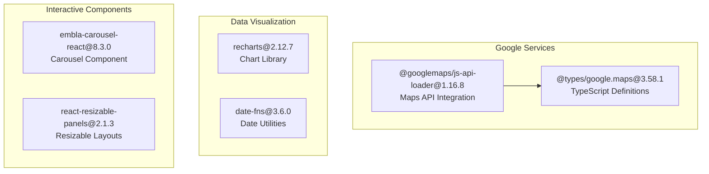
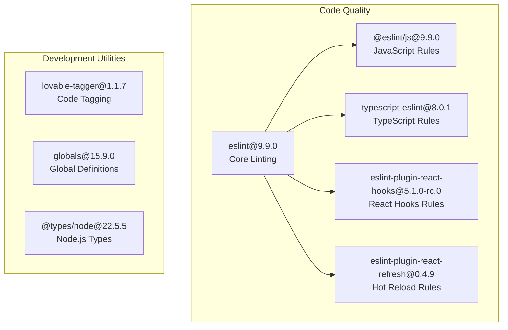

# Dependencies and Tech Stack

Relevant source files

The following files were used as context for generating this wiki page:

- [package-lock.json](/package-lock.json)
- [package.json](/package.json)
- [tailwind.config.ts](/tailwind.config.ts)

This document provides a comprehensive overview of the dependencies and technology stack used in the CasinoVizion administrative panel. It covers the core frameworks, libraries, and tools that power the application's functionality, from the React foundation to AWS authentication and UI components.

For information about environment configuration and AWS setup, see [Environment Configuration](./3_Environment_Configuration.md). For build and deployment procedures, see [Build and Deployment](./27_Build_and_Deployment.md).

## Core Framework & Build System

The application is built on a modern React foundation with Vite as the build tool and TypeScript for type safety.

**Sources:** [package.json:1-92](), [package.json:6-12]()

| Technology | Version | Purpose |
|------------|---------|---------|
| `react` | 18.3.1 | Core UI framework |
| `vite` | 5.4.1 | Build tool and dev server |
| `typescript` | 5.8.3 | Static type checking |
| `react-router-dom` | 6.26.2 | Client-side routing |

## Authentication & Backend Services

AWS Amplify provides the backbone for authentication and backend services integration.

**Sources:** [package.json:46](), [package.json:71-72]()

The AWS Amplify integration enables:
- User authentication via `aws-amplify` SDK
- Backend infrastructure management through `@aws-amplify/backend`
- Development tooling via `@aws-amplify/backend-cli`

## UI Component Libraries

The application uses a layered approach to UI components, building from low-level primitives to high-level composed components.

**Sources:** [package.json:17-43](), [package.json:47-48](), [package.json:60](), [package.json:64](), [package.json:65-67]()

### Radix UI Components

The application extensively uses Radix UI primitives for accessible, unstyled components:

| Component | Version | Usage |
|-----------|---------|-------|
| `@radix-ui/react-dialog` | 1.1.2 | Modal dialogs |
| `@radix-ui/react-dropdown-menu` | 2.1.1 | Dropdown menus |
| `@radix-ui/react-select` | 2.1.1 | Custom select inputs |
| `@radix-ui/react-tabs` | 1.1.0 | Tab navigation |
| `@radix-ui/react-toast` | 1.2.1 | Notification system |

## Styling & Design System

The styling architecture is built on Tailwind CSS with custom design tokens and utilities.

**Sources:** [tailwind.config.ts:1-128](), [package.json:74](), [package.json:79](), [package.json:83]()

### Custom Color Palette

The design system includes CasinoVizion brand colors:

| Color | Default Value | Usage |
|-------|---------------|-------|
| `navy` | #13294B | Primary brand color |
| `maroon` | #7D1D28 | Secondary brand color |
| `casino.green` | #1A5935 | Casino-themed accent |
| `casino.gold` | #E0B100 | Casino-themed accent |

**Sources:** [tailwind.config.ts:66-96]()

## Form Handling & Validation

Form management is handled through React Hook Form with Zod schema validation.

**Sources:** [package.json:16](), [package.json:52](), [package.json:58](), [package.json:60](), [package.json:68]()

## Data Management & State

Data fetching and state management use modern React patterns with TanStack Query.

| Library | Version | Purpose |
|---------|---------|---------|
| `@tanstack/react-query` | 5.56.2 | Server state management |
| `react-router-dom` | 6.26.2 | Client-side routing |
| React Context | Built-in | Global user state |

**Sources:** [package.json:44](), [package.json:62]()

## External Integrations

The application integrates with external services for enhanced functionality.

**Sources:** [package.json:15](), [package.json:45](), [package.json:50-51](), [package.json:61](), [package.json:63]()

## Development Tools & Linting

The development environment includes comprehensive tooling for code quality and development experience.

**Sources:** [package.json:69](), [package.json:75-85]()

## Build Scripts & Commands

The application provides several build and development commands:

| Script | Command | Purpose |
|--------|---------|---------|
| `start` | `vite` | Start development server |
| `dev` | `vite` | Start development server (alias) |
| `build` | `vite build` | Production build |
| `build:dev` | `vite build --mode development` | Development build |
| `lint` | `eslint .` | Code linting |
| `preview` | `vite preview` | Preview production build |

**Sources:** [package.json:6-12]()