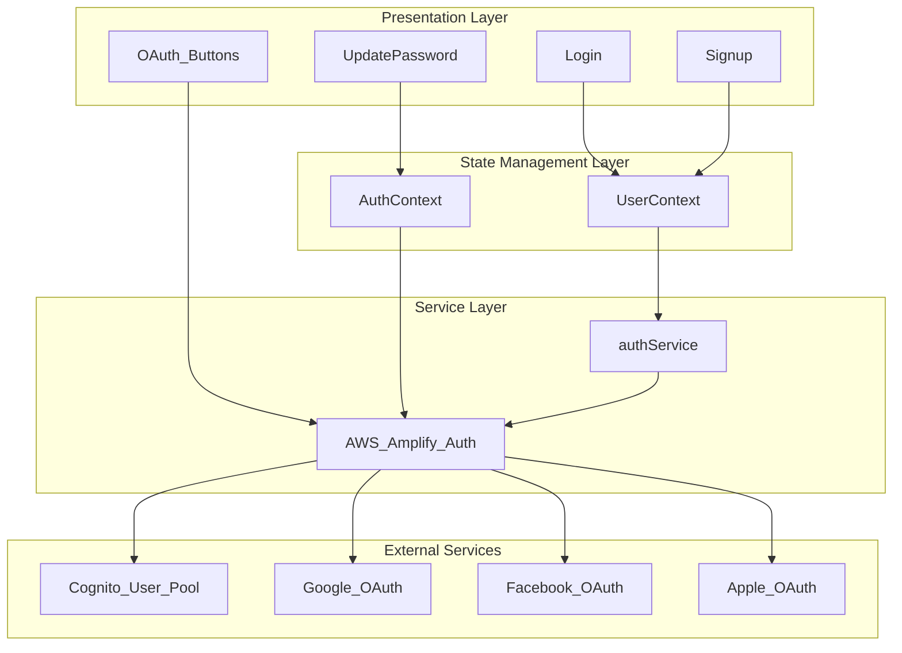
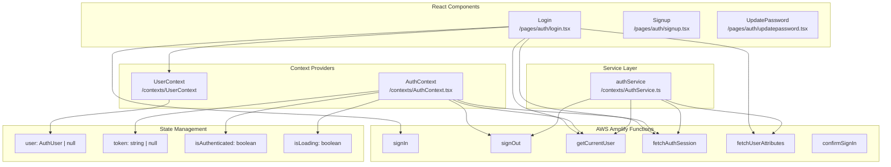
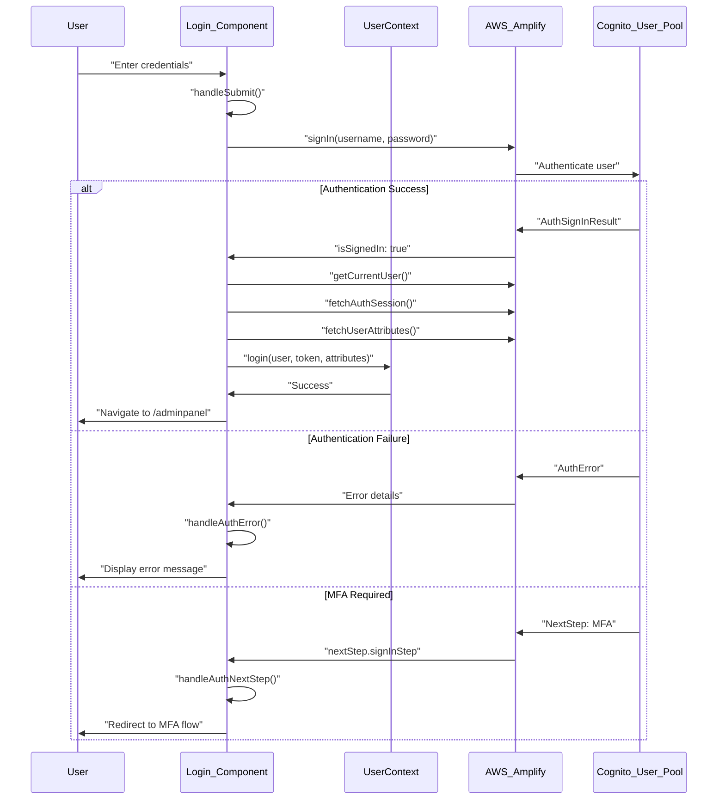
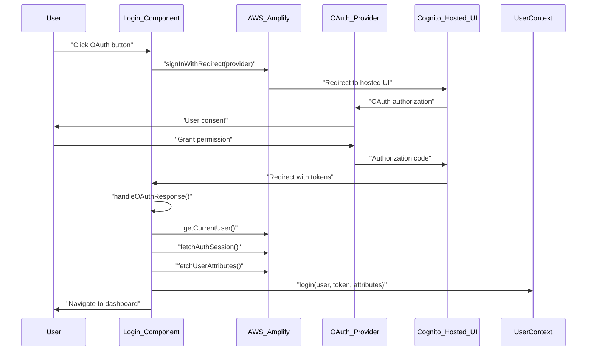
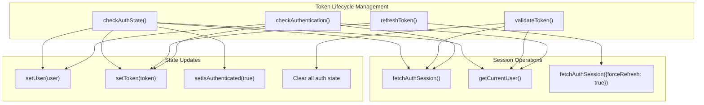
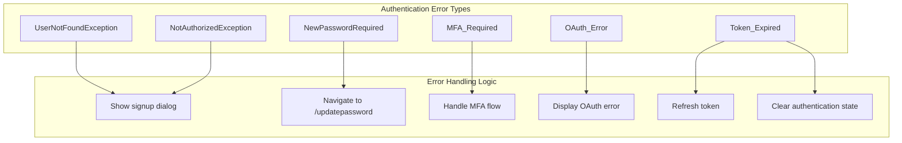
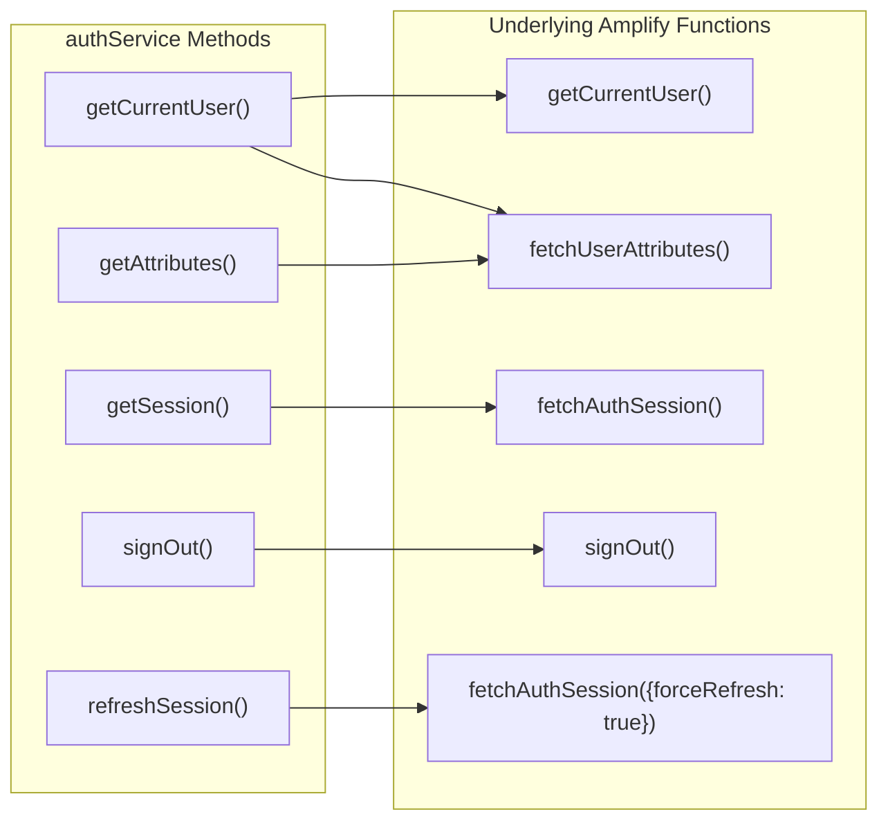

# Authentication System

Relevant source files

The following files were used as context for generating this wiki page:

- [src/contexts/AuthContext.tsx](src/contexts/AuthContext.tsx)
- [src/contexts/AuthService.ts](src/contexts/AuthService.ts)
- [src/pages/auth/login.tsx](src/pages/auth/login.tsx)

This document covers the comprehensive authentication system implemented in the CasinoVizion administrative panel. The system provides secure user authentication through AWS Cognito, supporting both traditional email/password login and OAuth social providers (Google, Facebook, Apple). It includes JWT token management, role-based access control, and multi-factor authentication capabilities.

For information about route protection and authorization, see [Application Architecture](./11_Application_Architecture.md). For details about user interface components used in authentication, see [User Interface Components](./14_User_Interface_Components.md).

## System Architecture

The authentication system follows a layered architecture with clear separation between presentation, business logic, and external service integration:

Sources: [src/pages/auth/login.tsx:1-333](), [src/contexts/AuthContext.tsx:1-201](), [src/contexts/AuthService.ts:1-62]()

## Core Components and Code Entities

The authentication system consists of several key components that work together to provide a complete authentication solution:

Sources: [src/pages/auth/login.tsx:8-10](), [src/contexts/AuthContext.tsx:1-8](), [src/contexts/AuthService.ts:1-2]()

## Authentication Flows

### Primary Login Flow

The main authentication flow handles credential validation, session management, and various authentication scenarios:

Sources: [src/pages/auth/login.tsx:44-98](), [src/pages/auth/login.tsx:100-114]()

### OAuth Authentication Flow

The system supports OAuth authentication through multiple providers with automatic redirect handling:

Sources: [src/pages/auth/login.tsx:116-161]()

### Token Management and Session Validation

The authentication system implements comprehensive token management with automatic refresh and validation:

Sources: [src/contexts/AuthContext.tsx:44-70](), [src/contexts/AuthContext.tsx:105-129](), [src/contexts/AuthContext.tsx:165-178]()

## AWS Cognito Integration

The system integrates deeply with AWS Cognito for identity management, using the AWS Amplify Auth library as the primary interface:

| Function | Purpose | Source File | Usage |
|----------|---------|-------------|-------|
| `signIn` | Authenticate user credentials | login.tsx | Primary login flow |
| `confirmSignIn` | Handle MFA confirmation | login.tsx | Multi-factor authentication |
| `getCurrentUser` | Get authenticated user info | Multiple | Session validation |
| `fetchAuthSession` | Retrieve current session tokens | Multiple | Token management |
| `fetchUserAttributes` | Get user profile attributes | Multiple | User information |
| `signOut` | End user session | AuthContext.tsx | Logout functionality |

### Authentication Error Handling

The system implements comprehensive error handling for various authentication scenarios:

Sources: [src/pages/auth/login.tsx:83-97](), [src/pages/auth/login.tsx:100-114](), [src/pages/auth/login.tsx:116-130]()

## State Management Architecture

The authentication system uses React Context for global state management, providing a clean separation between authentication logic and UI components:

### AuthContext State Structure

| State Property | Type | Purpose |
|----------------|------|---------|
| `user` | `AuthUser \| null` | Current authenticated user |
| `token` | `string \| null` | JWT ID token |
| `isLoading` | `boolean` | Authentication check in progress |
| `shown` | `boolean` | User interface display state |
| `isAuthenticated` | `boolean` | Authentication status |
| `userAttributes` | `FetchUserAttributesOutput` | User profile attributes |

### Context Methods

| Method | Parameters | Returns | Purpose |
|--------|------------|---------|---------|
| `login` | `user`, `token`, `attributes` | `Promise<boolean>` | Set authenticated state |
| `logout` | None | `Promise<boolean>` | Clear authentication |
| `validateToken` | None | `Promise<boolean>` | Check token validity |
| `refreshToken` | None | `Promise<string \| null>` | Refresh session token |
| `checkAuthState` | None | `Promise<void>` | Initial auth check |
| `checkAuthentication` | None | `Promise<void>` | Validate current auth |

Sources: [src/contexts/AuthContext.tsx:10-23](), [src/contexts/AuthContext.tsx:131-142](), [src/contexts/AuthContext.tsx:144-163]()

## Service Layer Abstraction

The `authService` provides a clean abstraction over AWS Amplify authentication functions, centralizing common operations and error handling:

Sources: [src/contexts/AuthService.ts:3-62]()