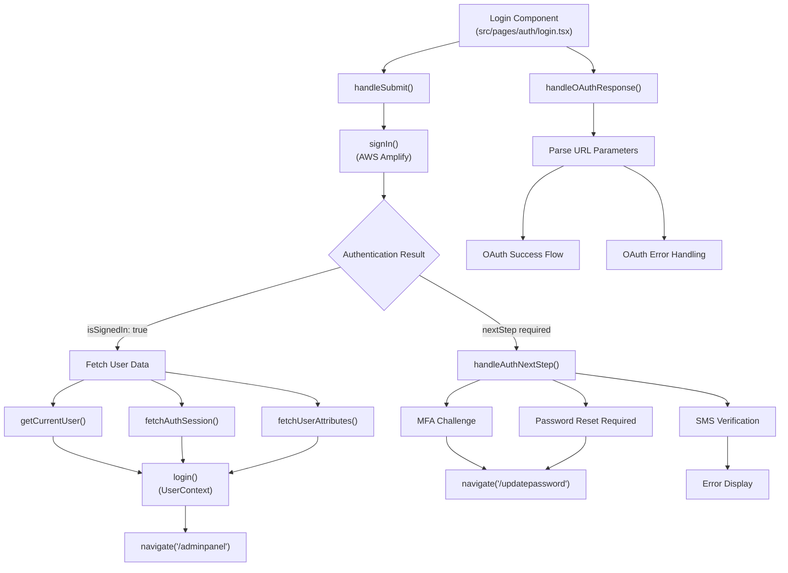
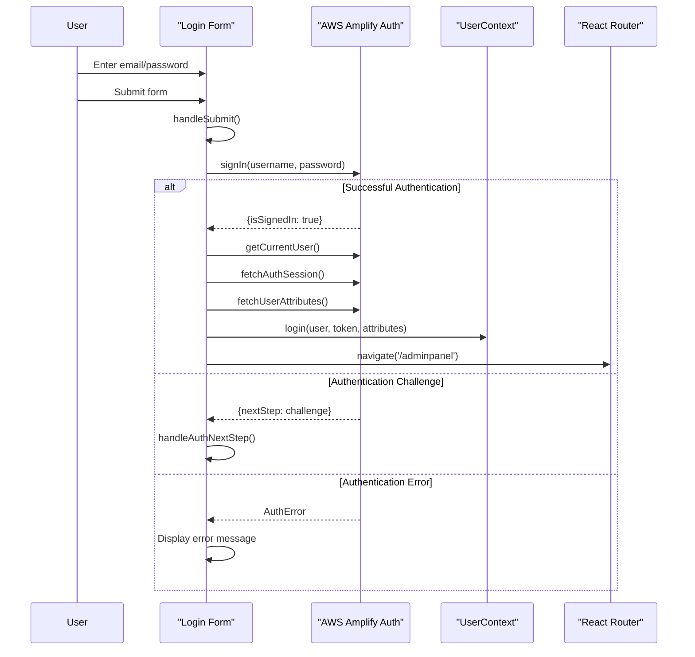
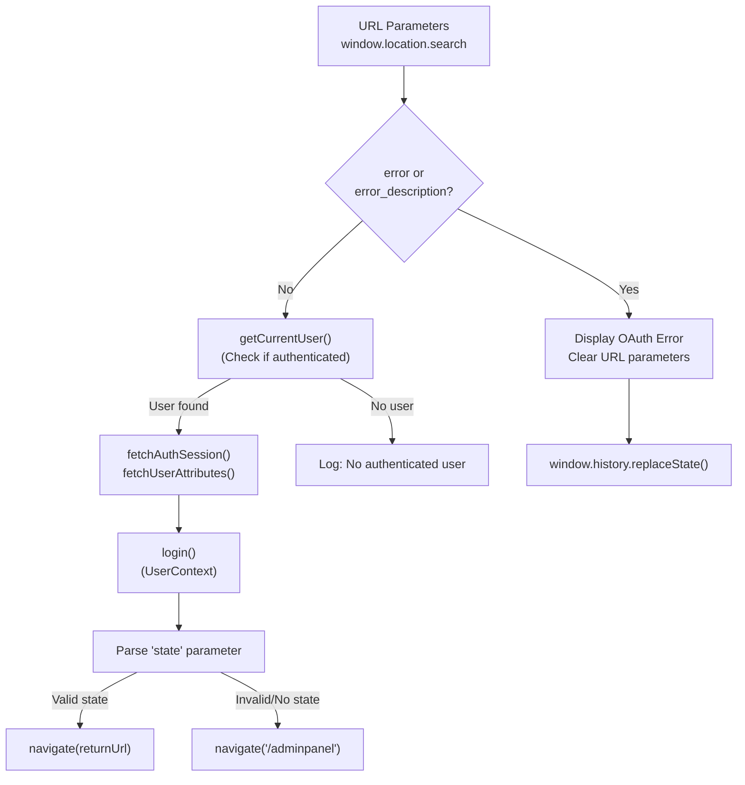
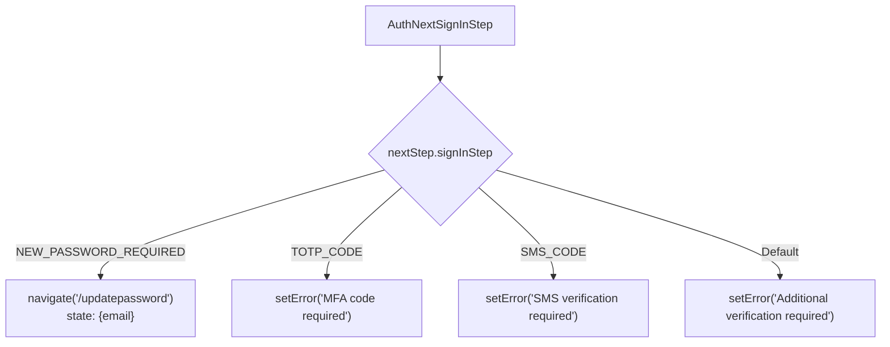
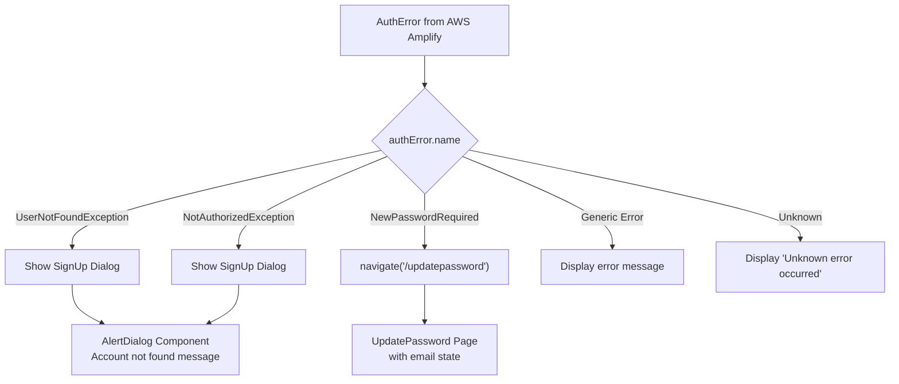
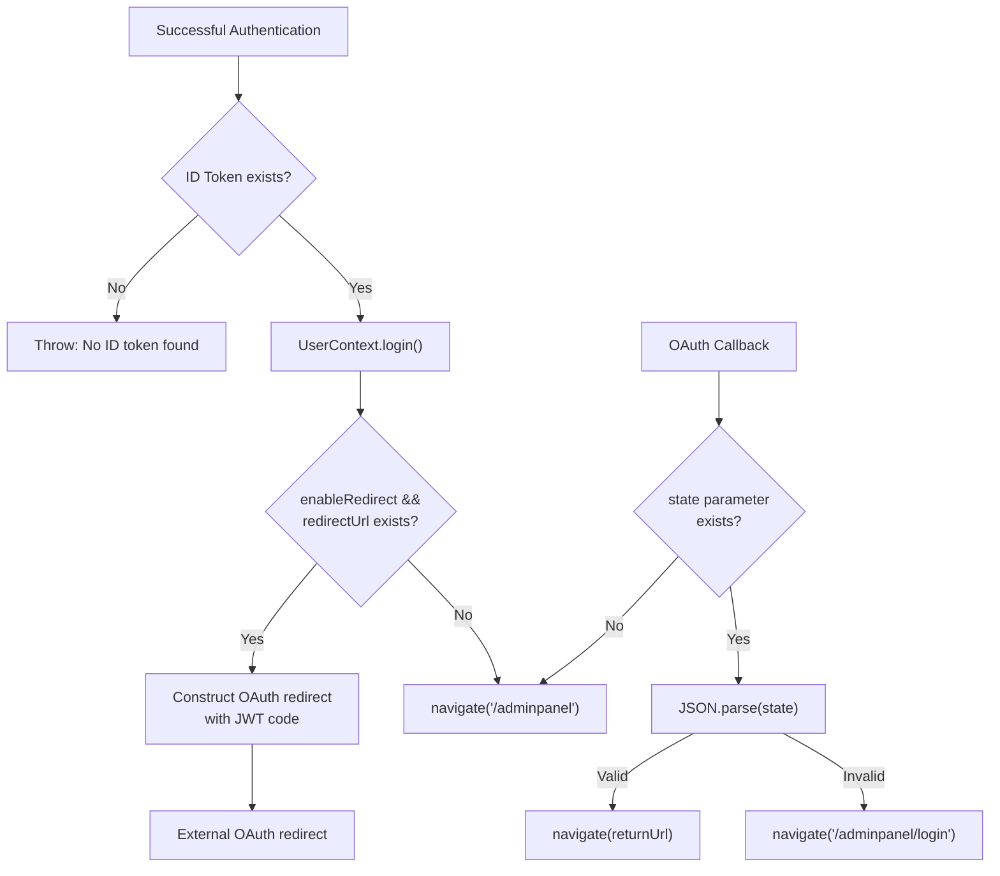

# Login Flow

Relevant source files

The following files were used as context for generating this wiki page:

- [src/pages/auth/login.tsx](/src/pages/auth/login.tsx)

## Purpose and Scope

This document covers the authentication flow for the CasinoVizion administrative panel, specifically focusing on the login process implemented in the React frontend. The login system supports both traditional email/password authentication and OAuth social login through AWS Cognito, with multi-factor authentication capabilities.

For information about user registration and signup processes, see [User Registration](./7_User_Registration.md). For password reset and update functionality, see [Password Management](./8_Password_Management.md). For OAuth provider configuration details, see [OAuth Integration](./9_OAuth_Integration.md).

## Authentication Flow Overview

The login system is implemented as a single-page component that handles multiple authentication scenarios through AWS Amplify Auth integration. The flow supports immediate sign-in, multi-factor authentication challenges, password reset requirements, and OAuth provider redirects.

Sources: [src/pages/auth/login.tsx:44-98](), [src/pages/auth/login.tsx:100-114](), [src/pages/auth/login.tsx:116-161]()

## Form-Based Authentication

The primary authentication method uses a traditional email/password form with validation and error handling. The form component manages local state for user inputs and integrates with AWS Amplify for authentication.

### Form State Management

The login form maintains state for user credentials and UI feedback:

| State Variable | Type | Purpose |
|----------------|------|---------|
| `email` | string | User email input |
| `password` | string | User password input |
| `isLoading` | boolean | Loading state during authentication |
| `error` | string | Error message display |
| `showPassword` | boolean | Password visibility toggle |

### Authentication Process

The `handleSubmit` function performs credential validation and initiates the AWS Amplify authentication process. It handles the complete authentication flow including token retrieval and user context initialization.

Sources: [src/pages/auth/login.tsx:44-98](), [src/pages/auth/login.tsx:27-37]()

## OAuth Authentication Handling

The login component automatically processes OAuth redirects from social authentication providers (Google, Facebook, Apple) through AWS Cognito's hosted UI. This occurs when users return to the application after completing social authentication.

### OAuth Redirect Processing

The OAuth flow is handled automatically through the `useEffect` hook that runs on component mount, checking for OAuth callback parameters and processing the authentication result.

Sources: [src/pages/auth/login.tsx:116-161]()

## Multi-Factor Authentication and Verification Steps

When AWS Cognito requires additional verification steps, the `handleAuthNextStep` function processes the authentication challenge and routes the user to appropriate flows.

### Authentication Challenge Types

| Challenge Type | Constant | Action |
|----------------|----------|---------|
| New Password Required | `CONFIRM_SIGN_IN_WITH_NEW_PASSWORD_REQUIRED` | Navigate to `/updatepassword` |
| TOTP MFA | `CONFIRM_SIGN_IN_WITH_TOTP_CODE` | Display MFA error (not implemented) |
| SMS MFA | `CONFIRM_SIGN_IN_WITH_SMS_CODE` | Display SMS error (not implemented) |
| Default | Other values | Display generic verification error |

Sources: [src/pages/auth/login.tsx:100-114]()

## Error Handling and User Feedback

The login component implements comprehensive error handling for various authentication failure scenarios, providing specific user feedback and recovery options.

### Error Classification and Response

The error handling system distinguishes between different AWS Cognito error types and provides contextual responses. The `showSignUpDialog` state controls the display of an alert dialog for authentication failures.

Sources: [src/pages/auth/login.tsx:83-97](), [src/pages/auth/login.tsx:187-200]()

## Session Management and Navigation

Upon successful authentication, the login component establishes the user session through the UserContext and performs appropriate navigation based on the authentication result and any redirect parameters.

### Session Initialization Flow

The session establishment process involves multiple AWS Amplify calls to gather complete user information:

1. `getCurrentUser()` - Retrieves basic user information
2. `fetchAuthSession()` - Gets authentication tokens including ID token
3. `fetchUserAttributes()` - Fetches user profile attributes
4. `login()` - Updates UserContext with complete user data

### Navigation Logic

Sources: [src/pages/auth/login.tsx:59-82](), [src/pages/auth/login.tsx:143-153]()