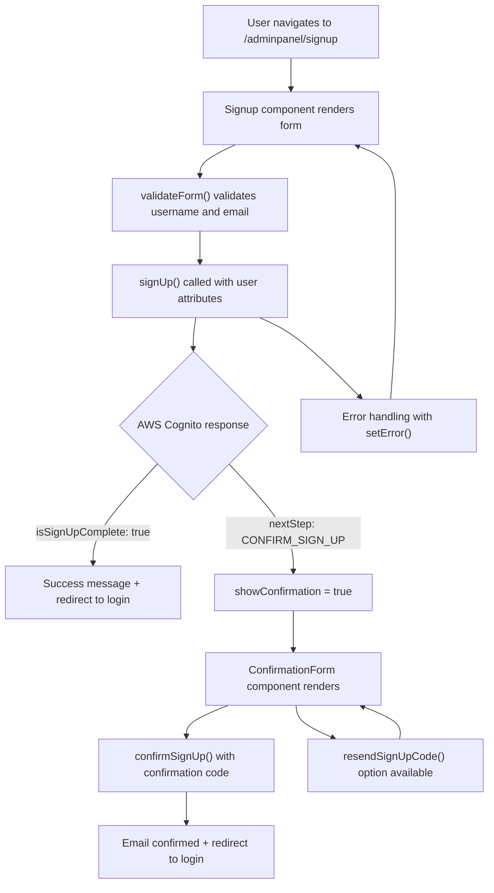
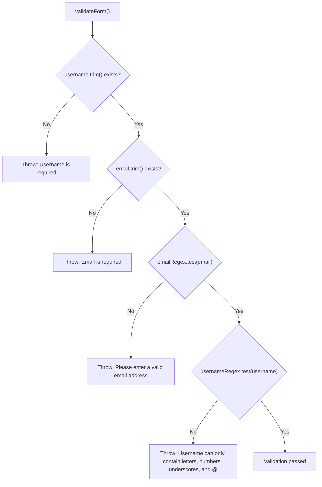
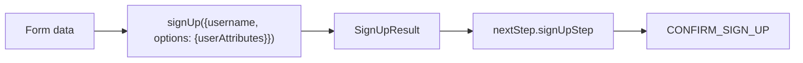
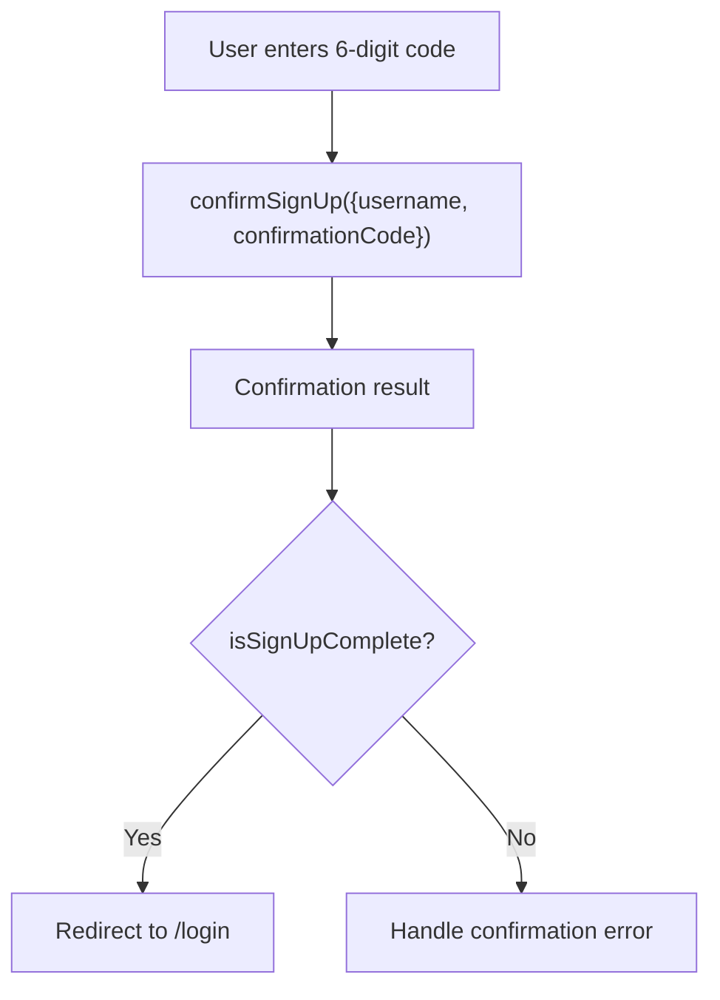
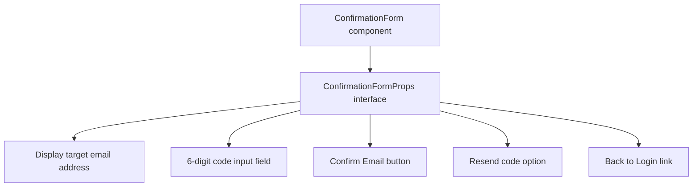
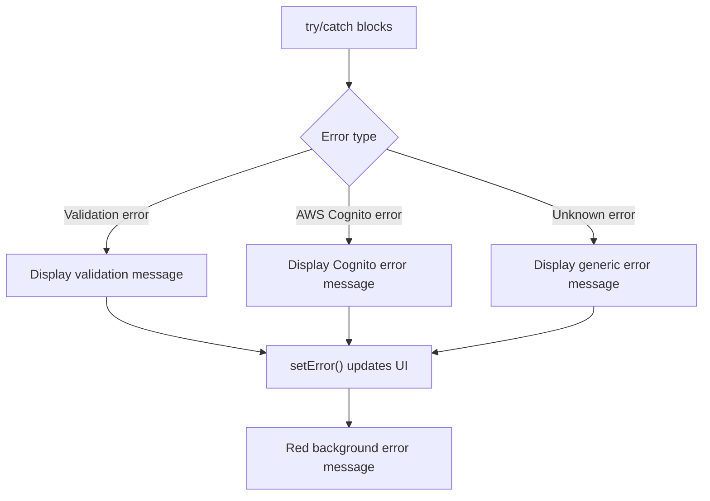
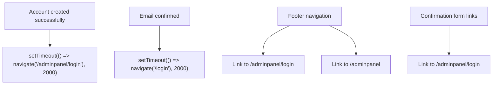

# User Registration

Relevant source files

The following files were used as context for generating this wiki page:

- [src/pages/auth/ConfirmationForm.tsx](/src/pages/auth/ConfirmationForm.tsx)
- [src/pages/auth/signup.tsx](/src/pages/auth/signup.tsx)

This document covers the user registration system in CasinoVizion, which implements a two-step signup process using AWS Cognito authentication. The registration flow includes initial account creation with comprehensive user attributes and mandatory email confirmation.

For information about the login process after registration, see [Login Flow](./6_Login_Flow.md). For password management functionality, see [Password Management](./8_Password_Management.md). For OAuth-based registration alternatives, see [OAuth Integration](./9_OAuth_Integration.md).

## Registration Flow Overview

The user registration system consists of two main phases: initial signup form submission and email confirmation. The process is handled by the `Signup` component with support from the `ConfirmationForm` component for email verification.

Sources: [src/pages/auth/signup.tsx:93-140](), [src/pages/auth/signup.tsx:197-210](), [src/pages/auth/ConfirmationForm.tsx:18-71]()

## Form Fields and User Attributes

The registration form collects comprehensive user information that maps to AWS Cognito user attributes. The form is implemented using a responsive two-column grid layout.

### Required Fields

| Form Field | Cognito Attribute | Validation |
|------------|-------------------|------------|
| `username` | username | Required, alphanumeric + underscore + @ |
| `email` | email | Required, valid email format |
| `givenName` | given_name | Required |
| `familyName` | family_name | Required |

### Optional Fields

| Form Field | Cognito Attribute | Type |
|------------|-------------------|------|
| `middleName` | middle_name | Text |
| `website` | website | URL |
| `phone` | phone_number | Tel |
| `address` | address | Text |
| `birthdate` | birthdate | Date |

The form state is managed through the `IForm` interface and handled by the `handleChange` function which updates the form state and clears any existing error messages.

Sources: [src/pages/auth/signup.tsx:29-39](), [src/pages/auth/signup.tsx:102-117](), [src/pages/auth/signup.tsx:232-345]()

## Form Validation

The `validateForm` function implements client-side validation before submission to AWS Cognito:

The validation patterns are:
- Email: `/^[^\s@]+@[^\s@]+\.[^\s@]+$/`
- Username: `/^[a-zA-Z0-9_@.]+$/`

Sources: [src/pages/auth/signup.tsx:72-91]()

## AWS Cognito Integration

The registration process integrates with AWS Cognito through three main functions from `aws-amplify/auth`:

### Initial Signup

The `signUp` function is called with the username and user attributes:

The `SignUpResult` interface defines the expected response structure with `isSignUpComplete` boolean and `nextStep` object containing the `signUpStep` value.

Sources: [src/pages/auth/signup.tsx:17-27](), [src/pages/auth/signup.tsx:102-118]()

### Email Confirmation

The confirmation process uses `confirmSignUp` with the username and 6-digit code:

### Code Resending

The `resendSignUpCode` function allows users to request a new confirmation code if the original email was not received.

Sources: [src/pages/auth/signup.tsx:142-173](), [src/pages/auth/signup.tsx:175-195](), [src/pages/auth/ConfirmationForm.tsx:39-61]()

## Email Confirmation Interface

The `ConfirmationForm` component provides a dedicated interface for email verification with the following features:

### Component Structure

### Props Interface

The component receives the following props from the parent `Signup` component:

| Prop | Type | Purpose |
|------|------|---------|
| `email` | string | Display target email for confirmation |
| `error` | string | Error message display |
| `success` | string | Success message display |
| `confirmationCode` | string | Current code input value |
| `isLoading` | boolean | Loading state management |
| `handleCodeChange` | function | Code input change handler |
| `handleConfirmSignUp` | function | Form submission handler |
| `handleResendCode` | function | Resend code functionality |

Sources: [src/pages/auth/ConfirmationForm.tsx:7-16](), [src/pages/auth/ConfirmationForm.tsx:18-71]()

## Error Handling and User Feedback

The registration system implements comprehensive error handling with user-friendly feedback messages:

### Error States

### Success States

- Account creation success: `"Account created successfully! You can now log in."`
- Email confirmation pending: `"Account created! Please check your email for the confirmation code."`
- Email confirmed: `"Email confirmed successfully! Redirecting to login..."`
- Code resent: `"Confirmation code resent! Please check your email."`

Sources: [src/pages/auth/signup.tsx:130-139](), [src/pages/auth/signup.tsx:161-172](), [src/pages/auth/signup.tsx:222-231]()

## Navigation and Routing

The registration flow includes several navigation paths:

### Route Structure

| Route | Component | Purpose |
|-------|-----------|---------|
| `/adminpanel/signup` | `Signup` | Main registration form |
| `/adminpanel/login` | Login | Post-registration destination |
| `/adminpanel` | Home | Alternative navigation option |

### Navigation Logic

The system uses `react-router-dom`'s `useNavigate` hook for programmatic navigation and `Link` components for user-initiated navigation.

Sources: [src/pages/auth/signup.tsx:121](), [src/pages/auth/signup.tsx:159](), [src/pages/auth/signup.tsx:347-357](), [src/pages/auth/ConfirmationForm.tsx:62-64]()