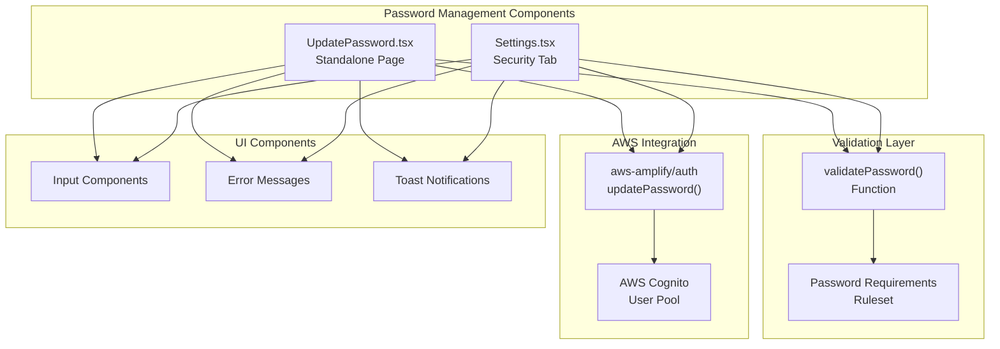
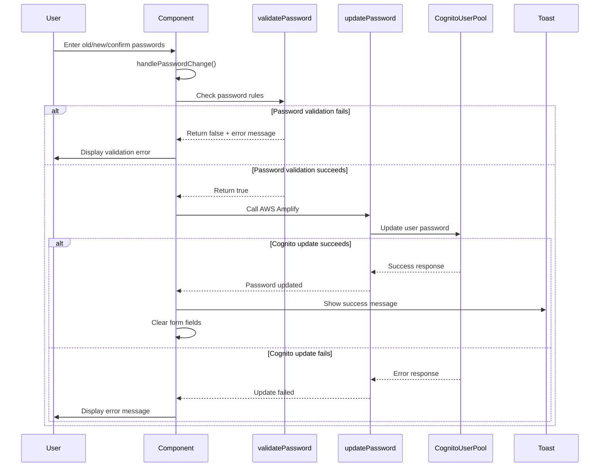
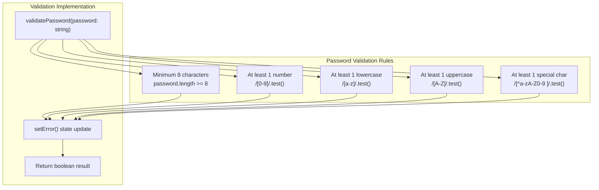
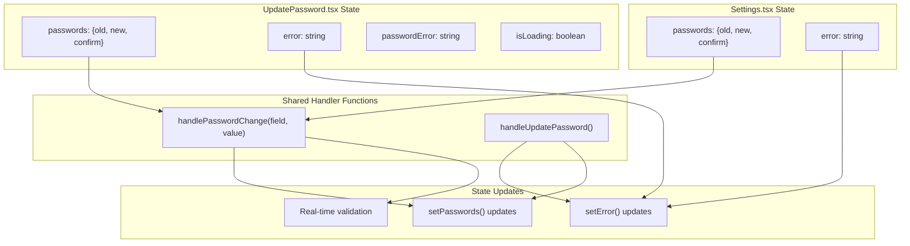
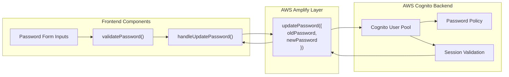

# Password Management

<details>
<summary>Relevant source files</summary>

The following files were used as context for generating this wiki page:

- [Password-petition.md](/Password-petition.md)
- [src/pages/auth/UpdatePassword.tsx](/src/pages/auth/UpdatePassword.tsx)
- [src/pages/settings/Settings.tsx](/src/pages/settings/Settings.tsx)

</details>


This document covers the password management functionality within the CasinoVizion administrative panel, including password updates, validation rules, and AWS Cognito integration. The system provides two distinct interfaces for password changes: a standalone update page and an integrated settings panel section.

For general authentication flows, see [Authentication System](./5_Authentication_System.md). For user account settings beyond password management, see [Settings Management](./20_Settings_Management.md).

## System Overview

The password management system enables authenticated users to update their passwords through secure validation and AWS Cognito integration. The system enforces strict password complexity requirements and provides real-time validation feedback.



**Sources:** [src/pages/auth/UpdatePassword.tsx:1-160](), [src/pages/settings/Settings.tsx:1-386](), [Password-petition.md:1-6]()

## Password Update Flows

The system provides two distinct user flows for password updates, each serving different use cases and user contexts.

### Flow Architecture



**Sources:** [src/pages/auth/UpdatePassword.tsx:64-88](), [src/pages/settings/Settings.tsx:88-109]()

### Component Implementation Patterns

Both password update implementations follow similar patterns but serve different contexts:

| Feature | UpdatePassword.tsx | Settings.tsx |
|---------|-------------------|--------------|
| Route | `/updatepassword` | `/adminpanel/settings?tab=security` |
| Layout | Standalone card layout | Integrated settings tab |
| Form State | `passwords` object | `passwords` object |
| Validation | `validatePassword()` | `validatePassword()` |
| Error Handling | `setError()` state | `setError()` state |
| Success Feedback | Toast notification | Toast notification |
| Loading State | `isLoading` boolean | No loading state |

**Sources:** [src/pages/auth/UpdatePassword.tsx:19-23](), [src/pages/settings/Settings.tsx:40-44]()

## Password Validation Rules

The system enforces comprehensive password complexity requirements defined in the validation logic.

### Validation Requirements



**Sources:** [src/pages/auth/UpdatePassword.tsx:25-54](), [src/pages/settings/Settings.tsx:57-86](), [Password-petition.md:1-6]()

### Validation Logic Implementation

The `validatePassword` function implements each requirement with specific error messaging:

| Rule | Regex Pattern | Error Message |
|------|---------------|---------------|
| Length | `password.length < 8` | "Password must be at least 8 characters long." |
| Number | `!/[0-9]/.test(password)` | "Password must contain at least 1 number." |
| Lowercase | `!/[a-z]/.test(password)` | "Password must contain at least 1 lowercase letter." |
| Uppercase | `!/[A-Z]/.test(password)` | "Password must contain at least 1 uppercase letter." |
| Special Character | `!/[^a-zA-Z0-9 ]/.test(password)` | "Password must contain at least 1 special character or a space." |

**Sources:** [src/pages/auth/UpdatePassword.tsx:25-54](), [src/pages/settings/Settings.tsx:57-86]()

## Component State Management

Both password update components manage form state through React hooks with similar patterns but slight implementation differences.



**Sources:** [src/pages/auth/UpdatePassword.tsx:13-23](), [src/pages/settings/Settings.tsx:40-45]()

## AWS Cognito Integration

Password updates integrate directly with AWS Cognito through the Amplify Auth library, providing secure password management with the existing user pool.

### Integration Flow



**Sources:** [src/pages/auth/UpdatePassword.tsx:3,76](), [src/pages/settings/Settings.tsx:14,99]()

### Error Handling Patterns

Both components implement consistent error handling for AWS Cognito failures:

```typescript
// Common error handling pattern
try {
  await updatePassword({ oldPassword: passwords.old, newPassword: passwords.new });
  // Success: Show toast and clear form
} catch (err) {
  setError("Failed to update password. Please check your old password and try again.");
  console.error("Password update error:", err);
}
```

**Sources:** [src/pages/auth/UpdatePassword.tsx:74-87](), [src/pages/settings/Settings.tsx:98-108]()

## UI Components and Styling

The password management interfaces utilize the application's design system components for consistent user experience.

### Component Dependencies

| UI Component | Usage | Import Source |
|--------------|--------|---------------|
| `Button` | Submit actions | `@/components/ui/button` |
| `Input` | Password fields | `@/components/ui/input` |
| `Label` | Field labels | `@/components/ui/label` |
| `Card` | Container layout | `@/components/ui/card` |
| `toast` | Success/error notifications | `@/hooks/use-toast` |

**Sources:** [src/pages/auth/UpdatePassword.tsx:4-8](), [src/pages/settings/Settings.tsx:4-13]()

### Form Validation States

Both implementations provide visual feedback for form validation states through disabled buttons and error displays:

- **Submit Button Disabled When:** Missing required fields, validation errors present, or loading state active
- **Error Display:** Real-time validation messages and AWS Cognito error responses
- **Success Feedback:** Toast notifications with form reset on successful password update

**Sources:** [src/pages/auth/UpdatePassword.tsx:150-151](), [src/pages/settings/Settings.tsx:273-275]()