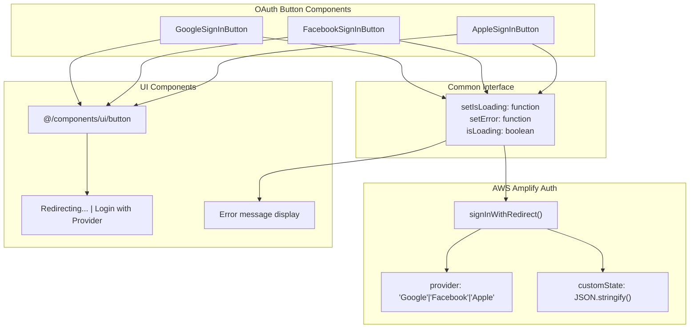
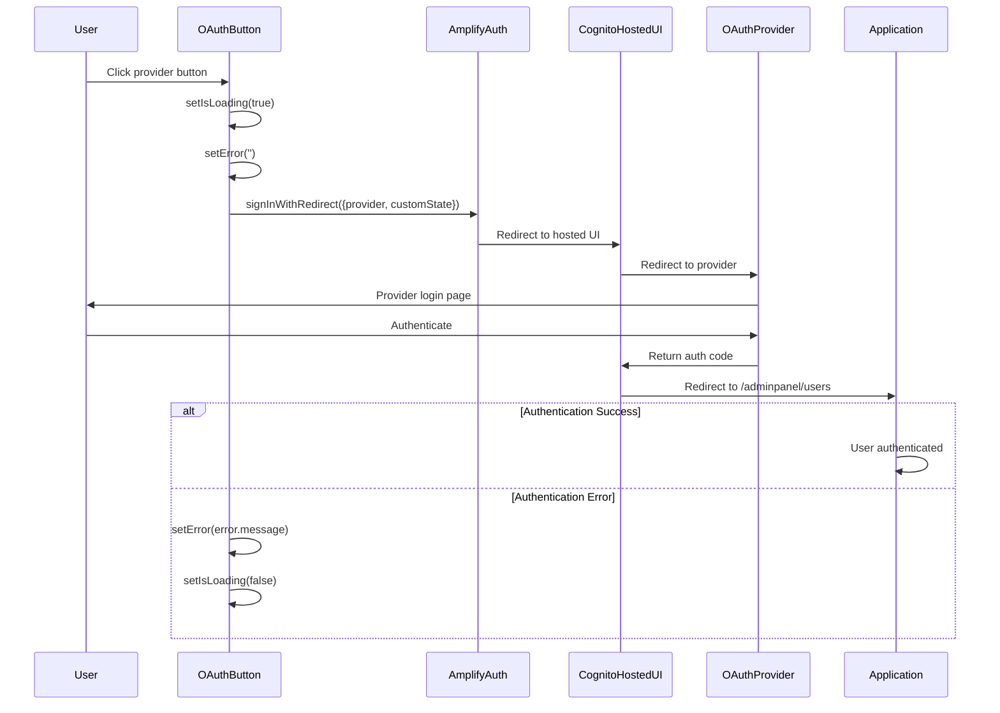

# OAuth Integration

<details>
<summary>Relevant source files</summary>

The following files were used as context for generating this wiki page:

- [src/pages/auth/AppleSignInButton.tsx](/src/pages/auth/AppleSignInButton.tsx)
- [src/pages/auth/FacebookSignInButton.tsx](/src/pages/auth/FacebookSignInButton.tsx)
- [src/pages/auth/GoogleSignInButton.tsx](/src/pages/auth/GoogleSignInButton.tsx)

</details>


This document covers the OAuth authentication integration in the CasinoVizion administrative panel. The system supports social login through Google, Facebook, and Apple OAuth providers, all managed through AWS Cognito's hosted authentication UI.

For traditional email/password authentication, see [Login Flow](./6_Login_Flow.md). For user registration processes, see [User Registration](./7_User_Registration.md). For overall authentication architecture, see [Authentication Services](./10_Authentication_Services.md).

## Supported OAuth Providers

The application integrates with three major OAuth providers through dedicated button components that handle the authentication redirect flow:

| Provider | Component | File Location |
|----------|-----------|---------------|
| Google | `GoogleSignInButton` | `src/pages/auth/GoogleSignInButton.tsx` |
| Facebook | `FacebookSignInButton` | `src/pages/auth/FacebookSignInButton.tsx` |
| Apple | `AppleSignInButton` | `src/pages/auth/AppleSignInButton.tsx` |

Each provider button implements the same interface pattern with loading state management and error handling capabilities.

**Sources:** [src/pages/auth/GoogleSignInButton.tsx:1-40](), [src/pages/auth/FacebookSignInButton.tsx:1-40](), [src/pages/auth/AppleSignInButton.tsx:1-40]()

## OAuth Button Component Architecture



All OAuth button components follow an identical architectural pattern with consistent prop interfaces and authentication flow handling.

**Sources:** [src/pages/auth/GoogleSignInButton.tsx:5-9](), [src/pages/auth/FacebookSignInButton.tsx:5-9](), [src/pages/auth/AppleSignInButton.tsx:5-9]()

## Authentication Flow Implementation



The authentication flow uses AWS Amplify's `signInWithRedirect` function to initiate OAuth authentication. Each provider follows the same redirect pattern with customizable return URLs.

**Sources:** [src/pages/auth/GoogleSignInButton.tsx:12-30](), [src/pages/auth/FacebookSignInButton.tsx:12-30](), [src/pages/auth/AppleSignInButton.tsx:12-30]()

## OAuth Handler Implementation

Each OAuth button component implements a consistent handler pattern:

### Handler Function Structure

```typescript
const handleProviderSignIn = async () => {
  setIsLoading(true);
  setError('');

  try {
    await signInWithRedirect({
      provider: 'ProviderName',
      customState: JSON.stringify({ returnUrl: '/adminpanel/users' })
    });
  } catch (error: unknown) {
    // Error handling logic
  }
};
```

### Key Implementation Details

| Function | Purpose | Location |
|----------|---------|----------|
| `handleGoogleSignIn` | Initiates Google OAuth flow | [src/pages/auth/GoogleSignInButton.tsx:12-30]() |
| `handleFacebookSignIn` | Initiates Facebook OAuth flow | [src/pages/auth/FacebookSignInButton.tsx:12-30]() |
| `handleAppleSignIn` | Initiates Apple OAuth flow | [src/pages/auth/AppleSignInButton.tsx:12-30]() |

All handlers use the same return URL (`/adminpanel/users`) and implement identical error handling patterns.

**Sources:** [src/pages/auth/GoogleSignInButton.tsx:17-20](), [src/pages/auth/FacebookSignInButton.tsx:17-20](), [src/pages/auth/AppleSignInButton.tsx:17-20]()

## Configuration Requirements

The OAuth integration requires proper AWS Cognito configuration for each provider:

### Provider Configuration

Each OAuth provider must be configured in the AWS Cognito User Pool with appropriate client IDs and secrets:

- **Google**: Requires Google OAuth 2.0 client configuration
- **Facebook**: Requires Facebook App ID and App Secret
- **Apple**: Requires Apple Services ID and private key

### Return URL Configuration

All OAuth flows redirect to `/adminpanel/users` upon successful authentication, as specified in the `customState` parameter:

```typescript
customState: JSON.stringify({ returnUrl: '/adminpanel/users' })
```

This return URL must be configured as an allowed callback URL in the AWS Cognito hosted UI settings.

**Sources:** [src/pages/auth/GoogleSignInButton.tsx:19](), [src/pages/auth/FacebookSignInButton.tsx:19](), [src/pages/auth/AppleSignInButton.tsx:19]()

## Error Handling

OAuth authentication errors are handled consistently across all provider buttons:

### Error Handling Pattern

```typescript
catch (error: unknown) {
  console.error('Provider sign-in error:', error);
  if (error instanceof Error) {
    setError('Provider sign-in failed: ' + error.message);
  } else {
    setError('An unknown error occurred during Provider sign-in.');
  }
  setIsLoading(false);
}
```

### Error Types

| Error Scenario | Handling | User Feedback |
|---------------|----------|---------------|
| Network errors | Log to console, display generic message | "Provider sign-in failed: [error message]" |
| Authentication cancelled | Reset loading state | No error message displayed |
| Unknown errors | Log to console, display fallback message | "An unknown error occurred during Provider sign-in." |

The error handling ensures the loading state is properly reset and provides user-friendly error messages while logging detailed errors to the console for debugging.

**Sources:** [src/pages/auth/GoogleSignInButton.tsx:21-29](), [src/pages/auth/FacebookSignInButton.tsx:21-29](), [src/pages/auth/AppleSignInButton.tsx:21-29]()